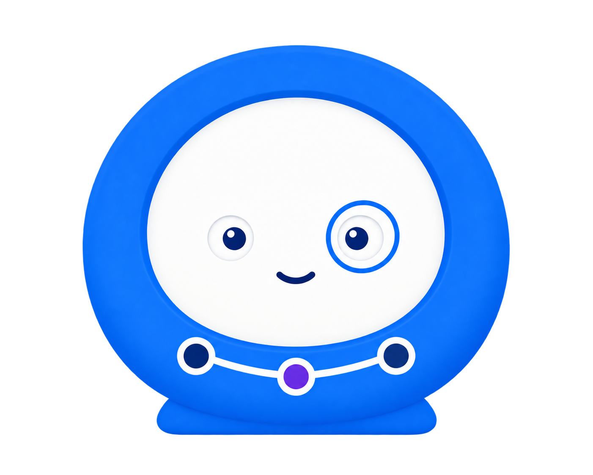

# 平台助手图标：亲和观测员

更新：2026-09-14。状态：**用户已确认采用，已替换悬浮入口和助手面板头像**。



## 正式素材

- [assistant-observer-v1.png](../../../packages/web/src/assets/brand/assistant-observer-v1.png)：1402 × 1122 PNG，真实 Alpha 透明背景，已清除方格。784.8 KiB 原图仅作素材源，Web 页面不直接加载。
- Web 通过 `packages/web/src/features/assistant/icon.ts` 共用 70 / 140 / 210px 宽的透明 WebP 和 `srcSet`；分别为 70 × 56（1.86 KiB）、140 × 112（4.17 KiB）、210 × 168（7.02 KiB）。浏览器根据 `sizes` 与设备像素比选择资源，小图显式禁止内联，避免所有候选一起进入脚本包。
- 悬浮入口为 56 × 56px，透明按钮内只显示头像，去掉外层白色圆底、边框与阴影；图像以 `object-cover` 收紧两侧透明边距并保持比例。完整图像填满高度后的宽度约 70px，所以入口 `sizes` 为 70px，覆盖 1 / 2 / 3 倍屏。面板头像使用 36 × 36px 容器、`object-contain` 与 `sizes="36px"`。
- 入口支持鼠标和触控自由拖动，松手记住位置，刷新恢复；普通点击打开助手。位置限制在屏幕内，窗口缩小也不会拖丢。右键可打开移动与重置控件，键盘方向键可微调，Home 恢复默认位置。
- 形象采用圆润的观测仪器、平视的小眼睛、简短微笑与细圆透镜，下部蓝紫路径表达共享执行过程。
- [尺寸与使用位置预览](assistant-icon-preview.html)。[替换与验证记录](../../reviews/2026-09-14-assistant-icon-replacement.md)。
- 用户要求换完后删除其他方案，项目只保留本款正式图标、使用样本和本说明。其他候选图、旧图标及其独立说明已清理。
- 相关功能：[平台助手一期方案](../../spec/2026-09-14-platform-assistant-phase-one.md#7-交互与组件复用)。图标确认不改变业务权限与执行边界。

## 生成记录

使用内置 `image_gen`，未使用 CLI。先全新生成观测员，再收敛眼睛比例与体积，最后保留已选造型并移除方格背景。中间图像已清理，仅保留以下提示词与最终输出。

最终原始输出：`/Users/tinker/.codex/generated_images/01a09dda-60b2-7293-9e27-725049673370/exec-366790b7-213b-4802-bb09-59334f796358.png`。

Web 派生资源由原 PNG 确定性缩放与编码，保留透明背景与形象。使用 `cwebp -q 90 -alpha_q 100 -m 6 -resize WIDTH HEIGHT`，尺寸对应 70 × 56、140 × 112、210 × 168；未重新生成或重绘图标。

### 生成观测员

```text
Use case: stylized-concept.
Create ONE entirely new, reassuring enterprise software assistant mascot for Cairn / 识途, a platform for web automation and observing execution results.
Creative concept: a small friendly OBSERVATION INSTRUMENT brought to life. It feels like a helpful desk companion and careful inspector. The visual should immediately feel safe, approachable and composed.

Form: a compact softly rounded blue observation lens, almost circular but with a slightly flattened lower edge and a short sturdy matching base. The lens itself is the main character, with a warm ivory face set FLUSH into its broad simple blue rim. Nothing covers the top of the face. No hood or cloak. Two tiny rounded feet are integrated into the bottom base to give a grounded friendly posture; two very short rounded side grips suggest relaxed arms. Keep the entire body compact enough for a 56px icon.
Face: natural LEVEL gaze, two small ROUND eyes with visible white sclera and medium-blue pupils, with modest catchlights. Eyes placed horizontally, no slant, no pointed corners. A small relaxed closed-mouth smile. Calm, good-natured and attentive; not grinning, not a baby face. No eyebrows needed, no large black almond eyes.
One eye has a slender circular blue observation-lens outline, like a discreet integrated monocle, which gives the character a thoughtful inspector identity. It must be light and open, with the eye clearly visible.
Brand signature: a short white execution route is inset into the lower blue rim, connecting exactly three restrained circular nodes: two navy-blue and one small violet. The path is a construction detail of the observation instrument. No diagrams floating around it.
Style: polished graphic 2.5D mascot, simple large shapes, gently rounded edges, mostly matte finish with subtle depth. Clean enterprise product illustration. Use restrained sapphire blue #245CE5, soft navy #18253D, warm porcelain white, and one tiny violet #7C5CFC detail. No fluorescent glow, chrome, heavy gloss, or dramatic shadows.
Composition: one centered character, facing almost directly toward the viewer. Entire silhouette inside a square canvas with 12% generous margins. Quiet, balanced, small-scale readability. No accessories held in hands, no props, no text.
Background: truly transparent PNG with real alpha transparency and clean edges. No checkerboard printed in the picture, no backdrop, no tile, no outside cast shadow.
STRICTLY AVOID anything eerie or threatening: no hood, cape, shroud, ghost, floating face, pointed head, horn, sharp crest, tilted dark alien eyes, hollow sockets, faceless mask, threatening grin. Also avoid realistic humans, anime hairstyles, astronaut helmets, black robot visors, antennae, giant baby eyes, toy packaging, sparkle effects and overly busy details.
```

### 收敛表情与体积

```text
Refine this assistant mascot for an ENTERPRISE software console while keeping it gentle and reassuring.
Keep the recognizable blue rounded observation-lens body, ivory face, one light circular monocle outline, and the SAME lower white route joining two navy nodes and one purple center node. Keep its pleasant level gaze.
The specific correction is to REMOVE THE BABY-TOY QUALITY:
- Make the eyes less than HALF their current size, small and naturally spaced. Keep tiny blue pupils inside restrained white eyes; the eyes must remain horizontal and rounded, never slanted or sharp. A tiny calm smile, substantially smaller than the existing smile.
- Make the face a simple flatter porcelain-white plane, without puffy cheeks or skin coloring. Make the ring around the observing eye thinner and smaller with its eye.
- Replace the inflated soft-toy finish with broad, crisp graphic planes and restrained shallow 2.5D depth. No plush texture, no shiny toy material.
- Remove the mitten arms and little feet; use one low integrated blue base so it reads as a compact professional observation companion and a strong UI icon.
- Slightly wider than tall, balanced and stationary. Nothing pointed or hooded. No ghost shape, floating mask, hair, human nose, visor, ears or antennae.
One centered compact icon with even clear margins. White/royal-blue/navy with just one small violet waypoint. Retain the original friendly identity and observation/route motifs while making everything visually quieter.
Genuinely transparent PNG with real alpha, no background card, no printed checkerboard, no cast shadow, no text.
```

### 已选形象的透明背景处理

```text
Use case: background-extraction. This is the FINAL APPROVED DESIGN; absolutely preserve the mascot exactly. Remove the entire gray checkerboard background from the provided image and export the blue observation mascot as a clean PNG STICKER / TRANSPARENT CUTOUT, using genuine alpha transparency. Preserve every foreground detail: its round blue body and short base, white face, small level eyes, blue monocle, smile, and white path with two blue nodes and one purple center node. Do not redesign, restyle, redraw the expression, add limbs, change proportions or add anything. Background only: all area outside the blue outer silhouette must be empty and transparent, including the spaces alongside the narrow bottom base. The checker pattern in the input is unwanted artwork and must be erased; it is not transparency. No checkerboard in the output, no white/gray/black background, no cast shadow. Keep the original framing and foreground colors.
```
