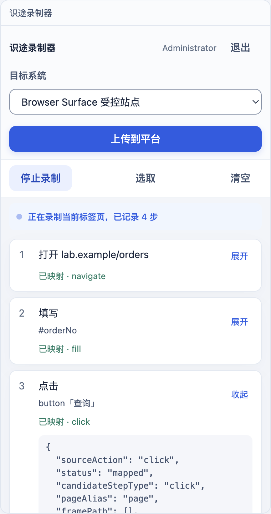
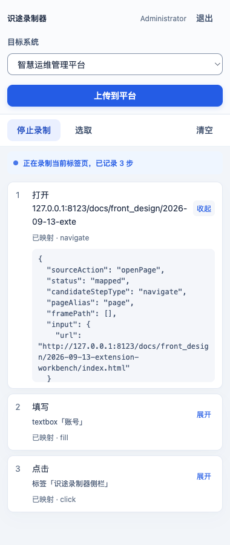

# 识途录制器 · 侧栏工作台样本

日期：2026-09-13。对应方案：[工作台收敛与设计语言对齐](../../spec/2026-09-13-extension-workbench-ui.md)。

浏览器打开 [index.html](index.html)。宽度约 380px，模拟 Side Panel，不是控制台整页。数据是写死的，不能当真登录。

两个画面：

1. **登录**：账号密码；环境是下拉，当前只有「本地开发环境」，不写标题也不展示地址。
2. **工作台**：Target、上传、录制 / 选取、编号步骤。最醒目的操作跟着状态走：没录到步骤时是「开始录制」，录到了才轮到「上传到平台」。录制中带蓝点提示与已记录步数；每步显示定位摘要，可展开看与控制台草稿同一套字段。

样式只引用 [tokens.css](../../design/front/tokens.css)，用来评审插件是否跟平台同一套色和层次。

## 真实面板

下面这张不是原型，是加载了 `dist/` 的真实 Chrome：真实登录、面板里点「开始录制」挂上标签页、真实录到的三步与展开的原始字段。原型只作视觉参考，能力证据看这张。

