# 识途：未来功能页面设计原型

日期：2026-09-13。共 15 个页面，每页一张图片；用于讨论未来产品方向，图中业务、账号、运行编号与指标均为示例。各图独立表达页面状态，不构成同一时刻的完整数据快照。不是已上线能力清单，也不替代模块开发前的方案评审。

[打开图片画廊](index.html) · [完整生成提示词](prompts.json)

生成方式：内置 `image_gen` 逐页生成；导入页另做一次[步骤数量与来源行号校正](08-correction-prompt.txt)，目录只保留 15 张最终稿。用户指定 GPT-Image 2.5，但当前工具不提供模型选择或实际模型版本信息，因此不能把本套图片确认为 GPT-Image 2.5 输出。

## 设计依据

- [项目宪法](../../../AGENTS.md)：统一 Scenario / Run / Evidence，Sequence First，TargetAccount 与控制台身份分离。
- [前端设计语言](../../design/front/design-language.md)与 [Design Token](../../design/front/tokens.css)：冷灰画布、白色内容面、连续导航外壳、蓝色主操作、紫色仅表达 AI。
- [MVP 范围与验收基线](../../arch/05_识途MVP范围与开发实施路线图_v1.0.md)：录制、手工、自然语言、表格导入四种创建入口，汇入同一执行闭环；交付顺序只引用[工程计划](../../plan/识途开发路线与工程实施计划.md#5-当前交付顺序与验收样例)。
- [Authoring 与 IR 设计](../../arch/04_识途Scenario_Authoring与IR详细设计_v1.0.md)：候选步骤可审阅，用户确认后形成草稿和版本。
- [Evidence 方案](../../spec/2026-09-12-evidence-trace.md)：执行结论与证据完整性分为两根轴。

UI/UX 技能的本地检索匹配到 Data-Dense Dashboard，借用其表格、筛选、对齐与清晰状态的方向；其营销页布局建议不适用，本套以仓库现有规范为准。

## 页面索引

| 编号 | 页面 | 设计重点 | 范围定位 |
| --- | --- | --- | --- |
| 01 | [工作台](01-workbench.png) | 先呈现待处理运行、认证问题与证据缺口，再看趋势；从异常直接进入对应 Run 或 Session。 | 核心闭环 |
| 02 | [目标系统与账号](02-targets.png) | 用目标系统组织场景、目标账号和会话策略；详情侧栏分别呈现连接、认证与运行可用性。 | 核心闭环 |
| 03 | [场景库](03-scenario-library.png) | 场景列表同时暴露绑定目标、已发布版本和草稿；录制、手工、AI、导入作为同一场景的创建入口。 | 核心闭环 |
| 04 | [Scenario Studio 顺序编排](04-scenario-studio.png) | 左侧步骤库、中间有序步骤、右侧属性、底部试跑证据；确定性与 AI 步骤使用同一套编辑结构。 | 核心闭环 |
| 05 | [步骤编辑与页面定位](05-step-editor.png) | 从页面目标、输入契约与执行策略配置步骤；复杂 iframe 路径可见，参数引用无需靠脚本猜测。 | 核心闭环 |
| 06 | [AI 辅助创建与审阅](06-ai-authoring.png) | 自然语言生成可检查的步骤候选；逐项接受、编辑或拒绝，明确区分 AI Action、Extract、Assert。 | 核心闭环 |
| 07 | [录制工作台](07-recorder.png) | 把原始操作归并为业务步骤后交给用户审阅；录制结果回到 Studio，可继续编辑与试跑。 | 核心闭环 |
| 08 | [Excel／CSV 导入审阅](08-import-review.png) | 保留原始行到步骤的对应关系；列映射、参数和断言候选可核对，有歧义时先处理再生成草稿。 | 核心闭环 |
| 09 | [运行中心](09-run-center.png) | 手工、试跑、调度共用运行列表；执行结果与证据完整性分列，认证等待和人工核查都有明确入口。 | 核心闭环 |
| 10 | [运行详情与调试](10-run-detail.png) | 按 Run → StepRun → Attempt 逐层定位问题；展示冻结版本、实际输出和每次尝试，避免把重试失败误判为步骤失败。 | 核心闭环 |
| 11 | [证据查看与回放](11-evidence-viewer.png) | 证据绑定到步骤和尝试；截图、输入输出、错误和 AI 摘要并列可查，Trace 作为补充且保留期限可见。 | 核心闭环 |
| 12 | [浏览器会话中心](12-browser-sessions.png) | 分别展示会话生命周期、健康状态、认证状态与当前独占使用；用户能看清复用关系和等待原因。 | 核心闭环 |
| 13 | [调度与巡检计划](13-schedules.png) | 把频率、时区、发布版本、目标账号及冲突处理放在同一计划中；触发后进入统一 Run。 | 规划能力 |
| 14 | [业务动作与术语库](14-business-assets.png) | 将高频业务操作沉淀为有版本、有契约的动作；术语匹配给出候选，由用户确认引用固定版本。 | 后续增强 |
| 15 | [平台设置：模型路由与用量](15-platform-settings.png) | 把模型路由、只读语义、成本和策略版本放在同一治理视图；成员、权限、审计和执行资源作为同级设置入口。 | 平台治理 |

## 建议的交互主线

1. **准备资源**：在目标系统里登记入口与目标账号，确认健康、认证和会话策略。
2. **创建与验证**：场景库选择手工、录制、AI 或 Excel/CSV 导入；都进入 Studio，以相同 Structured Step 编辑、校验、试跑，再发布。
3. **运行与复盘**：手工、试跑、调度生成统一 Run；从运行中心进入详情，再定位到 StepRun、Attempt 和具体证据。
4. **持续运行**：会话中心解释复用与等待，计划页管理时间、时区、版本和冲突处理；平台设置管理权限、模型、资源与审计。

## 页面组合建议

以下编号是原型页编号，表达界面之间的组合关系，不表示交付顺序；当前里程碑以工程计划为准。

优先把 **02 目标系统、03 场景库、04 Studio、05 步骤编辑、09 运行中心、10 运行详情、11 证据查看、12 会话中心** 做成连贯闭环。01 工作台应复用这些页面的事实与操作入口，避免先做缺少数据支撑的统计展示。

06 AI、07 录制、08 表格导入都接入统一草稿与执行链路。13 调度补齐版本、时区与账号冲突语义。14 业务资产先做小范围版本化动作和术语复用；15 以基础模型路由、可获得的用量和审计为主，避免扩成复杂计费系统。范围定位是页面设计建议，不另行安排交付顺序。

## 评审时应保留的语义

- 同一场景可以混合确定性步骤和 AI Action / Extract / Assert，不能因来源不同形成第二套运行时。
- AI、录制和导入的结果要能编辑与审阅；不能直接静默覆盖已发布版本。
- 历史 Run 使用自己的冻结版本、配置与证据解释；“新建运行”会创建新记录。
- Attempt 1 失败、Attempt 2 成功时，StepRun 可以成功；图 10 特意展示这种关系。
- 业务成功与证据不完整可以并存。图中截图缺失、待核查、等待认证是不同问题。
- 副作用结果未知的运行必须核查，不能提供盲目重放入口。
- 会话健康、认证状态、生命周期、当前租约独立显示；运行结束只释放使用权，不等同于销毁会话。
- 目标账号与平台成员分开管理；图片仅包含虚构账号、掩码或凭据引用。
- 图片为生成式视觉稿，少量文字、图标、Logo 比例和控件细节可能需要人工校正；实现时以现有品牌 SVG、Design Token 和经过评审的交互规范为准。
- 页面落地时，示例统计、分页与跨页运行关联必须接入同一持久化事实源；尤其待核查运行不能继续持有执行租约，会话复用不能无条件触发重新登录。

## 单页设计说明

### 01 · 工作台

先呈现待处理运行、认证问题与证据缺口，再看趋势；从异常直接进入对应 Run 或 Session。

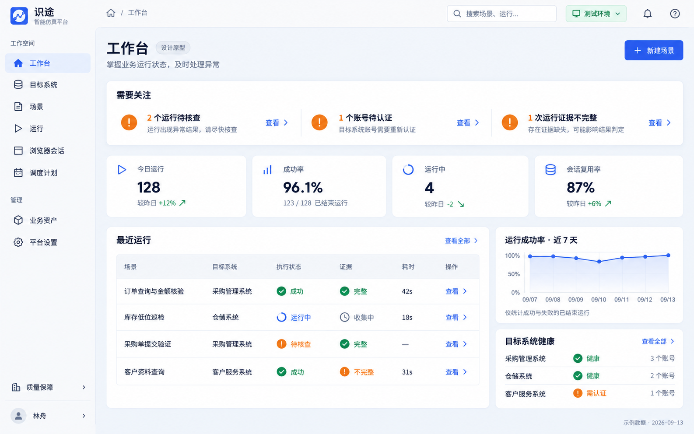

### 02 · 目标系统与账号

用目标系统组织场景、目标账号和会话策略；详情侧栏分别呈现连接、认证与运行可用性。

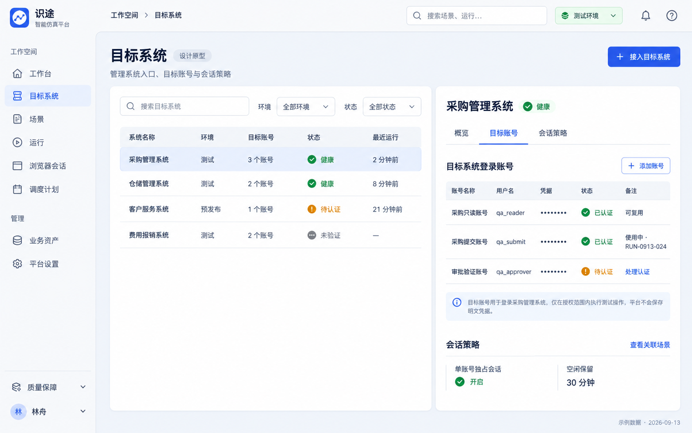

### 03 · 场景库

场景列表同时暴露绑定目标、已发布版本和草稿；录制、手工、AI、导入作为同一场景的创建入口。

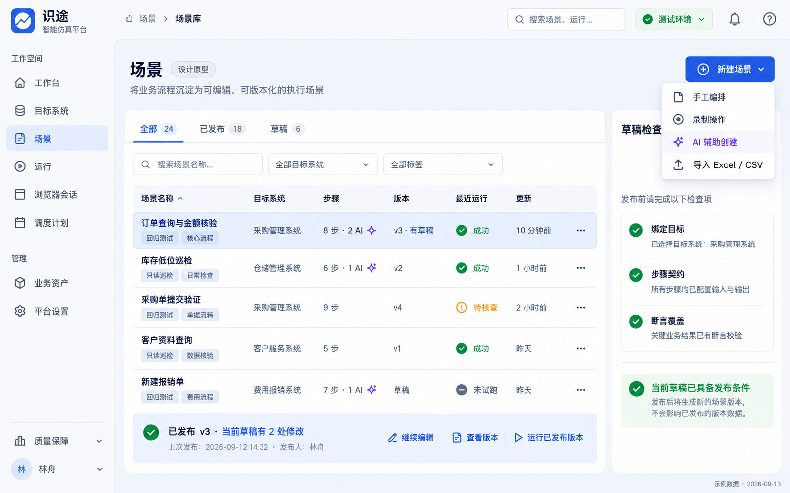

### 04 · Scenario Studio 顺序编排

左侧步骤库、中间有序步骤、右侧属性、底部试跑证据；确定性与 AI 步骤使用同一套编辑结构。

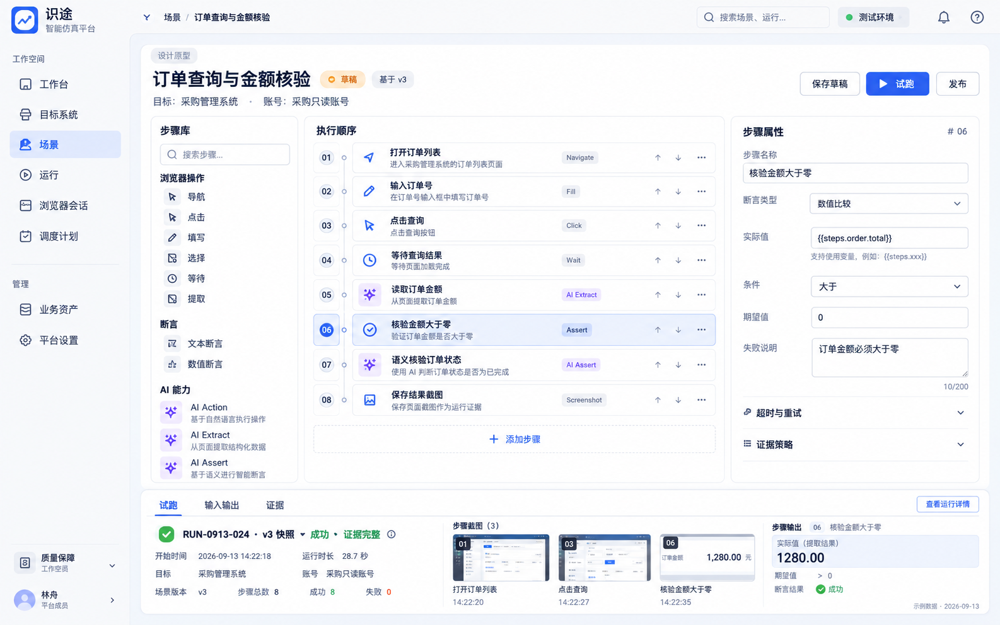

### 05 · 步骤编辑与页面定位

从页面目标、输入契约与执行策略配置步骤；复杂 iframe 路径可见，参数引用无需靠脚本猜测。

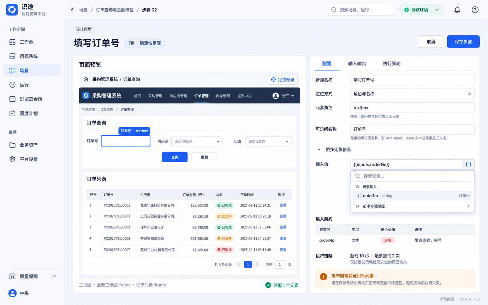

### 06 · AI 辅助创建与审阅

自然语言生成可检查的步骤候选；逐项接受、编辑或拒绝，明确区分 AI Action、Extract、Assert。

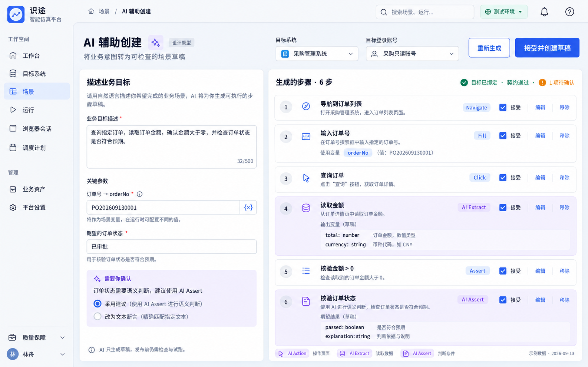

### 07 · 录制工作台

把原始操作归并为业务步骤后交给用户审阅；录制结果回到 Studio，可继续编辑与试跑。

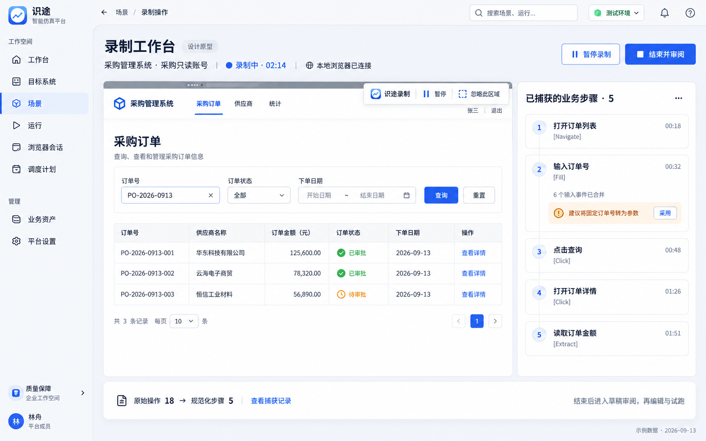

### 08 · Excel／CSV 导入审阅

保留原始行到步骤的对应关系；列映射、参数和断言候选可核对，有歧义时先处理再生成草稿。

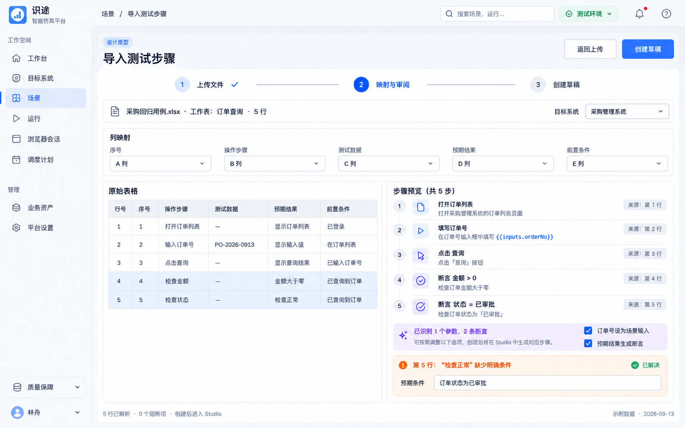

### 09 · 运行中心

手工、试跑、调度共用运行列表；执行结果与证据完整性分列，认证等待和人工核查都有明确入口。

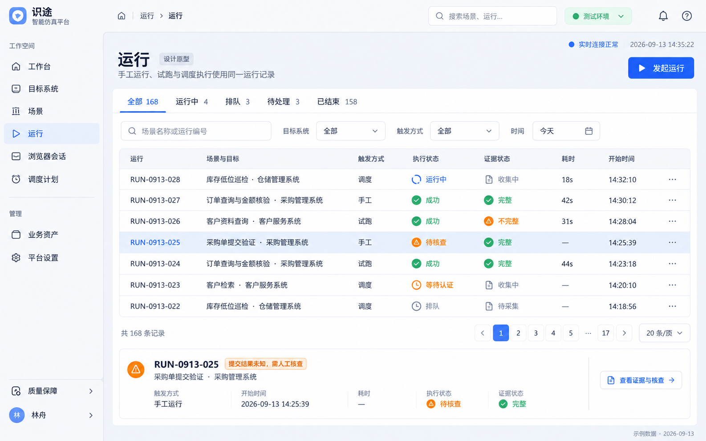

### 10 · 运行详情与调试

按 Run → StepRun → Attempt 逐层定位问题；展示冻结版本、实际输出和每次尝试，避免把重试失败误判为步骤失败。

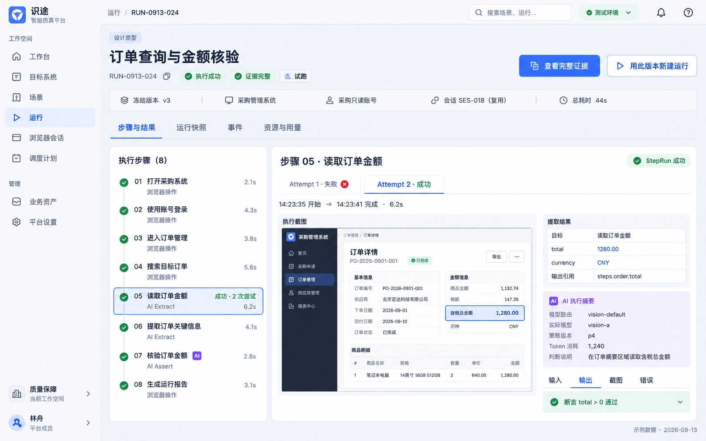

### 11 · 证据查看与回放

证据绑定到步骤和尝试；截图、输入输出、错误和 AI 摘要并列可查，Trace 作为补充且保留期限可见。

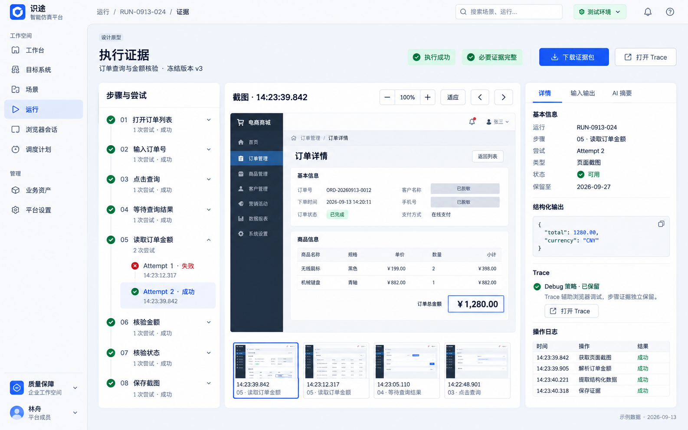

### 12 · 浏览器会话中心

分别展示会话生命周期、健康状态、认证状态与当前独占使用；用户能看清复用关系和等待原因。

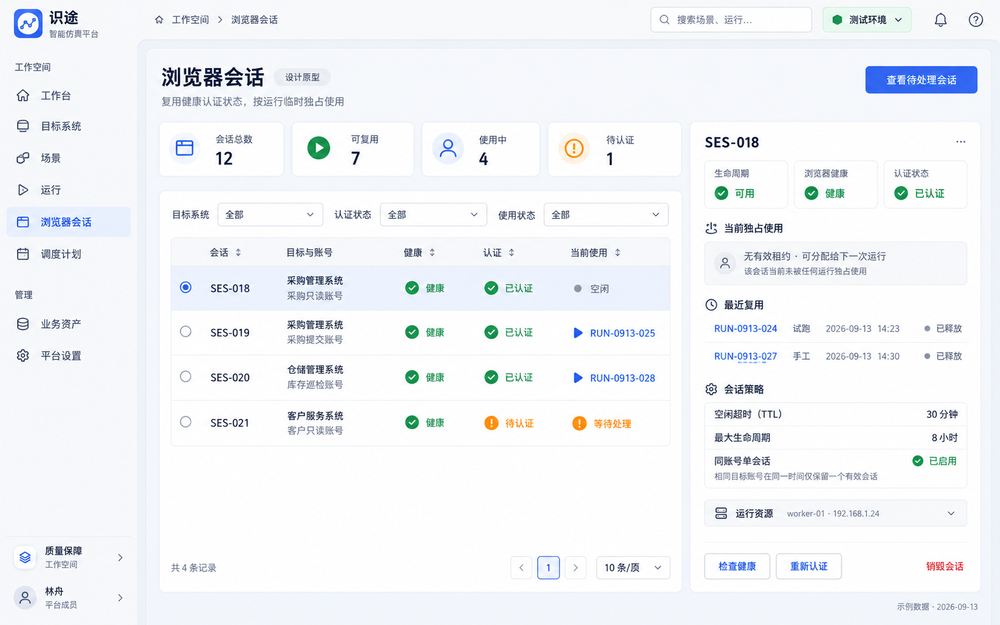

### 13 · 调度与巡检计划

把频率、时区、发布版本、目标账号及冲突处理放在同一计划中；触发后进入统一 Run。

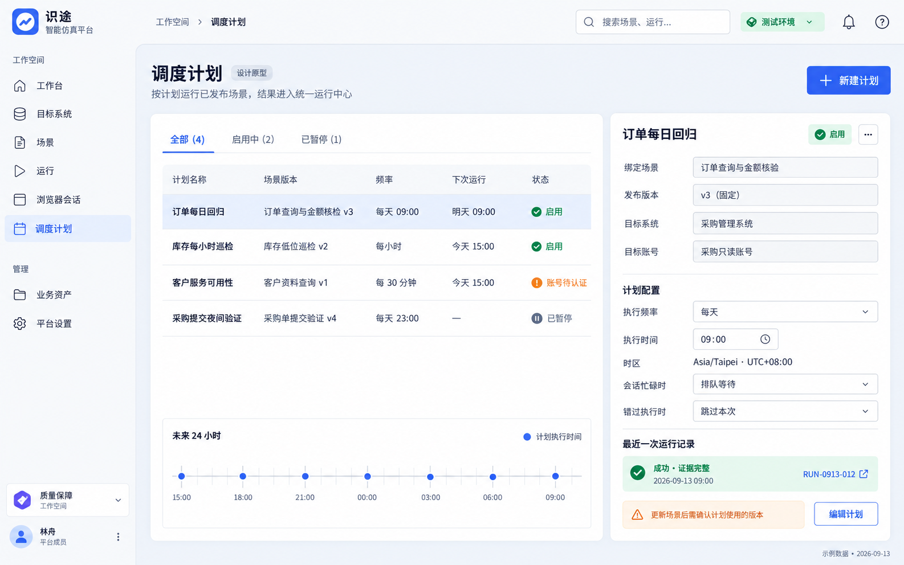

### 14 · 业务动作与术语库

将高频业务操作沉淀为有版本、有契约的动作；术语匹配给出候选，由用户确认引用固定版本。

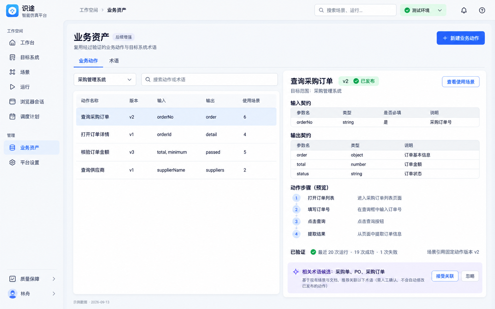

### 15 · 平台设置：模型路由与用量

把模型路由、只读语义、成本和策略版本放在同一治理视图；成员、权限、审计和执行资源作为同级设置入口。

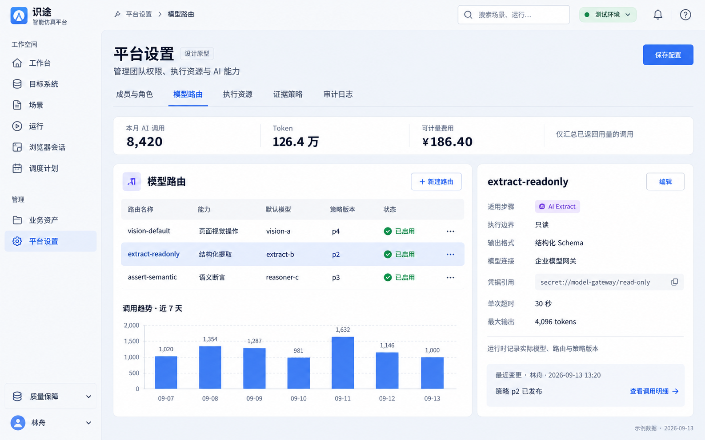
