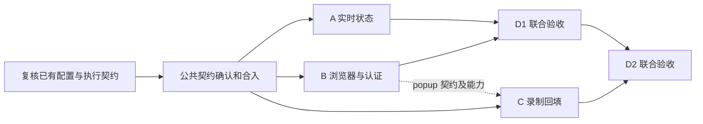

# 识途开发路线与工程实施计划 v1.3

唯一交付路线　｜　2026 年 9 月 14 日更新

本文件是开发顺序、里程碑与交付 Gate 的唯一维护位置。[MVP 范围与验收基线](../arch/05_识途MVP范围与开发实施路线图_v1.0.md)只定义范围与质量目标；[方向复核](../spec/2026-09-13-hybrid-authoring-direction-review.md)保存判断依据和行业资料，不另列有效排期。新增模块仍按 [宪法「开发与交付」](../../CLAUDE.md#开发与交付)先审详细方案再实施；本次文档修订不表示对应功能已经开发完成。

## 执行结论

下一阶段围绕一条约 10 步的真实混编流程交付：用户可创建、修改、试跑，查看正在执行的受管浏览器，再将录制结果接入同一编辑器。当前有效顺序只维护在[第 5 节](#5-当前交付顺序与验收样例)。

本轮决策是“成熟开源执行能力＋必要的产品与运行管理”。保留 Cairn 主线，优先 Playwright 确定性执行与一个 AI 执行器，当前从 Midscene 开始；Page Agent 按明确 DOM 需求选用，Stagehand 是替代 SDK 候选。框架数量不是验收目标；Skyvern、n8n 当前作为源码参考，不默认引入第二套正式运行体系。

2026-09-13 初始盘点时，已有执行账本、五种确定性浏览器步骤、会话与双 Lease、Evidence 存储及最小观察页面；工作区已有确定性草稿、Compiler、顺序编辑、发布与试跑，以及插件登录、Target 绑定、JSONL 上传与录制 IR 草稿。当时正式 AI Step、SSE、录制草稿进入可执行 Scenario 的闭环和浏览器 Live View 尚未落地。后续完成记录见 docs/spec/README.md 及对应报告；2026-09-14 本轮只更新知识与经验的架构目标，未重新验收这些模块，不把“已实现”当成 Foundation 联合 Gate 已通过。

保留已有基础设施并收口实际缺项。Foundation RF01–RF18 仍是运行可信度 Gate，但不再把完成全部基础设施打磨当作录制、AI 和编辑器小范围验证的前置条件。任何正式运行仍须满足对应安全、所有权、快照与证据要求。

优先完成受管 Page 的 AI 接入、录制结构化转换、实时浏览器画面与认证交接探针。浏览器画面嵌入平台，与录制器是否运行在本地是独立选择；首版保留本地扩展录制，同时交付平台内查看受管浏览器的能力。

## 使用方法

P0–P16 是稳定的能力工作包／Epic 编号，保留给既有方案、代码和验收引用，不表示必须依次做完。第 3 节列技术依赖，第 4 节列探针，第 5 节的 D0–D4 定义当前唯一交付顺序。工作包可按最小闭环拆分，正式开放能力前通过对应 Gate。

文中的数值均为建议验收目标或排期假设，不是已经完成的实测结果。阶段负责人在首次运行前固定环境与阈值，在验收记录中保存提交号、测试命令和证据；不得在测试失败后临时放宽阈值。

## 阅读导航

1. 总体策略与范围控制
2. Runtime Foundation v0.1 目标与验收
3. P0 至 P16 能力工作包
4. PoC 与 Spike 插入点
5. 当前交付顺序与验收样例
6. 测试与质量策略
7. ADR 文档与技术债
8. Gate 与排期规则
9. AI 与 Codex 协作实施
10. 技术参考资料

## 1 总体策略与范围控制

### 先冻结语义 再增长实现

统一使用结构化 Scenario Definition、Step Type 和 Executor。录制、手工、Excel 和 AI 是不同的编写入口；它们最终都经过校验与编译，生成可执行的 ScenarioVersion。自然语言只是 AI Step 的一个字段，不是另一套运行事实源；第一版不自建 DSL。

核心执行关系为 Run → StepRun → Attempt。ScenarioVersion 表达发布后的定义；RunSnapshot 冻结本次执行输入及配置；Evidence 记录实际执行过程。修改草稿、模型路由或 Business Action，都不能改变已启动 Run 的解释。

平台掌握状态机、重试、副作用策略、浏览器生命周期、双 Lease、证据和权限。Playwright、Midscene、Page Agent 只在对应边界内提供能力。模块职责可以先由少量函数和文件实现，不把每个概念都建成一个服务、类或 package。

### 复用与自研的边界

平台负责领域与可靠运行契约，不等于这些实现必须全部从零编写。每个模块详细方案先说明已有实现能否复用，再说明必须新增的差异；不为证明自研价值而重写成熟能力。

| 范围 | 当前处理方式 | 增量开发的边界 |
| --- | --- | --- |
| 浏览器动作与录制 | 复用 Playwright、现有 CRX 与上传／归一化模块 | 只补受管页面交接、录制到 Scenario 的映射及未覆盖的必要动作 |
| AI 浏览器执行 | 第一个实现采用 Midscene；S07 Page Agent 按需，S-ALT Stagehand 为替代对照 | 适配输入输出、授权范围、取消、预算和 Evidence；不自研视觉识别或通用 Agent 推理循环 |
| 平台通用 AI | 独立于浏览器 AI 的模型配置与调用；OpenAI 兼容接入需求包括 DeepSeek、千问 | 可复用客户端、Secret 与日志，不依赖 Midscene 配置或 Browser Session；生成与辅助判断的首批功能另案确定 |
| 场景产品能力 | Cairn 维护草稿、顺序编辑、参数、断言、版本、业务动作与结果呈现 | 使用现有组件与协议，只新增业务闭环实际需要的内容 |
| 可靠运行与账号 | 复用已有 Engine、队列、Session、双 Lease、Secret 与 Evidence | 修复和补齐真实缺口；不削弱所有权、未知副作用和持久化要求，也不另起一套状态事实 |
| 其他平台源码 | Skyvern 参考工作流／录制／会话／复盘设计；n8n 参考编排、数据映射和节点扩展设计 | 当前不整体迁移；实际复用代码须核对相应许可与来源，阅读源码不等于获得任意复制权 |

模块方案用一张简短表记录“直接使用／最小适配／仅参考／自行实现”的选择、上游版本或源码位置、具体差异与验证方式。实际采用代码时保留适用的来源与许可说明；参考目录 `vendor/ref/` 不进入 workspace 或产品构建。

Stagehand 对照只在现有 AI 接入存在明确不足，或有可检验的降本假设时启动；比较同一任务的接入改动、取消与页面交接、独立后置断言、运行成本和维护量。胜出后替换对应实现，不默认长期增加第三套执行器。若考虑整体改用 Skyvern，应单独比较其领域映射、自托管可靠性、授权和升级维护成本，再作架构决策；本计划不把迁移作为当前前置。

### 商业价值与范围决策

交付围绕四项结果衡量：业务人员能独立构建、流程可持续复跑、失败容易处理、场景能跨任务复用。实现了几个框架、几个管理页或多少节点，均不能替代这些结果。

长期能力方向包括目标系统知识地图、目标语义映射与业务动作、运行经验优化，愿景及跨模块边界见[总体架构第 6 节](../arch/识途智能仿真平台总体架构设计方案_v1.0.md#6-knowledge-与-business-action)。它们共同服务有依据的场景构建、AI 与规则复用、业务结果验证及变更维护；阶段目标和进入条件只在[本计划对应章节](#知识与运行经验的阶段目标)维护。

企业用户与个人经营者共用同一场景、账号和执行核心。近期不并行建设两套产品，也未确定电商是唯一首发；先用一个明确客群的真实重复任务验证首次成功时间、维护时间、失败处理和交付成本。模板化简化入口可以复用 Studio 与 Run 能力。

业务数据批处理（如逐 SKU 上架）与 P14 的“导入流程步骤表”是两项能力。若选批量运营为首发，需另案明确逐项结果、去重、结果核对、仅补未完成项与必要结构化条件，再在第 5 节调整优先级；本次不自动增加通用 Dataset、任意循环或自由流程图范围。最小 AI Authoring 可在编辑／试跑稳定后按构建成本证据提前，完整自然语言通用构建仍按需扩大。

### 三条建设主线

| 主线 | 当前交付 | 增长条件 |
| --- | --- | --- |
| 工程与执行 | Contracts、配置、数据库、Engine、Worker、故障恢复 | 每项都有可重跑检查，禁止只有接口没有闭环 |
| 浏览器与证据 | 会话复用、基础定位、留证、SSE 观察 | 样本系统的关键操作可以稳定定位并复盘 |
| 场景与智能 | 版本编译、顺序编辑、导入和 AI | 复用前两条主线，不再另开执行通道 |

### 能力范围与投入边界

| 分类 | 能力范围 |
| --- | --- |
| 已有基础持续收口 P0–P7 | Schema、快照、运行事实、双 Lease、Session、Surface、Evidence；补齐 SSE 和受管浏览器查看／认证出口 |
| 当前用户闭环 P8–P13 | 已验证 AI Provider、Draft／Compiler、Sequence Editor、参数、断言、试跑、扩展录制回填 |
| 复用与扩展 P14–P16 | 优先少量版本化 Business Action 与可信旧脚本；Excel 和完整 AI Authoring 按试点需求扩大 |
| 知识与经验基础 | 随相关闭环补齐关键选择、结果评价、知识来源与版本的可追溯性，逐步接入有限范围的地图、映射和经验复用 |
| 有证据再投入 | 完整云端录制、任意运行中人工接管、分支并行画布、任意用户代码执行、复杂 Hybrid 融合、跨 Worker 活会话迁移、全量知识检索、K8s 与多租户商业化 |

保留 shadcn-admin 作为现有控制台基础。只在实际模块需要时建立共享包；P12 的录制探针前移至 D0，平台发起录制与回填草稿在 D2 交付。基础鉴权、账号隔离、Secret 引用和证据访问控制贯穿各次交付。

## 2 Runtime Foundation v0.1 目标与验收

### 目标与执行边界

交付一条真实链路：API 创建已冻结的 Run → PostgreSQL 持久化 → Worker 原子领取 → Engine 执行 → Run、StepRun、Attempt 和证据落库 → SSE 通知 → Web 查询并展示。同一链路先跑 Mock Step，再跑受控浏览器样例。

版本范围是单环境、顺序步骤、失败即停、小规模多 Worker；浏览器优先 Chromium，每个 Target 与 TargetAccount 的健康 Session 串行复用。人工认证允许成为显式等待状态。没有 AI Provider、Recorder 或调度日历，Foundation 仍须完整运行。

### 必须贯穿 P0 至 P7 的约定

- Schema 和数据：跨进程输入必须运行时校验。Scenario、TargetAccount、Snapshot、执行记录分开；目标系统账号与控制台用户分开。所有正式 Run 绑定 Target；Mock 验收使用隔离的测试 Target。
- 快照：创建 Run 时冻结定义、输入、策略及所需执行器版本；凭据只存引用。对定义采用确定性序列化及摘要，不以摘要代替原始快照。发布定义和已有快照不可原地修改。
- 执行：顺序执行、类型化输出、超时、取消和有限重试。失败 Attempt 可被后续成功 Attempt 覆盖 StepRun 的最终结果，但原 Attempt 证据必须保留。
- 双 Lease：RunLease 管执行所有权；SessionLease 管浏览器独占使用。Worker Heartbeat 只表达存活观察，不能代替续租。过期不可原 token 复活，重新领取必须增加 fencing token。
- 副作用：READ_ONLY、IDEMPOTENT、SIDE_EFFECT 是经审定的策略，不根据 click、navigate 名称自动推断；未声明的动作默认按 SIDE_EFFECT 处理。外部结果不明的副作用不得自动重试或切换 Provider 再做一次。
- 证据：平台逐 Attempt 的脱敏输入输出、错误和时间是主证据；截图是浏览器步骤默认产物，采集失败须留原因。Trace 是补充调试证据，不能代替断言结果。
- 实时性：PG 是事实源，NOTIFY 和 SSE 只负责通知。支持重连补读；浏览器无需靠定时轮询获取运行进度。

### 状态与恢复的最小定义

建议 Run 主状态为 QUEUED、RUNNING、RECOVERING、WAITING_FOR_AUTH、NEEDS_REVIEW、SUCCEEDED、FAILED、CANCELLED。取消请求单独记录，取消确认前不能伪装成已终止。NEEDS_REVIEW 与 WAITING_FOR_AUTH 暂停自动推进；人工结论产生审计记录。

失败即停指 StepRun 最终失败后，后续步骤标记 SKIPPED。恢复时保留历史 Attempt；只在检查点的变量和浏览器前置状态可重建、且步骤符合重放策略时继续。无法证明安全恢复则停止并说明原因，不假装从崩溃点透明续跑。

### Foundation 验收矩阵一

以下 RF 编号是自动化验收与 Task 的追踪键。安全不变量要求零失败；涉及时间的目标先在固定测试环境验证。

| 编号 | 验收场景 | 通过条件 |
| --- | --- | --- |
| RF01 | 全新环境启动 | 一条文档化入口启动 Web、API、Worker 与 PG；缺关键配置时快速失败并给出脱敏错误；CI 构建及检查通过 |
| RF02 | Contracts 边界 | 未知 Step Type、非法字段、失效引用、未绑定 Target 均被拒绝；Web 与 Worker 使用同一契约；Secret 不进入客户端构建 |
| RF03 | Run 创建与快照 | 同一幂等键重发返回同一 Run；同键不同输入返回冲突；修改定义和配置后旧 RunSnapshot 内容及摘要不变 |
| RF04 | Engine 独立运行 | Echo → Delay → Echo 传递输出正确；不加载浏览器或 AI SDK；Run、StepRun、Attempt、基本 Evidence 完整 |
| RF05 | 重试与终态 | 先失败后成功保留两个 Attempt；耗尽重试后 Run 失败且后续 SKIPPED；超时与取消没有迟到结果覆盖终态 |
| RF06 | 原子领取 | 3 个 Worker 竞争 100 个 Mock Run，重复 10 轮；每个 Run 最多一个有效执行所有者，无重复有效完成、无丢失 Run |
| RF07 | Crash 与恢复 | kill Worker 后租约到期，安全样例可接管；旧 token 写入和过期续租均失败；恢复历史及新 Attempt 可查询 |
| RF08 | 失联与副作用 | 模拟提交已发出但完成写库前崩溃，进入 NEEDS_REVIEW；不自动再次提交；暂停 Worker 恢复后不能覆盖新所有者 |
| RF09 | 数据库与迁移 | 空库迁移及上一版本升级通过；失败事务回滚；约束阻止重复 Attempt 和非法持有者；API 重启后状态一致 |

RF06 验证有效所有权和状态提交，不承诺“外部动作只发生一次”。数据库 fencing 无法撤回已发到目标系统的点击或请求；此限制必须在故障测试中真实呈现。

### 建议验收环境与时间目标

参考环境为单台 8 vCPU、16 GiB 内存的开发或 CI 执行机，PG 与三个 Worker 可分进程运行；Mock 压测不启动浏览器。真实环境不同须记录配置并重新建立基线。

初始参数建议为 heartbeat 5 秒、lease TTL 30 秒、恢复扫描上限间隔 5 秒，均可配置。恢复接管目标为租约到期后 10 秒内；RF07 的有效执行完成时间不含业务重做耗时。租约过期以数据库时间判定，测试通过可控屏障或故障注入缩短等待。

### Foundation 验收矩阵二

| 编号 | 验收场景 | 通过条件 |
| --- | --- | --- |
| RF10 | Session 串行复用 | 同账号连续两个 Run 复用同一健康 BrowserContext，登录次数为 1；另一账号使用隔离 Context，Cookie 和数据不串用 |
| RF11 | 双 Lease 与 Affinity | 同一 Session 同时只有一个持有者；任务路由到活跃 owner；无容量则等待；过期 Session token 的命令被拒绝 |
| RF12 | Session 失效 | 浏览器崩溃后 Session 标记 LOST 或 BROKEN；不承诺迁移活会话；重新认证后可运行，需 MFA 时显示 WAITING_FOR_AUTH |
| RF13 | Surface 与定位 | 普通 DOM、两层 iframe、动态重挂载、popup、小图标 role/title 的受控样例各连续运行 20 次无误点；找不到、多匹配、失效 Frame 返回结构化错误 |
| RF14 | Evidence 与 ObjectStore | 可查询每个 Attempt 的输入输出和错误；截图可授权下载；对象上传失败显示证据缺失原因，不能把无证据结果标成完整成功 |
| RF15 | Trace 策略 | Debug 样例可打开 Trace；按策略保留失败 Trace；成功样例按策略清理；取消与复用 Session 不混入前后两个 Run 的 Trace |
| RF16 | SSE 恢复 | 正常提交到页面更新目标 p95 小于 2 秒；断开后重连补读到一致状态；重复及乱序通知不使状态倒退，刷新 GET 可还原结果 |
| RF17 | 故障与资源回收 | API、Worker、浏览器分别重启，已完成事实不丢；执行 50 次浏览器样例后无遗留 Run Page、活动 Lease 或失控进程，Session 数不超过配置上限 |
| RF18 | 最小安全与观测 | 未授权查询及跨账号访问被拒绝；日志、SSE、Evidence 不含测试用密钥明文；一次 Run 可按 runId 关联日志，失败类型及丢租指标可查 |

### Gate 通过的证据包

Foundation 的 Gate 由 RF01 至 RF18 的最新结果、已知问题、环境信息、数据库升级记录和演示 Run ID 共同组成。RF13 的受控样例必须全部通过；真实企业系统至少验证一条含嵌套 iframe 和小图标的关键流程，未覆盖区域列入 Target 适配限制。

若真实系统暂时无法提供，受控环境可通过“内部 Foundation”验收，但不得宣称该企业系统已兼容。涉及重复副作用、越权、旧 token 写入成功、状态丢失或快照可变的失败，一律阻断 Gate；不能以技术债方式放行。

## 3 P0 至 P16 能力工作包

### 工作包与技术依赖

| 工作包 | 工作重点 | 直接依赖 |
| --- | --- | --- |
| P0 | 现有工程核对与 Contracts 基础设施 | 项目脚手架 |
| P1 | PG 与 Drizzle 持久化 | P0 最小契约 |
| P2 | Execution Engine Skeleton | P0、P1 |
| P3 | Worker Queue RunLease Fencing | P1、P2 |
| P4 | Browser Runtime Session 双 Lease | P3 |
| P5 | Browser Surface 与 TargetResolver | P4、P0 描述契约 |
| P6 | Evidence ObjectStore Trace | P1、P2；浏览器部分依赖 P4 |
| P7 | API SSE、Run Observer、Live View 与受控认证 | SSE 依赖 P3、P6；实时画面／认证依赖 P4、P5、S-LIVE；可分别验证 |
| P8 | 最小模型路由与 Provider 适配；浏览器 AI / 平台 AI 配置分域 | 浏览器适配依赖 P2、P4、P6；平台模型调用不以浏览器或 P9 为前置，具体功能另案确定 |
| P9 | 首个 AI 接入与条件触发的候选对照 | P5、P8；Midscene 优先，Page Agent／Stagehand 非硬前置 |
| P10 | Scenario Version IR Compiler | P0、P2；试跑观察复用 P7，AI 能力清单依赖 P9 |
| P11 | Sequence Editor | P10 |
| P12 | Recorder 进入 Scenario IR | 捕获／归一化探针不依赖编辑器；产品闭环依赖 P5、P10、P11 |
| P13 | Assert Builder | P5、P10；最小断言表单与 P11 同批，增强部分按需扩展 |
| P14 | Excel 与 CSV Import | P10、P11；完整验收依赖 P13 |
| P15 | Business Action、可信代码动作与 Terminology | P10、P13；AI 实现依赖 P9；代码模块先验证受管能力边界 |
| P16 | AI Authoring 与 Trial Fix Loop | 最小生成依赖 P8、P10、P11、P13；AI Step 依赖 P9；动作库／多来源按需 |

P6 的结构化证据从 P2 就实现，P6 负责补齐二进制存储及生命周期。P7 可以在 P3 后开始状态查询，待 P6 后接入证据。P10 的最小定义与校验不是到 P10 才出现，而是从 P0 持续生长。

可以并行的是已经有稳定契约的工作，例如 P4 与 P6 的 ObjectStore、P8 至 P9 与 P10 的确定性编译、P12 与 P13。共享 Schema 和迁移文件由一个集成人负责合并，避免多条任务同时修改未冻结的公共模型。

### 阶段统一完成条件

每阶段必须同时交付可运行代码、阶段验收检查、变更后的接口或迁移、最小使用说明以及已知限制。测试不通过或 PoC 尚无结论，不得把对应能力标为完成。以下阶段页中的验收均加上此统一条件。

### P0 现有工程核对与契约基础

**目标**　把现有脚手架变成可持续开发的工程起点，建立跨进程协议与基础能力。

**核心任务**

- 盘点 Web、API、Worker 的启动、依赖、测试和鉴权现状；沿用现有 Node、pnpm、NestJS、React 及 shadcn-admin 选型，锁定兼容版本和 lockfile。只补缺项，不批量升级。
- 建立 contracts 的最小 Runtime Schema，使用 Zod 推导 TypeScript 类型 [S1]。先覆盖 Step 公共字段、Echo/Delay/Fail、RunSnapshot、状态、错误、Evidence 元数据和事件信封；未实现的 Step 不注册为可执行能力。
- 区分跨进程 Schema、持久化 Row 与领域逻辑。Schema 可验证结构，引用合法性、权限和状态迁移由对应边界检查；禁止用 TypeScript 类型断言代替输入校验。
- Config 在进程启动时统一验证，Web 仅获得显式允许的公开配置。Logger 采用 pino 并脱敏，统一 requestId、runId、stepRunId、attemptId、workerId、traceId。
- Error 先定义 code、category、retryable、safeMessage、cause，不建庞大异常继承树；是否可以重试仍由执行策略判断。ID 使用成熟原生能力；UTC 存储、展示时转换，计时与数据库租约时间分开。
- Telemetry 先支持上下文传递、关键耗时和计数、开发环境可关闭的导出；不新建监控平台。建立最小鉴权、TargetAccount 凭据引用和日志脱敏入口。

**产出物**　可复现启动说明、依赖图、首批 Schema 与正反例、配置清单、日志错误规范、CI 入口、仓库 AGENTS.md。

**依赖**　现有脚手架；不需要完整数据库和业务页面。启动 S01 样本收集及 S02、S03 的限制探查。

**验收**　RF01、RF02、RF18 的工程部分通过；Web bundle 不包含后端 Secret 或数据库依赖；新增最小模块可直接使用配置、日志和契约；契约破坏性变更会使检查失败。

**现在不做**　通用 Result 框架、万能 shared 包、所有未来 Step 的字段、完整 OTel Collector 集群、extension 空壳重建。

### P1 PostgreSQL 与持久化边界

**目标**　建立可迁移、可约束、可事务化的持久化基础，支持第一条真实 Run 链路。

**核心任务**

- 使用 Drizzle schema 与审阅后的 SQL migration；开发和 CI 执行同一升级流程 [S2]。空库建库和上一版本升级都要验证；禁止以生产环境直接 schema push 代替迁移记录。
- 第一批只建 Target、TargetAccount、最小 Scenario/ScenarioVersion、Run/RunSnapshot、StepRun、Attempt 和基础 Evidence 元数据。Worker/RunLease 在 P3 增量建；BrowserSession/SessionLease 在 P4 建；大对象生命周期字段在 P6 扩展。允许快照先与 Run 同表 JSONB 保存，但保持逻辑不可变。
- Repository 按实际操作组织，如 createRunWithSnapshot、appendAttempt、finishAttempt；事务在需要共同提交的操作边界内完成。API 和 Engine 不散落 Drizzle 查询；不要先造 GenericRepository、UnitOfWork 框架或整套 DAO。
- 用外键、唯一约束和条件更新保护事实。建议唯一键覆盖 Run 内 Step 标识、StepRun 内 Attempt 序号、幂等创建键；幂等键按用户或工作空间限定，并比较输入摘要。
- 一次事务创建 Run、快照及初始记录；后续一次事务提交 Attempt 结果、StepRun/Run 状态、基本 Evidence 与事件序号。任何失败都不能留下“状态成功但主证据不存在”的半提交。
- 提供测试数据、独立测试库和受限数据库角色。备份恢复先有最小操作说明，破坏性迁移需前向修复方案和数据恢复验证。

**产出物**　最小物理模型、迁移目录、Repository 操作、测试 seed、数据库开发说明、RF03 与 RF09 的检查。

**依赖**　P0 契约；事务竞争问题进入 S01。后续字段按阶段逐步添加，不一次铺开全部领域表。

**验收**　空库迁移和上一版本升级通过；重复创建可幂等返回；同键不同输入冲突；事务注入失败后无半成品；改场景后旧快照不变，越权读取被拒绝。

**现在不做**　30 张以上未来业务表、Event Sourcing、CQRS、数据库抽象兼容多 ORM、自建 PostgreSQL 高可用集群。

### P2 Execution Engine Skeleton

**目标**　在完全没有浏览器和 AI 的情况下，运行带上下文、策略、证据和终态的顺序步骤。

**核心任务**

- Engine 接受已校验快照，通过 Executor Registry 分发 Step，统一获取上下文与 AbortSignal，返回已校验的输出和证据。编排内核不 import Playwright、Midscene 或 Page Agent。
- 先实现 Echo、Delay、Fail 三个测试 Executor。职责可由简单函数承担；RunCoordinator、ContextManager、PolicyEngine 等是职责名称，不强制各建一个类。
- 定义 Run、StepRun、Attempt 状态转换表。显式支持重试上限、退避、总超时、步骤超时、取消请求、失败即停；一个逻辑重试新建一个 Attempt，不能覆盖旧记录。
- 先支持参数和前序 Step 输出的命名引用，不支持任意表达式求值。禁止前向引用、未定义变量及原型污染路径；只把已成功、已校验、已提交的输出写入持久化上下文。
- 在动作前记录 Attempt 开始，在结束事务内写结果、基本 Evidence 和状态。超时后发送取消，Executor 真正停止或被隔离前不启动重试；迟到回调不得改写已关闭 Attempt。
- 建立副作用分类和恢复决策的最小接口。FailExecutor 可注入“发出副作用后失去响应”，验证 UNKNOWN 进入人工核查；不用接真实支付或审批系统。

**产出物**　可独立运行的 Engine、三个测试 Executor、状态转换表、上下文引用规范、Mock Vertical Slice、RF04 与 RF05 测试。

**依赖**　P0 与 P1；最小 Scenario 校验已存在，不等待正式 Authoring Compiler。P6 的结构化 Evidence 提前在本阶段建立。

**验收**　Echo → Delay → Echo 正确传递输出；先失败后成功记录两个 Attempt；耗尽重试则后续 SKIPPED；超时与取消没有迟到写入；删除浏览器和 AI 配置仍能运行。

**现在不做**　分支、并行、循环、插件市场、复杂表达式语言、任意脚本执行、为每种 Step 自建调度逻辑。

### P3 Worker Queue RunLease 与 Fencing

**目标**　让多个 Worker 竞争任务，并在失联、暂停和崩溃后保住有效所有权与状态一致性。

**核心任务**

- 注册 Worker 和启动实例标识，配置容量并上报 Heartbeat。使用 PG 队列表与短事务中的 FOR UPDATE SKIP LOCKED 领取，原子设置 owner、过期时间和递增 fencing token；不把数据库事务持有到 Run 执行结束。[S3]
- 新领取和恢复领取统一经过同一 Repository 操作。续租须匹配 owner、token 且租约未过期；用数据库时间判定。Worker 存活、Run 续租与资源容量是不同条件。
- 所有影响 Run、StepRun、Attempt、Context 和主 Evidence 关联的提交，须在同一事务内锁定并验证当前 Lease，再更新事实；避免先查租约、另一次事务写入造成竞态。
- 丢租或无法确认租约时停止新动作，取消在途任务并拒绝迟到结果。优雅停机先停止领取并回收执行资源；异常退出依靠 TTL 与恢复扫描，不能依赖 finally 一定释放。
- 恢复扫描只对过期任务做原子接管。READ_ONLY/IDEMPOTENT 还须满足状态重建条件；SIDE_EFFECT 的未知结果转 NEEDS_REVIEW。浏览器内存状态尚不能重建时不得机械接着下一步。
- NOTIFY 用作任务唤醒；Worker 启动、监听重连和低频安全扫描补查待领任务及过期租约。该后台队列兜底与 Web 轮询进度是两回事。

**产出物**　Worker 进程、领取与续租操作、恢复扫描、容量限制、故障注入工具、所有权 ADR、RF06 至 RF08。

**依赖**　P1、P2；S01 通过。加入 Worker 和 RunLease 数据结构，先固定资源上限，不实现复杂调度评分。

**验收**　3 Worker × 100 Mock Run × 10 轮无重复有效提交；kill、进程暂停、DB 断连三类故障都能进入正确恢复路径；过期和旧 token 的所有写入检查返回拒绝；未知副作用不重试。

**现在不做**　Redis/Kafka 队列、独立 Scheduler 服务、跨区域调度、把 PG 领取事务包装成外部操作 exactly-once 保证。

### P4 Browser Runtime 与 Session 所有权

**目标**　让 Run 使用平台管理的认证会话，健康会话跨 Run 复用，并受独立 SessionLease 保护。

**核心任务**

- Worker 持有浏览器，API 不持有 Page、Cookie 或目标登录态。优先使用 Playwright 原生启动与连接；仅在受控远程浏览器或实际接入场景需要时启用 CDP，不把 CDP 当成前置要求。
- Session 键从 Target + TargetAccount 开始；隔离范围进入唯一约束。先支持一个键一个活跃 Session、一次一个持有 Run，并允许不同账号隔离运行。增加 ownerWorkerInstance、generation、health、idle/max TTL。
- 同一 Context 内按需 NEW_PAGE 或 REUSE_PAGE。S02 验证 Cookie、sessionStorage、SPA 内存和单标签限制；只有目标健康检测通过才复用。storageState 不能等价于完整活会话备份。[S4]
- 先创建或复用 Session，再原子取得 SessionLease；令牌至少关联 Run、RunLease token、Session generation 和 Session token。浏览器命令入口校验两种有效所有权；双 Lease 按固定锁顺序获取，失败立即释放已占资源。
- Affinity 优先将 Run 放到健康 owner Worker；容量不足则等待，不在其他 Worker 同时开第二份。认证等待不长期占 Run 执行槽；释放执行租约后仍保留受控认证会话与独立认证占用，认证完成后重新领取并增代。
- 同进程丢租立即停止浏览器动作。失联 owner 的浏览器可能仍存活，先隔离该 Session 和账号键；只有确认旧浏览器已停止或完成隔离后才允许重建。未确认时等待人工处置，不通过新租约假装消除了旧浏览器。

**产出物**　浏览器适配、Session 生命周期、SessionLease、最小 Affinity/Capacity 策略、认证恢复说明、RF10 至 RF12。

**依赖**　P3；S02 通过。浏览器崩溃与 SessionStorage 限制必须形成可复跑样例。

**验收**　两个连续 Run 登录一次；不同账号隔离；竞争同一 Session 只有一个执行者；owner 失联不冒险双开；确认旧进程停止后可重建，需人工认证时显示 WAITING_FOR_AUTH。

**现在不做**　活 Session 跨 Worker 迁移、浏览器集群控制器、自动解决验证码或 MFA、无限制会话池。

### P5 Browser Surface 与 TargetResolver

**目标**　为企业系统的 iframe、微前端和小图标建立稳定的页面上下文及目标描述边界。

**核心任务**

- Browser Surface 管理 Page、Frame、popup 与可访问的 open Shadow DOM 上下文。微前端按实际页面结构处理，不增加“微前端引擎”。closed Shadow DOM 等能力缺口明确报出。
- 补齐当前 Page 的标识与切换语义：明确 popup 是否成为下一步目标、Agent 完成后交回哪个页面、Frame／导航后如何重建。Live View 的查看页和执行页须明确标识；仅切换查看页不得静默改变 Scenario 的执行目标。
- TargetDescriptor 保存 pageRef、可重建的 framePath、语义定位候选和必要的相对锚点。FramePath 使用 frame 元素特征与 URL/name 等组合描述，不存一次运行的对象句柄或仅存 frame 下标。
- Resolver 优先 role/name、label、text、title、testId，再用受限 CSS 与 relative anchor。复用 Playwright Locator/FrameLocator 的等待与作用域能力，不写第二套 DOM 选择器引擎。[S5]
- 每次执行重新解析定位句柄；Frame 重载、detach、popup 切换后失效重建。返回 FOUND、NOT_FOUND、AMBIGUOUS、SURFACE_LOST 等可判定结果，多候选不能默认点击第一个。
- 小图标优先 ARIA、title、所在行的文本锚点。无语义或 Canvas 目标留下候选及失败证据，交给 P9 验证 AI；不提前实现复杂 Geometry/Hybrid 系统。
- 为未来视觉结果定义坐标所属 Page/Frame、viewport、滚动和缩放信息；点击前检查上下文仍有效。第一版不将一次截图坐标保存成永久可回放 Target。

**产出物**　最小 TargetDescriptor Schema、Resolver、受控测试站点、真实系统定位报告、RF13。

**依赖**　P4；S03 在本阶段完成。跨域 iframe 的 Playwright 控制能力与浏览器扩展脚本注入能力分别验证，不能相互替代。

**验收**　两层 iframe、小图标、popup、open Shadow DOM、Frame 重挂载分别运行；多匹配和 Frame 失效能够定位到具体步骤并停止；真实系统的关键链路有成功记录和明确未支持项。

**现在不做**　通用页面语义图、永久 elementId、自动选择器修复、全量 DOM 存储、无验证的 AI 自动兜底点击。

### P6 Evidence ObjectStore 与 Trace

**目标**　让任何一次执行都能解释发生了什么，并能区分业务结果与证据持久化结果。

**核心任务**

- 延续 P2 的逐 Attempt 结构化主证据，补齐 Screenshot、附件和 Trace 的统一元数据。PG 保存索引和小型结构化结果，大文本或二进制进入 ObjectStore；每项带 Run/Attempt 归属、类型、大小、摘要和采集状态。
- 先做 LocalObjectStore 的 put/get/delete 最小接口与一个实际 S3 兼容适配；开发不强制 MinIO。多机联合验收使用所有 API/Worker 可访问的共享对象存储，不能依赖某台 Worker 的本地目录。
- 上传采用 PENDING 元数据 → 幂等对象键写入 → 校验并提交 AVAILABLE。DB 与对象存储没有跨系统事务；提供未完成上传重试与孤儿对象清理，过期 token 不得把旧产物关联成当前结果。
- 单独记录 evidenceStatus 与 executionOutcome。必要证据失败可有限重试上传，不能重放已经成功的业务动作；超时后以明确的 EVIDENCE_INCOMPLETE 失败原因结束，不伪装完整成功。Crash 恢复可以只做证据收尾。
- 浏览器步骤默认采集脱敏截图；无截图的 Mock Step 仍有结构化证据。浏览器已崩溃而无法截图时记录原因、错误和可用痕迹；是否满足完整证据由冻结策略判断。
- Trace 必须在操作前开始采集才能保留失败之前的过程。需要“失败保留”时提前录制，成功丢弃；Debug 明确保留。按 Run/Attempt 划分 chunk，禁止复用 Context 时混入另一个 Run。context.tracing 不记录平台自定义断言，断言结果仍由平台存储。[S6]
- 配置体积上限、保留期、授权下载及清理任务。Secret、Cookie、Token、敏感输入在写日志和证据前脱敏；截图按已知敏感区域遮罩，未知敏感区域的采集策略必须可关闭。

**产出物**　ObjectStore 适配、证据查询下载、保留清理策略、失败收尾工具、RF14 与 RF15、S04 报告。

**依赖**　P1、P2；截图和 Trace 依赖 P4。基础存储可与 P4 至 P5 并行。

**验收**　中断上传、对象已写但 DB 提交失败、重复上传均不产生错误关联；重试只补证据；权限与脱敏通过；失败 Trace 可打开，成功 Trace 按策略回收。

**现在不做**　无限保留全量 Trace、视频默认全开、复杂报告设计器、跨地域对象存储复制平台。

### P7 API SSE、Run Observer 与受管浏览器交互

**目标**　让开发者和验收人员看见真实状态，并在断网和重启后恢复同一份事实。

**核心任务**

- API 基础部分提供创建 Run、获取 Run/StepRun/Attempt、取消请求、证据列表与授权下载；沿用现有鉴权。基础 Observer 包含 Run 列表、详情、步骤时间线、Attempt 和证据查看；实时浏览器交互按下述增量提供。
- 状态提交事务同时写入 run_event 与单 Run 递增 eventSeq，并发写入通过锁定同一 Run 排序。NOTIFY 仅携带可查询的标识与序号；事务提交后才通知，payload 不承载完整结果或敏感数据。[S7]
- SSE event id 使用 Run 与 eventSeq；读取 Last-Event-ID 后从数据库补读。先建立监听再读取高水位与缺失事件，连接切换后重新补读，客户端按序号去重。各数据库的通知组合与支持 Gate 见 [A 实时状态方案](../spec/2026-09-13-run-realtime-observation.md)，持久化兼容不等于通知已兼容。
- 若事件已超保留窗口，返回 reset 语义并 GET 完整快照；若监听连接故障，标记实时通道不可用、重建监听并补读，不让 UI 假装连接健康。
- GET 返回状态版本和一致的步骤视图。前端不从日志猜状态，不因旧事件倒退；SSE 仅用于触发增量更新或查询。处理慢消费者、缓冲上限、连接关闭及反向代理超时。
- 初始以单 Run 事件流验收，跨 Run 全局游标没有真实需求时不实现。Worker 不回调 API，Web 不直接连数据库或 Worker。

**产出物**　GET／POST 接口、可补读事件流、Run Observer、S05 结果、Foundation 联合验收包；Live View 与受控认证按下述增量边界交付。

**依赖**　P3、P6；Foundation 最终通过还需 P4、P5。查询、SSE、Live View 可分别实现，编辑器复用这些能力而无需等待完整观察系统。

**验收**　RF16、RF17、RF18 通过；断开 SSE、重启 API、漏发或重复 NOTIFY 后都能还原数据库状态；证据缺失、等待认证、需要核查明确显示；RF01 至 RF18 完整复跑。

**现在不做**　WebSocket 进度事实源、浏览器定时轮询、通用事件总线、完整监控大屏、全套运营控制台。

#### Live View 与受控认证增量

Live View 显示 Worker 正在执行的 BrowserSession / Page。Web 可使用组件或 iframe 嵌入平台查看器，不以 iframe 直接加载目标网站来代替受管浏览器；平台登录与 TargetAccount 认证仍分开。

- D0 的 S-LIVE 先验证 Chromium CDP `Page.startScreencast` 推送画面，以及经受控输入完成认证；它是实验性浏览器接口，须验证固定版本、导航／popup、图像延迟和资源开销。默认自动化仍复用 Playwright，不因需要画面就把所有执行改成 connectOverCDP。传输选型由探针决定，不预建远程桌面平台。
- D1 提供只读运行画面、页面标识、连接状态与最近帧时间；Viewer 断线不能让 Run 失败或成功，重新连接须重新鉴权并查询持久化事实。Run 状态继续使用 SSE；图像流不进入 run_event，也不默认永久保存。
- 首次认证和 WAITING_FOR_AUTH 提供有范围的人工操作入口。沿用现有等待语义：释放 RunLease，由 Session owner Worker 的独立认证占用保护浏览器；不能为查看器重新占住 Run 执行槽。确认自动化已停止、旧执行授权失效，且认证占用有效，才授予短时人工控制；认证命令不能复用已释放的执行 grant。退出、断线、到期、取消或占用失效即撤权。先关闭人工输入，再走已有 resume-auth／重新领取增代与认证、页面检查；任意 AI 执行中暂停、接管、恢复另行验证。[既有等待与恢复语义](../spec/2026-09-11-run-lease.md)
- Web 只访问平台鉴权出口，经受控转发到 Browser Runtime；不暴露 Worker 地址、原始 CDP URL、浏览器端口或供应商长期密钥。API 不创建浏览器、不持有 Page；输入由 Worker 验证并执行，执行事实由 Worker 直接落数据库。GET 图像流、POST 输入、认证交接和页面语义按 [B 浏览器方案](../spec/2026-09-13-managed-browser-view-and-auth.md)及 S-LIVE 结论实施；平台业务 API 仍只用 GET／POST。
- 查看与操作权限在服务端分别验证，绑定 actor、Run、Session generation、Page 与有效所有权；不能仅靠 `pointer-events: none` 变成只读。每条输入都检查控制权和当前页面／视口，拒绝过期坐标；不允许多个操作者或 Agent 与人工同时写同一会话。
- 认证输入与敏感页面实行脱敏／受限采集；持久化认证交接和关键人工动作的脱敏审计，不保存密码键盘流。Live View、录制步骤数据、平台 Evidence 分别处理。完整云端录制还需元素语义捕获与 IR 转换，不能用画面流或鼠标坐标直接代替。

增量验收：LV01 同一 Session／Page 的画面与实际步骤一致；LV02 只读用户、旧 token、错误 Run／Page 无法注入输入；LV03 认证等待不持有 RunLease、无自动动作，关闭人工输入后重新领取增代并检查状态才继续；LV04 断线、取消、丢租或认证占用失效后拒绝迟到输入；LV05 导航／popup／缩放／中文输入有明确支持范围；LV06 图像延迟、开销、断线显示与敏感信息控制可复核。浏览器内容画面不承诺覆盖操作系统窗口、证书弹窗和本地文件选择器，这些由目标样本另行验证。

### P8 最小模型路由与 Provider 适配

**目标**　分别配置浏览器仿真 AI 与平台通用 AI，让模型与浏览器 Agent 接入受预算、权限和生命周期约束，并可被替换。

**核心任务**

- 明确两层边界：Model Gateway 管模型请求、路由、凭据、超时、限流与用量；Agent Provider 管观察、定位及执行循环。第三方类型、模型 SDK 不进入 Engine 与 Scenario 公共契约。
- 模型配置区分浏览器仿真 AI 与平台通用 AI，各自选择模型、服务地址、凭据引用与调用策略；平台 AI 直接调用模型，不经 Midscene，也不回退到 Midscene 配置。共享基础设施与独立配置的边界见[模型配置需求记录](../spec/2026-09-13-ai-model-configuration-boundaries.md)。
- 先通过 Fake Provider 验证，再接一条真实模型路由；复用 SDK 与既有配置、Secret、日志能力，只补模型配置冻结、权限、预算及结果映射。Gateway 首期是进程内受控调用边界，不先建设独立网关产品。
- 浏览器执行侧只为实际开放的 AI Action、AI Extract、AI Assert 建立最小适配契约，不提前建设通用插件 SPI 或 ground 工具目录。执行调用信封包含 step/attempt 标识、剩余预算、AbortSignal、受控浏览器能力、输出 Schema 与 Evidence sink。平台生成或分析按功能与请求关联，不要求浏览器或伪造 Attempt；作为 Scenario 步骤执行的判断仍遵守统一 Runtime。
- 冻结本次 provider/adapter 版本、模型路由配置版本、实际模型标识、prompt/policy 版本和参数。每次调用另记实际路由与用量；模型不支持固定版本时记录可获得的信息，不能承诺输出完全重现。
- 平台拥有逻辑重试和总预算；SDK 内部重试必须关闭或计入同一预算。429、超时、取消和输出校验失败映射到平台错误；Agent 已经发出副作用后，不因换模型而自动重做。
- Provider 只能在平台授权的 Target、Page 和账户范围内动作。页面文字及模型输出当作数据处理，不得扩大权限、读取凭据或绕过确认；取消或丢租后仍会动作的 Provider 不得用于有副作用场景。

**产出物**　两类 AI 的独立配置边界、一条真实浏览器模型路由、一个正式 Provider 的最小适配、Fake Provider、契约检查、用量与错误记录。平台通用 AI 的具体调用入口与配置实现随首个功能方案确定，不以浏览器路线接通代替平台 AI 交付。既有 P8/SPI 引用保留原编号，不代表要求建设完整扩展框架。

**依赖**　浏览器适配依赖 P2、P4、P6 的最小能力；D0 即验证适配，正式开放须通过相关运行、权限、预算、取消和证据 Gate。平台通用 AI 的模型访问复用配置、Secret、授权与日志，不依赖 Midscene 或浏览器接入完成。确定性运行不会被模型服务不可用阻断。

**验收**　Fake 与真实 Provider 通过同一输出、超时、取消和预算测试；Provider 不写 Run 主状态、不自行销毁 Session；AI 数据输出必须符合 Schema；密钥不进入页面脚本。

**现在不做**　多供应商全覆盖、智能成本优化、无限 fallback 链、完整模型控制台、未验证的统一 execute/observe/ground 大接口。

### P9 首个 AI 接入与候选替换决策

**目标**　先使一个成熟 AI 实现在受管浏览器上稳定接续，按业务证据决定是否增加或替换能力。

**核心任务**

- 在识途 Browser Runtime 内接入 Midscene 适配。官方有 Playwright 集成入口 [S8]；仍须实测既有 Page、会话复用、Trace、取消和模型路由，而不是把它的演示脚本当平台执行器。
- S07 仅在已识别的 DOM 场景有明确收益或现有能力缺口时验证 Alibaba Page Agent。它面向客户端网页增强 [S9]；启用前验证注入、CSP、导航重建、多页面、iframe、服务端凭据代理与取消。未启动 S07 不阻塞首个 AI 的交付。
- S-ALT 在 Midscene 存在明确不足或有具体降本假设时，用 Stagehand 做限时替代对照；复用相同夹具与输出、停止、页面、证据要求。采用替代实现时记录新的默认 Provider，不把 Midscene 品牌本身当作硬门槛。
- 不混淆 Alibaba Page Agent 与其他 SDK 中同名 PageAgent 类。PoC 锁定仓库、提交号、模型与运行方式；将依赖许可证和分发条件记入接入记录。
- 先比较当前确定性实现与首个 AI，只有启动候选时才加入同样例对照。每步采用明确实现，不预建 DOM → Vision → Hybrid 全链路或自动路由评分。
- 记录实际后置断言结果、误点、人工介入、延迟、调用次数、tokens/成本、取消结果和 Evidence 完整性。成功由独立断言判定，不能仅采信 Agent 自报成功。

**产出物**　首个 AI 接入报告、支持矩阵、选用或拒绝记录、可执行 AI Step 的最小目录；S07/S-ALT 未触发时标为未启动，不要求补两份空实验。

**依赖**　P5、P8；D0 使用当前受管浏览器先验证关键接续，再用 S03 页面集扩充评估。结论必须来自平台集成实验。

**验收**　普通 DOM、小图标、嵌套 iframe、popup/导航、Canvas 按实际支持范围登记；拟开放类别各至少 5 个代表任务、每任务重复 3 次，未开放类别明确限制。按类别报告，不用总平均掩盖失败；建议成功率至少 90%，安全误操作为零，超时与成本上限预先冻结。D0 的小范围探针不要求完成全部类别评估。

**失败出口**　首个 AI 不满足要求则限制范围或触发替代 SDK 验证，不能以 Fake 成功交付真实 AI；Page Agent 不满足边界时拒绝或限制采用。产品验收依据已开放能力，不要求三个项目同时接入，也不宣传未验证能力。确定性编辑与录制可继续，不得为接入某家改变运行所有权。

**现在不做**　自研通用 ReAct 框架、全自动 Router 评分系统、生产副作用任务的静默 AI fallback。

### P10 Scenario Version IR 与 Compiler

**目标**　让所有 Authoring 入口产出同一种可校验、可发布、可试跑的场景资产。

**核心任务**

- 沿用 P0 最小定义，补齐 Draft、发布版本和编译产物。IR 可以包含 unresolved 意图与来源信息；Executable Definition 必须消解必需引用。两者职责不同，不要求现在设计两个庞大的 AST。
- Compiler 先做纯逻辑：Schema 校验 → Step ID 和顺序检查 → 参数及输出引用解析 → Target 与能力匹配 → 策略合并 → 生成可执行定义与诊断。Compile 不启动浏览器、不隐式调用 AI。
- 发布版本不可变，编辑产生新版本；草稿使用 revision 做乐观并发控制。记录 schemaVersion、compilerVersion、源文档摘要和能力需求；Worker 不支持相应契约时明确拒绝执行。
- Run 创建时解析版本、输入、Business Action 引用和运行策略，形成不可变快照。Trial Run 也先冻结当前草稿并落库；草稿继续修改不会影响正在执行的试跑。
- 复用已有确定性 Assert Executor，按需补齐输入契约；P13 的最小断言表单与 P11 编辑器同批交付。默认超时、失败截图、证据和重试是平台策略，不向用户 Scenario 人为塞入一串系统步骤。
- Analyzer 先做缺参数、缺目标、失效引用、无结果检查、弱定位和高风险副作用的规则诊断。错误阻断编译；警告保留说明与确认，不强制所有场景都必须包含业务断言。

**产出物**　正式定义与 IR 契约、Compiler、版本与发布接口、诊断代码、兼容策略、源定义到 RunSnapshot 的测试集。

**依赖**　P0、P2；编译和草稿无需等待 SSE／Live View 完工，试跑观察复用 P7。AI Step 只有 P9 已验证能力才可发布执行。

**验收**　相同源与相同 Compiler/Policy 版本生成相同产物；前向引用、未知能力和未解析 Target 阻断执行；试跑、发布及修改后的旧 Run 不变；数据库升级后旧版本仍按已声明兼容策略读取。

**现在不做**　复杂控制流 AST、通用 DSL、多语言编译器、自动把 AI 的一次轨迹固化为确定性场景、提前创建所有 Action 表。

### P11 Sequence Editor

**目标**　用顺序编辑界面完成第一条真正由用户创建的场景。

**核心任务**　复用现有 UI，提供步骤列表、增加删除、重排、参数绑定和类型化属性表单；展示 Compiler 定位到 Step 的诊断；保存草稿、发布、试跑均走统一 API。先提供上移下移和键盘操作，拖拽可后加。AI 操作、AI 提取、AI 判断按能力分别展示。

试跑区并列展示当前步骤、实际输出／断言和受管浏览器画面，错误能定位到 Step／Attempt。明确从 AI 结构化输出取字段供后续规则步骤引用；第一版可以从头试跑，不把截断步骤数组伪装成任意断点续跑。提供“录制到此场景”的平台入口，捕获和回填依赖 P12。

**产出物**　Sequence Editor、草稿冲突提示、Trial Run 入口、版本详情。

**依赖**　P10；最小断言表单复用 P13，观察与证据复用 P7；AI 控件只开放 P9 已验证的能力。

**验收**　用户可创建“打开 → 输入 → 查询 → 提取 → 断言”场景；D1 混编再验证“规则 → AI → 规则”、AI 输出字段绑定、popup 后当前页、实时画面与认证入口。保存、刷新、发布、运行后顺序和参数一致；重排导致引用失效时提示并阻止发布；两个编辑会话不会静默覆盖；键盘可完成核心操作。

**现在不做**　@xyflow 主画布、复杂分支连线、协同实时编辑、界面内暴露 Selector/SDK 配置作为默认用户流程。

### P12 Recorder 进入 Scenario IR

**目标**　采集业务操作顺序并转成可编辑草稿，不承诺原始事件无修改直接稳定回放。

**核心任务**　复用[已落地的插件登录与录制上传](../spec/2026-09-13-extension-login-and-recording-upload.md)、shared/recording 契约、recordings API 和录制草稿页面，不重建上传模块。核对 click、最终输入值、导航、页面/Frame 关联及来源映射；完善实际缺口。敏感值在采集时排除或转参数，上传保持幂等及服务端校验；不把默认截图或超时策略生成为用户操作步骤。

增量交付从 Studio 发起录制，关联平台实例、上传者、Target 与目标草稿；本地 CRX 捕获结束后把录制 IR 导入该 Scenario 草稿，继续编辑、校验、试跑与发布。沿用现有整批上传、平台身份与权限，补齐登录过期、重传、用户切换和 MV3 中断的真实浏览器验收。当前已从 sources 中的 JSONL actions／text 取数据，继续由平台版本化协议隔离上游格式；不把导出代码、storage state 或视频作为唯一来源。不支持操作保留诊断。

**产出物**　最小 Recorder、原始事件与 IR 映射、录制整理页、S08 报告。

**依赖**　D0 提前验证捕获、Frame 来源及转换，不等 P11；完整产品回填依赖 P5、P10、P11 和平台认证。浏览器扩展权限与跨域 Frame 注入需要单独验证。云端浏览器内录制是另一个 Source Adapter，不是插件录制交付的前置条件。

**验收**　10 条基准流程保留业务动作顺序；连续输入正确归并；重传不重复插入；嵌套 iframe 不丢失所属上下文；密码与 Token 不上传；用户补齐提示项后可走统一 Compiler 和 Runtime。卸载扩展不影响正式 Run。

**现在不做**　逐鼠标轨迹回放、直接生成可执行脚本、万能网站录制保证、扩展作为正式执行必需组件。

### P13 Assert Builder

**目标**　让用户以可理解的方式定义成功条件，并将断言结果留成证据。

**核心任务**　在 P10 断言 Executor 上提供元素选择、期望值和条件表单，先支持存在、可见、文本等于/包含、数值比较。Expected 与 Actual 明确分开；读取当前页面可做样例，不能自动当成业务正确标准。支持超时等待和“未获取到值”错误，不把异常当断言通过。确定性 Assert 与每次调用模型的 AI Assert 分开展示。

**产出物**　断言构建界面、字段及类型校验、断言 Evidence 视图、失败样例。

**依赖**　P5、P10；最小表单随 P11 在 D1 同批交付，不等待完整编辑器或录制器完成；增强构建能力按实际需求扩展。

**验收**　同一场景在符合与不符合预期的测试数据下分别通过和失败；证据包含目标、期望、实际、比较规则和时间。用户点选目标后无需填写代码。无元素、空值、数值格式错误不会误通过。

**现在不做**　视觉差异平台、全套复杂表达式、无约束 AI 判断；AI 生成确定性断言留到 P16。

### P14 Excel 与 CSV Import

**目标**　让已有步骤表格经映射与补齐进入同一 Scenario IR。

**核心任务**　先支持一份标准模板和列映射：场景、顺序、操作、目标、参数、期望结果；一个场景一个步骤组。导入分解析、预览、确认，保留源文件、sheet、行号与 IR 的映射；不猜测缺失的业务条件。调用同一 Analyzer 标出不明确目标与断言。限制文件大小、行数、解压规模和单元格类型，拒绝宏执行、外部链接求值；无公式缓存时标记待处理，不运行公式。

**产出物**　标准模板、导入预览和错误定位、Source Adapter、S09 结果。

**依赖**　P10、P11；期望结果转断言依赖 P13。结构解析可先做，无需 P15 全量知识库。

**验收**　用正常、空字段、混合场景、重复顺序、非法文件等样例验证；在预先固定的 200 行验收上限内导入；每行有去向或诊断；同批重传不重复建草稿；确认后能编辑、编译、运行并定位回原行。

**现在不做**　任意格式自动理解、批量百万行、自动执行宏、把模糊自然语言静默替换成生产操作。

### P15 Business Action、可信代码动作与 Terminology

**目标**　沉淀可复用的业务语义，并保持版本可追溯。

P15 承接目标语义映射与业务动作方向；知识和经验为动作候选提供适用依据与验证记录。长期目标及阶段进入条件见[知识与运行经验的阶段目标](#知识与运行经验的阶段目标)，不把完整地图或自动学习增加为本工作包最小复用能力的前置。

**核心任务**　先选 3 至 5 个真实高频动作；Action 定义名称、Target 范围、输入输出、前后置条件、副作用分类及实现版本。第一版优先结构化步骤实现，可选已通过 P9 的 AI Instruction；编译时固定引用版本并展开到快照，保留 actionId/version 与子步骤来源。术语先做按 Target 作用域的人工维护词表与别名；多个候选由用户选择，运行时不重新做模糊替换。检查循环引用并限制展开深度。

现有 JS 模块复用单独验收：仅注册平台维护的可信实现，固定模块版本／摘要及输入输出，使用受管浏览器能力，纳入统一取消、预算、副作用和 Evidence。不得保留“每个任务只能一个脚本步骤”或只能依附 Midscene 的限制。路径白名单和类型接口不是执行隔离；任意用户上传代码不包含在此能力内。

**产出物**　最小动作库、术语映射、版本引用、编译展开及诊断。

**依赖**　P10、P13 最小契约；AI 实现依赖 P9；不依赖 P14 表格导入、完整断言构建器或术语库。无需向量数据库或通用知识平台。

**验收**　两个场景复用同一 Action；发布 Action v2 后旧 Scenario 和 Run 仍使用 v1；歧义别名不自动替换；副作用策略传递到展开步骤；循环引用阻断编译。

代码动作在同一场景中至少调用两次，分别位于 AI 前后，验证页面和数据接续。不能把多个逻辑 Step 合成一个大 prompt 后用同一个结果替代各自的 StepRun／Attempt。

**现在不做**　大型本体、复杂 RAG、运行时动态追随 latest、由运行结果自动改写动作库。

### P16 AI Authoring 与 Trial Fix Loop

**目标**　降低场景编写成本，让 AI 产出可审阅的草稿和修复建议。

P16 逐步消费目标知识、已验证动作与运行经验，说明生成依据和未知部分，并通过 Trial 验证业务预期。知识不足时仍可基于明确需求、模板和现场观察形成草稿或诊断；阶段目标见[知识与运行经验的阶段目标](#知识与运行经验的阶段目标)。

**核心任务**　使用平台通用 AI 配置，将自然语言、Excel 片段或录制材料经术语/动作候选与受限提示生成 IR；模型只能输出允许的 Schema。Analyzer 给出缺项，用户补齐参数、目标和预期。AI 可生成确定性 Assert 建议；若判断本身仍需模型则保存 AI Assert。Trial Run 冻结草稿并走统一 Runtime；根据证据提出变更 diff，用户确认后形成新草稿或版本。每轮限制调用与试跑次数，高风险步骤默认禁止自动试跑。草稿生成与建议不依赖 Midscene 模型配置；试跑中的浏览器 AI 另按冻结的执行配置调用。

**产出物**　AI 草稿入口、诊断与差异确认、Trial/Fix 闭环、固定评估集与成本报告。

**依赖**　最小版本只用 P8、P10/P11、P13 已有能力，将一个明确需求或模板参数生成为可编辑草稿；生成 AI Step 依赖 P9 已开放目录。P15 术语／动作库和 Recorder/Excel 多来源属于增强，不作为最小 AI Authoring 的全局前置；进入时间只按第 5 节安排。

**验收**　固定 20 个代表性需求，每个输出都是合法 IR 或明确诊断；不虚构账号、目标或关键参数；所有可执行产物先经 Compiler。人工确认后才发布；失败修复不改旧快照。记录完成时间、人工修正次数、一次编译通过率、试跑成功率及实际模型成本，与人工基线比较后再决定扩大范围。

**现在不做**　无人监督自动发布、自我修改生产场景、无限 Agent 循环、把网页内容当成系统权限指令。

## 4 PoC 与 Spike 插入点

Spike 用于消除一个技术不确定性，不是提前开发整个模块。每项默认限时 1 至 3 个工程日；结束时必须给出采用、限制采用或拒绝，以及可重跑样例。真实系统联调受环境影响，可另记等待时间，不把等待伪装成开发工作量。

### Foundation 风险验证

| 编号与插入点 | 要回答的问题 | 通过证据与失败出口 |
| --- | --- | --- |
| S01　P1 后 P3 前 | PG 领取、续租和 fencing 是否真正原子 | 两进程屏障竞争；旧 token、过期续租与完成提交竞态均被挡住。若失败，修事务与约束，阻断 P3 Gate |
| S02　P0 收样 P4 决策 | 真实系统支持哪种会话复用 | 同账号连续两个 Run 登录一次；验证 NEW_PAGE 与 REUSE_PAGE，补测过期/MFA/浏览器崩溃。若不可复用，明确 Target 限制或调整接入方式，不扩大到整个平台承诺 |
| S03　P0 收样 P5 决策 | 嵌套 iframe 与小图标能否稳定定位 | 受控样例及真实关键流程留 FramePath、候选和结果；失败分类为目标缺语义、Frame 失效、权限限制或视觉需求。未支持部分不进入可执行能力清单 |
| S04　P4 至 P6 | Trace、截图和上传是否可控 | 测量开启前后延迟、产物体积；模拟上传中断与浏览器 Crash；逐 Run Trace 不串联。若开销过大，缩小默认策略并保留结构化主证据 |
| S05　P3 后 P7 前 | NOTIFY 丢失和 SSE 重连能否恢复 | 监听重连、重复事件、游标过期、慢消费者均能回到 PG 状态。无法恢复即阻断观察面 Gate，不以多刷新几次通过 |

S02、S03 应优先使用用户已遇到问题的企业系统页面。无法自动重置真实数据时，以只读操作和隔离测试账号验证；误点与提交类实验在受控站点完成。

### Spike 结论写什么

问题和假设；依赖版本与提交号；测试环境；页面或数据样本标识；运行步骤；成功判据；原始结果；失败分类；限制；最终决策；关联阶段和 ADR。这些字段写回**对应 Spike / 阶段方案**（能力矩阵或落地结论）和 CHANGELOG，不在 `docs/spec/` 另开与方案平级的实验记录。普通功能方案落地后只改方案状态与 CHANGELOG，不要求实验记录。实验代码保存在可删除的 spike 区，进入正式代码必须重新满足工程边界和测试要求。

S01 的基本互斥试验不能替代 RF06 多轮测试，S03 的单次成功也不能替代 RF13 的稳定性验收。PoC 证明路线可行，阶段 Gate 证明工程能力可交付。

### 智能与构建入口风险验证

| 编号与插入点 | 要回答的问题 | 通过证据与失败出口 |
| --- | --- | --- |
| S06　D0 核心探针，P8／P9 收口 | 适配层能否让 Midscene 服从受管 Page | 动作边保证 abort/丢租后零新动作；显式 modelConfig；destroy 后无未登记残留。失败则限制或拒绝，不开放 AI 混编。详见 [D0 探针方案](../spec/2026-09-13-d0-hybrid-probes.md) |
| S07　有明确 DOM 收益／缺口时启动 | Alibaba Page Agent 是否值得且能够接入 | 先记录业务假设，再验证 CSP、注入、导航、iframe、多页、凭据代理与动作控制。非 D0 硬门槛；不满足边界则限制或拒绝 |
| S-ALT　有明确不足／降本假设时启动 | Stagehand 能否更省地替代相应 AI 实现 | 同样例比较接入与维护改动、页面接续、输出、取消、证据与成本。限时形成采用／拒绝结论，不默认新增长期第三套实现 |
| S08　D0 探针，P12 收口 | Recorder 能否保留业务顺序与 Frame 来源 | 先取得结构化动作并转换；完整 Gate 用 10 条固定流程检查输入合并、导航、popup、iframe、敏感值剔除。未覆盖事件进入诊断，不等待编辑器才发现捕获限制 |
| S-LIVE　D0 探针，P4／P5／P7 收口 | 平台能否查看当前受管浏览器并受控完成认证 | 复用现有 Session，验证推送画面、页面选择、独占输入、中文输入、视口变化、断线和丢租撤权；固定 Chromium 版本记录延迟／开销／未支持弹窗。失败时给出具体替代方案，不以目标 URL iframe 或暴露 CDP 地址替代 |
| S09　P10 后 P14 前 | 旧表格可以多大程度标准化 | 从实际资产选 3 至 5 种典型表格；确定列映射和标准模板，标记歧义率及人工补齐时间。非标准格式不能可靠解析时退回映射预览，不扩大 AI 自动解释范围 |

### Provider PoC 的评价方法

采用同一页面、任务、初始状态和独立后置断言；固定 Provider、模型和提示版本，逐次重置数据。至少记录每类任务的通过数/总数、误操作数、超时数、人工介入数、p50/p95 延迟和调用成本。不同路线的成功率只在相同任务集上比较。

P9 按拟开放类别固定任务与重复次数；若五类全部开放，初始样本至少为 75 次尝试。不要为未计划采用的 Provider 或类别消耗全量评估成本。小样本不证明普遍可靠；副作用操作中未受控或不可确认的动作即判失败，不能靠成功率阈值替代控制。

Hybrid 先验证一个实际难题，不做“为了融合而融合”。若 DOM 已能稳定定位小图标，直接用确定性 Locator；若 Canvas 只能视觉处理，则测量视觉能力并声明限制，无需强迫每步都经历 DOM → Vision → Hybrid 全链路。

## 5 当前交付顺序与验收样例

以下 D0–D4 是唯一有效的交付顺序。它们从当前代码继续推进，按用户可使用的闭环组织 P 工作包；P、VS、F 的原编号保留用于追踪，不另外表达先后。基础安全与正确性缺陷随相关工作修复，正式运行仍须满足适用的 RF 验收要求。

**平台配置中心增量（2026-09-13，已实施）**：按[评估方案](../spec/2026-09-13-platform-configuration-center-assessment.md)把已有消费方的浏览器 AI、执行默认超时、会话默认策略和证据策略迁入一份数据库修订，治理页可保存并恢复；新 Run 冻结完整修订与 Target 认证解释，未主动覆盖时继承平台默认。不新增 D 阶段，不改变 D0–D4 顺序。平台通用 AI、安全策略、调度和跨 Run 预算仍按原方案后续功能接入。

**平台配置复查修复（2026-09-14，已完成）**：按[复查报告](../reviews/2026-09-14-platform-configuration-center-review.md)修复表单并发覆盖、连接测试与停用绕过凭据绑定、Run 有效 AI 超时、旧摘要嵌套覆盖及 Trace 保留期。三库新增不可变 Secret → origin 绑定并纳入转储，137 项相关回归通过；全仓并行改动的检查限制见报告，不改变 D0–D4 排期或完整 L3 判定。

**Worker 登记与执行节点治理（2026-09-14，已落地）**：按[登记方案](../spec/2026-09-14-worker-registry-and-fleet.md)把内部入口和心跳写进 `workers` 表，API 查表转发，治理页「执行节点」查看生命周期与 Session 计数。Worker 不向 API 注册。不新增 D 阶段，不改变 D0–D4。WR03 跨命名空间 HTTPS 与 WR13 旧/新二进制升级未跑，跳过≠通过；本机契约与实施边界见[实施报告](../reviews/2026-09-14-worker-registry-implementation.md)。

**受控执行 API 基础增量（2026-09-13，基础已实施、复现缺陷已修复）**：按用户授权完成[基础方案](../spec/2026-09-13-controlled-execution-api-and-service-credentials.md)自审与开发，复用现有 Run、版本快照、持久化队列及 Browser Runtime，开放服务凭据、Target/账号授权、已发布版本调用、限速/幂等/总期限及审核后的结果/截图读取，不向服务 Key 开放平台管理。二次复查的超期副作用恢复、请求体限制顺序、PG 外键 schema 三项缺陷已修复，424 项回归通过，本机 PG 升至 0020；细节与独立类型检查错误见方案第 14 节，其余验收遗漏仍按第 13.2 节补齐后再评定 Gate。直接提交 Structured Step、SSE 和开发者门户未纳入本次；具体外部 Target/AI 类别仍需通过方案中的接入 Gate。不新增 D 阶段或其他模块的全局前置。

| 顺序 | 交付内容与工作包 | 退出条件 |
| --- | --- | --- |
| D0 关键能力探针与复用选择 | 固定一条约 10 步样本及可重置夹具；核心先验证 S06 Midscene 与受管 Page 接续，S-LIVE 独立验证画面与受控认证。复用 S08 已有导出／上传结论，不重建。S07／S-ALT 仅按第 4 节条件触发；每个拟开发模块先明确复用选择。 | 形成可重跑样例、支持范围和采用／限制／拒绝结论；拒绝首选可结束该探针，但不能开放 AI 混编，需有通过共同边界验收的替代实现。画面／认证按 S-LIVE 单独收口。 |
| D1 可编辑、可观察的混编试跑 | P7 状态 SSE、只读 Live View 与受控登录；P8/P9 一个已验证 AI 的最小接入；P10/P11 草稿、校验、顺序编辑、参数及 P13 最小断言；P5 页面交接。当前 Midscene 优先，不要求第二个 AI 框架。 | 用户独立保存、修改并从头试跑“规则 → AI → 规则”；输出字段供后续使用，popup 后当前页正确，等待认证有可达入口，步骤与真实浏览器画面对应；刷新后状态恢复，失败可定位且可修改草稿。 |
| D2 录制回到同一 Studio | P12：复用已有插件登录、Target 绑定、整批上传与 IR 草稿，补平台发起、绑定目标 Scenario 草稿及回填；复用 P11/P13 编辑、断言与试跑。 | 普通用户完成“开始录制 → 回填步骤 → 改几步、插入 AI → 试跑 → 发布”；敏感值不上传，不支持动作有诊断，重传不重复；卸载录制插件后正式 Run 仍能执行。 |
| D3 可复用动作与可信脚本 | P15 最小版本化 Business Action；确需的既有 JS 先作为平台维护的可信模块注册，固定版本、能力和输入输出。无需等待 P14、完整术语库或额外 Provider；不以任意脚本自动转画布为前置。 | 同一场景在 AI 前后调用两个模块，输出接续、每次调用可追溯；两个场景复用同一版本，升级不影响旧 Run；不得继承 PulseAI 仅一个脚本或绑定 Midscene 的限制。 |
| D4 可持续试点 | 选择明确客群，在 1–2 个真实目标上重复使用；补认证过期、取消、失败复盘、权限与部署验收，按需加入基础调度和高频操作类型。 | 记录业务人员首次独立成功时间、跨次复跑成功率、人工维护与失败处理时间、模板复用的改动量和实际运行成本；每项对用户承诺的能力有证据，Provider 数量不作为通过条件。 |

D0 中独立且已决定启动的探针可并行；D1 的确定性编辑器无需等待所有 AI 类别，但混编验收必须有一个真实 AI 通过。S08 协议用于 D2，插件与 Studio 可按已冻结契约并行。D3 确需的脚本可随 D1/D2 穿插；进入时间由具体样本决定，不扩大为任意代码执行平台。

### 知识与运行经验的阶段目标

本节是目标系统知识地图、目标语义映射与运行经验优化的阶段目标唯一维护位置，承接[总体架构愿景](../arch/识途智能仿真平台总体架构设计方案_v1.0.md#2-总体目标)。以下阶段描述能力成熟度及进入条件，不新增 D 编号、不改变 D0–D4 的当前顺序，也不代表已经通过验收。功能拆分、具体契约、采集策略和权重算法留到对应专项方案审查。

| 能力阶段 | 用户应获得的结果 | 阶段能力目标 | 达到目标的证明 | 与当前交付的关系及进入条件 |
| --- | --- | --- | --- | --- |
| 一：事实可积累 | 每次运行能够解释当时的依据、选择及结果，为后续改进保留可靠材料 | 关键观察、实际选择、尝试和结果评价可以关联；成功、失败、未尝试、未知及人工介入有明确区别，定义与配置版本可追溯 | 在代表性成功、失败与恢复样例中还原决策及验证依据；重复处理不重复计数，重试不抹掉首次失败，历史事实不随评价更新被改写 | 作为相关底座增量随 D1–D4 收口；复用 Run、Attempt、Snapshot 与 Evidence，不要求先建设独立知识平台 |
| 二：知识可辅助构建 | 用户描述业务时，平台能提供目标系统依据和可靠做法，减少补写和反复试错 | 有限 Target 范围内形成页面与状态知识、术语和版本化业务动作；结合录制、受限采集与业务确认，说明覆盖范围、时效、生成依据和缺失信息 | 代表性需求能够生成可编辑草稿或明确诊断；两个场景可复用同一动作，知识与实现升级不改变旧版本；与原构建方式比较人工修正和完成时间 | 在 D3 的 P15 复用及 D4 试点中按需展开，P16 消费已有知识；完整地图与全站采集均不作为最小 AI Authoring 或 D4 的前置 |
| 三：经验可验证复用 | 平台能推荐更适用的方法，并说明依据及实际改进 | 从重复运行及业务验证中提取有条件的经验，支持 AI 参考与规则候选评价；样本可信度、适用范围和选择策略可区分，经验与策略可以版本化发布及回退 | 在固定且与经验提取分离的评价样例中，比较业务准确性、错误匹配、人工介入、成本和维护时间；能追溯使用的经验。AI 与规则消费分别验证，不能以一方通过代替另一方 | 在已有可重复任务、可靠结果评价及比较基线后进入；可先验证一个消费点，再按证据扩展，当前不预定完成日期 |
| 四：受控自适应与维护 | 目标系统变化时，平台能识别影响、提出修复，并在授权范围内改善后续执行 | 在已批准范围内增量更新知识与经验，支持受控候选选择、失效识别、场景影响分析和集中维护；持续比较改进效果并抑制退化 | 在页面或角色变化的样例中识别受影响资产；新建议或策略经受控验证后发布，可解释、可回退，历史 Run 不变，权限与副作用边界不被评分覆盖 | 在阶段三已证明稳定收益且维护需求明确后另案进入；自动化程度由验证结果决定，不承诺无人监督全站探索或生产试错 |

当前需要同步建设的是事实质量、来源关联与版本边界；后续阶段按实际问题增量投入，不为了满足远期愿景提前实现全部功能。未覆盖的 Target、角色与页面状态明确列为未知；单个样例或一个目标通过不能代表普遍适用。

各阶段以用户收益和证据质量判断是否扩大范围。准确性至少区分动作完成、业务预期满足及结果未知，保留所有原始成败与人工介入，避免只选成功样本。经验生成与效果评价使用分离样例，并包含不同表达、状态和目标变化；历史日志不能单独证明未执行方案的收益。

权重优化允许先从明确规则和可解释排序开始。任何影响正式行为的知识、Prompt、动作或策略更新都须可追溯；已发布场景的语义变化形成新版本，已授权自适应选择限定于本次冻结范围。具体阈值在专项验证前确定，不能以指标改进抵消权限、业务意图或未知副作用约束。

阶段验收标准写入对应 `docs/spec/` 方案；实施与验证结果写入 `docs/reviews/` 并在各自 README 登记。本节只维护目标和进入条件，不将文档更新标记为功能交付。

### 当前基线与三线协作（2026-09-13）

[Midscene 接入](../spec/2026-09-13-midscene-runtime-integration.md)和[顺序编排增强](../spec/2026-09-13-sequence-studio-foundation.md)已记录落地；Midscene 普通 DOM 在线样本为 5 任务 × 3 次共 15 次成功，其他 AI 页面类别仍按原能力闸门。[配置中心](../spec/2026-09-13-platform-configuration-center-assessment.md)已记录四组配置及 Run/Target 认证解释冻结的落地。开始重合代码前先复核其合入版本与验证记录，不再重复建设这些模块。上述子项完成不代表 D1 的 SSE、Live View、认证续跑和页面交接已完成。

三线范围如下；当前实施状态见[方案索引](../spec/README.md)，验收与整改范围见[报告索引](../reviews/README.md)。后续大模块按[宪法「开发与交付」](../../CLAUDE.md#开发与交付)先审方案再实施：

| 工作线 | 主要成果 | 可以立即独立推进的部分 | 完整验收依赖 |
| --- | --- | --- | --- |
| **[A 实时状态与恢复](../spec/2026-09-13-run-realtime-observation.md)** | 事务事件、SSE、一致查询、Studio/详情恢复 | 事件协议、数据库账本、流解析与恢复用例；不等浏览器画面 | 单线可先交付；三库通知分别验，完整 D1 再与 B 联合 |
| **[B 浏览器查看与认证](../spec/2026-09-13-managed-browser-view-and-auth.md)** | Live View、认证控制权、显式 popup 交接 | S-LIVE、PageRef、输入白名单、独立面板；不等 A 全部完成 | 采用配置中心的新快照/租约语义；控制权闭环自身通过；完整 D1 接 A |
| **[C 录制回填 Studio](../spec/2026-09-13-recording-studio-integration.md)** | 平台发起、绑定、精确转换、诊断、OCC/幂等回填 | 插件握手、单页转换、三库导入事务与预览；不等 D1 完工 | popup 导入依赖 B；最终可观察混编试跑依赖 A/B 与已落地 AI/Studio |

**开发可以三线并行，联合验收有先后。** 并行前先确认公共契约和修改归属；不要求一份方案的全部代码完成后，下一份才能开始。下面的 C0 只是一次公共契约交付，不新增 D 阶段或另一套排期。

#### C0：最小公共契约与集成归属

由一个集成负责人组织三线确认，按最小可审查改动先合入各线实际依赖的契约；未验证能力保持关闭，不因写下 Schema 就开放执行。

| 契约/重合区域 | 归属与规则 |
| --- | --- |
| 事件、游标、一致 RunObservation、流解析/鉴权错误约定 | A 主责；B 复用流读取但不把帧放事件表；C 不另造 Run 状态 |
| PageRef、pageAfter、AuthControl、浏览器查看/输入权限 | B 主责；C 只消费 popup 语义，未通过时输出诊断；A 只通知持久变化 |
| 录制绑定、normalizerVersion、预览/回执、草稿 revision 与来源映射 | C 主责；复用现有 Compiler/OCC，不扩充执行核心 IR |
| `shared` 出口、权限目录与三库迁移编号 | 一个集成负责人合入；各线提交自己的契约增量，迁移按合入时最新编号分配 |
| Run 创建、恢复和证据写入 | 先保留配置中心改动；A 负责事务事件入口，B 负责认证交接，共同函数由指定负责人合并，不能各自复制写路径 |
| SessionManager / Browser Surface | B 主责；A 通过持久化契约观察，C 不修改正式浏览器生命周期 |
| Studio / TrialPanel / Run Detail 入口文件 | 各线开发独立观察逻辑/Browser View/导入面板；集成负责人统一接线，保护已有草稿状态和 query key |

每条线可在隔离分支或 worktree 实施。对同一函数的修改按依赖顺序合入，不能用互相覆盖工作区文件实现“并行”。C 的单页转换不必等待 popup 探针，B 的 S-LIVE 也不必等待所有事件类型完成。

#### 集成顺序与依赖

1. **先完成各自最小依赖并开展并行开发。** A 的数据库/流协议、B 的 S-LIVE、C 的单页转换与 OCC 都可独立验证；B 不得绕过尚未完成的认证 fencing，C 不得抢先启用 popup。
2. **A 优先独立交付。** 即使 B 仍在浏览器探针，用户也先得到真实实时状态与断线恢复。PG 可先验收，非 PG 通知未通过的组合明确记录支持限制，不用轮询伪装完成。
3. **A+B 与现有 AI/Studio 关闭 D1。** 保存、混编、共享输出、认证、页面交接、可观察试跑、错误证据与恢复共同验收；功能开关或单元测试不能代替该用户流程。
4. **C 接入已验证的 D1，关闭 D2。** 单页导入可提前完成；正式 D2 必须连通录制、回填、编辑、AI 插入、试跑与发布，并证明 Runtime 不依赖插件。

人手不足时优先保证 A 和 B 的投入，C 先做协议/转换/事务，复用唯一的前端接线窗口；无需为了形式上的三线并行同时重改 Studio。D3/D4 顺序不变，具体工期随 S-LIVE 结果和实际人员确定，不提前承诺日期。

#### 三线共用的 D1/D2 样例

使用可重置的受控业务靶场，固定一条约 10 步“查询记录并核对业务回执页”的样例：导航列表 → 填查询参数 → 点击查询 → 确定性断言结果区 → AI Action 选择记录 → AI Extract 提取记录号/状态 → 确定性 Fill 消费提取字段 → AI Assert 核对页面业务条件 → 确定性 Click 显式打开一个 popup → 在新页确定性 Assert 核对记录。具体步骤按已开放契约实现，不能为凑样例偷偷开放未验 AI 类别；AI 在 popup 中操作另设能力变体验证。

登录与验证码属于 Run 的认证生命周期，不伪造成录制业务步骤。A 验证同一 Run 的状态与证据变化，B 验证认证交回及画面/页面一致，C 录制其中确定性片段并在同一 Studio 插入 AI 与输出绑定。使用正常、失败与恢复变体覆盖 SSE 断线、认证失效/取消、popup 歧义、上传重复及草稿冲突；真实外部目标继续从 `docs/targets/` 选择并单独登记 L3 证据。

以下能力说明继续沿用既有范围，不因三份方案拆分而扩大：

P8 设计须明确浏览器仿真 AI 与平台通用 AI 的独立配置边界。平台通用 AI 已纳入建设范围，但首批生成／辅助判断功能尚未确定，具体调用与配置实现随功能方案确定后在本节安排；D1 浏览器混编通过不代表平台通用 AI 已交付，也不因此提前承诺完整 P16。

S06 适配层、离线 Gate 与 S07-lite 见 [D0 混编关键未知探针](../spec/2026-09-13-d0-hybrid-probes.md)。该方案问的是适配层能否让 Midscene 服从受管 Page，不是 SDK 默认值；S07 完整版不再是 D0 硬门槛。S08 不重开，旧 JS 不在其范围，S-LIVE 仍是独立子项。探针“有结论”与正式能力“通过验收”分别记录。

Excel/CSV 流程导入（P14）、完整术语库、自然语言通用构建（P16）、复杂 AUTO Router、单步多模态融合、完整云端录制器和自由分支画布按试点反馈扩大，不阻塞 D4。业务核心是规则与 AI 混编、可控运行与复用，不再要求 Midscene、Page Agent 与另一 SDK 同时出现。

当 D1/D2 已有可编辑与试跑基础，且用户构建耗时成为主要障碍时，可在 D3/D4 中先交付 P16 最小增量：基于已有步骤／模板生成一个可编辑草稿并验证，不等待完整知识库。批量业务处理和条件／循环只有在首发场景明确需要后才单独改范围及排序，不把此次价值讨论写成已经承诺的功能。

### 验收样例目录

Vertical Slice 是跨层可演示、可验收的样例。以下沿用 VS 编号，不是另一套开发顺序。每条使用真实 PG 与统一执行记录；局部 Mock 只替代本条尚不需要的外部能力。

| 编号与落点 | 端到端闭环 | 必须证明 |
| --- | --- | --- |
| VS1　P2 至 P3 | API 创建测试 Run → PG 领取 → Echo/Delay/Fail → 状态与证据查询 | 没有浏览器和模型也能运行；3 Worker 竞争及 Crash 恢复不破坏记录 |
| VS2　P4 至 P7 | 同账号 Run A 登录 → Run B 复用 → 目标页 iframe 中查询 → 截图 → SSE 查看 | Session 独占、账号隔离、复杂页面基础定位、可复盘；D1 增量另按 LV01–LV06 验证实时画面和受控认证 |
| VS3　P8 至 P10 | 同一个 Run 中确定性操作 → AI 提取或操作 → 确定性断言 → 证据 | Provider 服从同一 Session、当前页、上下文、预算与 Attempt；结构化输出可被后续消费，AI 失败不会绕过策略 |
| VS4　P10 至 P13、P7 | 手工创建或录制 → IR → 补目标/参数/断言 → 编译 → 可观察 Trial → 发布 → Run | Authoring 入口产出统一版本；可看浏览器并处理认证；失败定位到 Step；已发布版本和历史 Run 不受编辑影响 |
| VS5　P14/P15 | 表格步骤 → 映射预览 → Action/术语候选 → 版本 → Run；复用动作另可独立验收 | 每个源行可追踪；歧义须处理；动作版本固定且可复用；P15 最小模块复用不依赖表格入口 |
| VS6　P16 | 自然语言 → AI 草稿 → 编译诊断 → 用户确认 → Trial → 修复建议 | AI 降低构建成本；任何修复都有 diff 与新版本，不能静默改生产定义 |

### 演示约定

每条 Slice 准备正常、失败和恢复各一个场景，现场能查到 RunSnapshot、Attempt 和 Evidence。演示应从干净测试数据启动；“只跑成功路径”不算验收。

VS3 不阻塞 VS4 的确定性版本。AI PoC 尚未通过时，团队仍可交付手工、录制和确定性断言；等适配验证完成再开放对应 AI Step。

VS4 的手工闭环随 D1 交付，录制闭环随 D2 交付；最小断言和参数编辑与 Studio 同批完成。VS5 的表格部分按实际需求从标准模板开始，不扩大为通用文档理解系统。

## 6 测试与质量策略

### 按风险选择测试层次

| 层次 | 验证内容 | 执行时点 |
| --- | --- | --- |
| 静态与契约 | 类型、依赖边界、Schema 正反例、序列化与版本兼容 | 每个相关 PR |
| 纯逻辑单测 | 状态迁移、引用解析、重试分类、Compiler 与 Analyzer | 每个相关 PR；不需要数据库或浏览器 |
| PG 集成 | migration、事务回滚、幂等创建、竞争领取、fencing、SSE 补读 | 每个相关 PR；使用真实目标大版本 PG |
| 浏览器集成 | Session 复用、账号隔离、Frame/popup、取消、资源清理 | 相关 PR 跑小样例；主分支跑完整受控集 |
| 故障与恢复 | kill、进程暂停、DB 断连、对象上传中断、旧 token 回调 | 所有权变更 PR 和阶段 Gate |
| AI 离线契约 | Fake Provider、输出 Schema、预算、超时取消、敏感数据 | 每个 AI 相关 PR；无真实模型成本 |
| AI 在线评估 | 固定任务集、独立断言、成功率、误操作、成本与延迟 | Provider/模型/提示版本变更和 AI Gate |
| 用户闭环 | 手工、录制、表格、AI 从草稿到 Run | 对应 Vertical Slice Gate |

沿用仓库已有测试工具；没有现成工具时先用最少必要工具建立测试入口，不同时引入多套 Runner。不要追求全仓固定覆盖率数字；重点覆盖状态分支、信任边界和数据一致性。UI 文案与无逻辑样式改动不做镜像测试。

### 故障注入必须覆盖的时刻

- 领取事务提交前后：验证回滚与唯一有效 owner。
- Attempt 开始记录后、动作调用前：验证可判定为未执行，不混同未知结果。
- 外部动作已发出、结果写库前：验证 UNKNOWN、副作用不重试、NEEDS_REVIEW。
- 租约过期后旧 Worker 恢复：验证续租、完成、上下文与证据关联都被拒绝。
- 对象上传完成、Evidence 提交前：验证幂等收尾及孤儿清理，不重复业务动作。
- SSE 建连、读取快照与通知交错：验证不漏状态、不因重放倒退。

### 稳定性与回归纪律

并发测试用屏障控制竞争顺序；逻辑时间测试优先可注入时钟。数据库租约边界必须至少保留一组真实数据库时间的集成测试，不能完全用内存模拟替代。浏览器样例使用可重置的受控站点，不以真实业务页面波动掩盖代码回归。

失败时保存第一次失败的结果；重复运行可帮助定位，但不能靠多次重跑把红色洗成绿色。进入隔离区的 flaky test 必须有负责人、原因和修复期限；互斥、权限、副作用和数据丢失类测试不得隔离后放行。

### 单个 Task 的完成定义

1. 行为符合任务卡，触及的所有调用方已经检查，公共契约没有无说明变更。
2. 至少一个能捕获本次风险的可运行检查；关键并发逻辑使用真实 PG。修 bug 时先复现，再证明修复。
3. 相关构建、类型、契约、集成检查通过，保存命令与实际结果；未运行项目明确标注原因，不写“应该通过”。
4. 迁移、兼容、配置、权限和日志随实现同步更新，新增 Secret 不进入源码或产物。
5. PR 写清触发条件、前后行为、验证和已知限制；关联 RF、Slice 或 PoC 编号。评审者能从证据复核结论。

### 质量信号

Foundation 追踪领取等待时间、丢租次数、拒绝旧 token 次数、恢复耗时、Session 命中率、重新登录原因、定位失败分类、证据缺失率和 SSE 延迟。先输出可查询指标与日志，不要求建设大屏。

Authoring 阶段追踪业务用户在无开发者代改代码时的首次可运行时间、人工补齐项数、诊断修复次数和放弃点；模板复用记录第二个场景需要修改什么。重复运行区分业务成功、执行失败、结果未知和证据缺口，并记录人工维护及恢复耗时。AI 补充预算超限、误操作和实际模型成本。字段和样例须在试点前固定，不以一次演示或 Agent 自报成功替代长期可用性结论。

## 7 ADR 文档与技术债

### 文档只保存决策与可运行约定

既有总体架构、领域模型、Execution/Browser Runtime 与 Authoring/IR 文档负责设计边界；arch/05 只保留 MVP 范围与验收基线。本计划第 5 节独占交付顺序与里程碑，方向复核文档保留证据与取舍。模块详细设计在实现前补充，控制在解释接口、状态转换、失败处理和关键取舍所需的篇幅内。

Contracts/Schema 负责协议形状，migration 负责物理变更，自动化验收负责行为，ADR 负责为什么。避免在多份长文档里手工复制相同表结构、接口和状态列表；API 说明能从契约生成时优先生成。

| ADR | 最迟决策点 | 应冻结的内容 |
| --- | --- | --- |
| A01 | P0 | 结构化 Step 与 Schema 单一来源，版本兼容方式 |
| A02 | P1 | Snapshot 不可变、发布与执行区别、Repository 事务边界 |
| A03 | P3 | PG 队列、RunLease、fencing、恢复与未知副作用处理 |
| A04 | P4 | Session 键、双 Lease、Affinity、认证占用、失联浏览器隔离 |
| A05 | P5 | TargetDescriptor、FramePath、重定位与多候选策略 |
| A06 | P6 | 主证据、对象上传收尾、Trace 采集和保留策略 |
| A07 | P7；Live View 在 S-LIVE 后补充 | 持久事件、NOTIFY/SSE 补读、游标与保留窗口；画面通道与执行状态分离、控制权交接和鉴权 |
| A08 | P9 | 最小模型访问／Provider 适配边界、首选与条件候选取舍、采用范围及取消能力 |
| A09 | P10 | IR 到可执行定义、Compiler、Trial 与发布语义 |
| A10 | P12 至 P16 | Source 映射、Action 版本、AI 建议的确认与发布边界 |

ADR 模板只需背景、决定、替代方案、代价、验证链接、状态和重新评估触发器。状态为 proposed、accepted 或 superseded；新增 ADR 不覆盖旧决定，Superseded 指向后继决策。

### 推荐维护位置

仓库根 AGENTS.md 放命令与边界；docs/adr 放决策；docs/runbooks 放启动、故障与恢复；docs/verification 放 Gate 记录；任务系统保存 Epic/Task 的状态与依赖。目录名是推荐约定，可映射到现有仓库结构，不为配目录而搬迁代码。

### 可接受的技术债及退出条件

| 简化 | 已知上限 | 何时升级 |
| --- | --- | --- |
| PG 同时做任务队列 | 领取查询、连接数与扫描随负载增加 | 压测证明排队延迟或锁争用超过目标后，再评估独立队列 |
| 一个账号一条串行 Session | 吞吐受账号数量与目标限制 | 已有安全隔离方案且实际并行需求出现后，加入 SessionProfile 或池化 |
| 固定 Worker 容量 | 资源利用率可能不最优 | 量测显示长期排队或内存压力后，调参或加入简单动态容量 |
| 模型访问先为进程内最小适配 | 独立扩缩容和网络隔离有限 | 多消费者、密钥隔离或模型流量出现已测需求时再扩展 Gateway |
| 受限 TargetDescriptor | 无语义图标和 Canvas 覆盖有限 | P9 证据证明需要某项 grounding 能力时添加 |
| 标准 Excel 模板与词表 | 非标准材料需要人工映射 | 真实导入量和补齐成本足以支撑自动化投入时扩展 |
| 单环境部署 | 不能直接当作多租户生产服务 | 企业试点前补齐部署隔离、备份恢复、密钥管理与运维 Gate |

每条债记录负责人、引入阶段、可量化触发器、关联任务和下次复查 Gate。默认在下一个里程碑复查；无明确使用场景的未来抽象不是技术债，无须排期偿还。

### 工程禁止事项

- 不创建第二套 Step/Run Schema，不用活场景解释旧 Run，不允许 Provider 私自写运行主状态。
- 不让浏览器或模型调用跨数据库长事务，不先查 Lease 后脱离事务写状态，不把 Heartbeat 当互斥锁。
- 不将“进程可能还活着”当作“已经被 fencing 停止”；没有确认隔离的旧浏览器不得与新 Session 同账号并行。
- 不盲目重试 UNKNOWN 副作用，不叠加 Engine、Agent、SDK 三层无界重试，不在超时后留下仍会操作的 Executor。
- 不默认每 Run 重新登录，不把 API、Web 内存、SSE 或对象存储当运行事实源，不以录制器替代执行内核。
- 不明文存储凭据、Cookie 或 Token；不通过日志、Trace、截图或模型请求绕过数据访问边界。
- 不提前做微服务拆分、K8s、复杂画布、全量表设计或通用插件框架；不因功能难做而关闭权限与一致性检查。

## 8 Gate 与排期规则

当前里程碑只使用第 5 节 D0–D4。原 M0–M5/M3A 与 arch/05 中另一套 M0–M6 排期已被本次顺序取代，不再用于安排新任务；历史验收记录中的编号保留原义。RF01–RF18、S01–S09、VS 和 F 编号仍用于追踪具体能力，不因此失效。

### 排期与人员使用

建议以“2 名后端或运行时开发 + 1 名前端或全栈开发 + 共享测试负责人”作为排期讨论假设；实际人员可一人兼多职。负责人职责必须有人承担：技术负责人维护契约与 Gate，阶段 owner 完成闭环，评审者复核证据，产品负责人确定真实系统样本与业务预期。

下一轮按第 5 节的 A/B/C 三线协作推进实时状态、受管浏览器与录制回填，先确认公共契约及共享文件归属，复用已落地的 AI、Studio、配置、Engine、Session 和 Evidence。开发可并行，D1/D2 联合验收依序完成；S-LIVE 先验证浏览器选择，S07/S-ALT 没有触发依据就不排期。先核对已有验证记录，只对受影响能力或未解决风险补验收；详细方案按 [宪法「开发与交付」](../../CLAUDE.md#开发与交付)审查后再开发。

每个 Gate 只细排后续 1 至 2 个迭代，根据实际任务吞吐和探针结果更新估时。Live View 的时延、资源占用和中文输入支持先量测再确定预算；不沿用从空仓起步的工期估算，也不承诺未经验证的云端录制器交付日期。

### Gate 失败与发布规则

安全或事实一致性失败必须修复后重测；一般可用性缺口可以通过缩小支持范围形成受限 Gate，但必须写明被关闭能力、负责人和解除条件。通过不等于“全部功能已完成”，只代表本里程碑列明能力可以继续依赖。

面向企业真实业务试点前增加部署 Gate：授权目标与测试账号、TLS/鉴权、Secret 管理、证据保留、数据库备份恢复、Worker 隔离与资源上限、版本升级和回退流程均完成验证。无需自建 HA 集群，但不能把单机 Foundation 验收等同生产高可用验收。

定时巡检调度在已有可用场景闭环后按 D4 试点需要增量加入，只负责按已发布版本幂等创建 Run，继续复用既有 Worker 与租约机制；基础排班、时区和错过触发策略按实际需求确定，不作为录制或混编的前置。

## 9 AI 与 Codex 协作实施

### Epic 到 Task 到验收

一个 Epic 对应本计划一个 P 能力工作包，按 D0–D4 切出本轮所需部分；一个 Task 对应一项可以独立证明的行为。Task 优先控制在半天至两天的实施量，并能形成一个可审阅的变更。超出时按行为拆分，不按“先把所有接口写完，再补实现，再补测试”拆分。

每张任务卡包含目标、前置依赖、必读契约、允许改动范围、输入输出、失败路径、验收方法和不做事项。给 Codex 的任务要说明希望改变的行为、相关代码或复现路径、必须保留的约束，以及如何验证；这是官方提示指导强调的基本结构。[S10]

### Foundation 基础验收任务目录一

| Task | 可单独交付的行为 | 依赖与验收 |
| --- | --- | --- |
| F00 | 盘点并形成可复现启动与 CI | 无；RF01；列出实际缺口，不重建脚手架 |
| F01 | 定义最小 Step/RunSnapshot/Event Schema | F00；RF02；合法样例可解析，非法样例拒绝 |
| F02 | 启动配置验证与结构化脱敏日志 | F00；RF01/RF18；缺配置快速失败，测试密钥不泄露 |
| F03 | 最小鉴权与 TargetAccount 凭据引用 | F01/F02；RF18；未授权与跨范围访问被拒绝 |
| F04 | 最小表结构与可升级 migration | F01/F03；RF09；空库与旧版本升级、回滚检查 |
| F05 | 幂等创建 Run 与不可变快照 | F04；RF03；重复请求、冲突及旧快照不变 |
| F06 | Echo/Delay 顺序执行及上下文 | F01/F04/F05；RF04；无浏览器可运行 |
| F07 | Fail、有限重试、超时和取消 | F06；RF05；迟到结果不覆盖，后续 SKIPPED |
| F08 | Attempt 结果与主证据原子提交 | F04/F06；RF04/RF09；提交失败无半成功 |
| F09 | 原子领取与 Worker 容量上限 | F07/F08/S01；RF06；并发竞争只有有效 owner |
| F10 | 续租与所有状态写入 fencing | F09；RF07；过期与旧 token 均拒绝 |
| F11 | Crash 恢复与 UNKNOWN 副作用停机 | F10；RF07/RF08；安全样例接管，未知副作用核查 |

F08 的基本主证据是 VS1 完成前提，不能等到整个 ObjectStore 模块完成。F10 必须覆盖所有写入入口，不允许仅修 finishRun 而遗漏 appendAttempt 或 Context 更新。

### Foundation 基础验收任务目录二

| Task | 可单独交付的行为 | 依赖与验收 |
| --- | --- | --- |
| F12 | 管理浏览器 Context 与同账号复用 | F11/S02；RF10；连续两个 Run 登录一次 |
| F13 | SessionLease 与双 Lease 命令守卫 | F10/F12；RF11；竞争、丢租、旧命令拒绝 |
| F14 | Affinity 容量与失联账号隔离 | F13；RF11/RF12；无容量等待，未确认旧进程停止不双开 |
| F15 | FramePath 与基础 TargetResolver | F12/S03；RF13；多匹配和 detach 可诊断 |
| F16 | Screenshot 与 ObjectStore 可靠上传 | F08/F12；RF14/S04；重复上传、中断与孤儿收尾 |
| F17 | Trace、保留期与证据访问权限 | F16；RF15/RF18；Trace 可读、不串 Run、不越权 |
| F18 | 单 Run 事件序号与事务通知 | F08/F10；RF16；事务回滚无假事件 |
| F19 | SSE 补读与最小 Run Observer | F18/F16/S05；RF16；断连、旧游标、乱序后状态一致 |
| F20 | Foundation 联合验收与恢复手册 | F00 至 F19；RF01 至 RF18 全部满足，VS2 可演示 |

F00–F20 保留为基础能力任务与验收模板，不是下一轮待办清单；已有完成状态以代码、docs/spec 和验证记录为准。进入各 Epic 时只为实际缺口补齐任务、负责人及估时。P8 至 P16 使用同一拆分规则，避免一次把整个工作包交给模型。

### 推荐协作流程

先让 Codex 读取任务涉及的真实入口、调用链、Schema、最近 ADR 和已有测试，报告会改哪些行为及需要复用的模块。确认理解后实施当前 Task；遇到未覆盖的架构问题先形成有证据的最小决策，不顺手扩展整个 Epic。

实现、测试和文档随一个 Task 完成。公共契约变更先合入或提供已冻结依赖，再让消费者更新。多个任务并行时按独立模块分工；共享迁移、Schema 与状态机由指定集成人串行审阅。每次集成后跑受影响的跨层检查。

Codex 的完成报告必须写实际运行的检查、结果、未验证项和剩余风险；人类评审状态机、事务条件、权限、未知副作用与迁移。模型生成的“测试通过”文字不能代替测试记录。

### 示例任务卡 F10

**标题**　拒绝过期租约和旧 Worker 的状态提交。

**目标**　当 Run 所有权变化时，旧 owner 不能续租，也不能提交 Attempt、上下文、Evidence 关联或 Run 终态。

**前置**　F09 已完成；A03 已冻结 RunLease 字段和错误语义。必读实际 Repository 操作、所有调用方及相关 migration。

**范围**　修改共享租约验证和状态提交事务，更新所有调用入口；保持 Engine 与浏览器无关。禁止改用内存锁，不引入新队列或通用锁框架。

**实现约束**　同一事务内锁定 Lease 并检验 owner、token、expiresAt；事务中使用数据库时间，不在锁等待之前取时间快照作最终判断。过期后续租返回 LeaseLost，重新领取增加 token。令牌不能由 Worker 自行生成。

**验收测试设计**

1. Given A 持有有效 token 1；When A 提交结果；Then 更新成功且主证据与结果一起提交。
2. Given A 的租约已过期但 B 尚未领取；When A 续租或提交；Then 拒绝且 token、过期时间与事实均不被修改。
3. Given B 接管取得 token 2；When A 使用 token 1 提交结果；Then 返回 LeaseLost，Run/StepRun/Attempt/Context/Evidence 关联均无变化。
4. Given A 完成提交与 B 接管并发；When 用屏障在真实 PG 执行；Then 结果可归入一个合法先后顺序，不出现双方都以当前 owner 身份提交的事实。
5. Given 成功事务后重复收到同一完成回调；When 再提交；Then 幂等返回已提交结果或明确冲突，不新建第二份有效输出。

**产出**　一个可审阅 PR、真实 PG 集成测试、测试命令与结果、更新的所有权说明。测试名称可约定为 lease-fencing.integration，具体文件位置沿用仓库测试布局。

### 可直接交给 Codex 的任务提示

请实施 F10。先阅读仓库 AGENTS.md、A03、RunLease 的 Schema/Repository 和所有状态提交调用方，复述当前所有权流转及本次修改边界。复用现有事务与错误处理方式，完成任务卡的五个验收场景。不要新增队列、抽象框架或业务页面。运行仓库对应检查并保存实际结果；如缺少真实 PG 测试环境，明确列出未验证项，不能宣称并发安全已通过。最后说明行为变化、影响文件、测试结果和限制。

## 10 技术参考资料

以下资料用于核对组件能力与限制；S1–S10 查阅于 2026 年 9 月 10 日，浏览器交互资料补充于 9 月 13 日。实施时以仓库 lockfile、数据库大版本和实际 PoC 结果为准；本计划中的交付安排、验收阈值与工程取舍是识途的实施建议，并非这些项目的官方架构要求。

- [S1 Zod 基础用法](https://zod.dev/basics)　支持运行时 parse/safeParse 与类型推导，对应 P0 契约边界。
- [S2 Drizzle Migrations](https://orm.drizzle.team/docs/migrations)　迁移生成与应用流程，对应 P1 的 schema、SQL migration 与升级验证。
- [S3 PostgreSQL SELECT 锁定语义](https://www.postgresql.org/docs/current/sql-select.html)　SKIP LOCKED 可用于队列式多消费者场景；它不提供外部业务操作的 exactly-once 保证。
- [S4 Playwright Authentication](https://playwright.dev/docs/auth)　认证状态复用及 sessionStorage 限制，对应 P4 的 Context、页面策略与真实系统验证。
- [S5 Playwright Frames](https://playwright.dev/docs/frames)　Frame 与 FrameLocator 基础能力，对应 P5 的 FramePath 与 Surface 适配。
- [S6 Playwright Tracing](https://playwright.dev/docs/api/class-tracing)　Trace 采集、chunk 和保存接口；context.tracing 不记录平台自定义断言。
- [S7 PostgreSQL NOTIFY](https://www.postgresql.org/docs/current/sql-notify.html)　事务提交与通知交付语义，对应 P7 持久事件和 SSE 补读设计。
- [S8 Midscene Playwright 集成](https://midscenejs.com/integrate-with-playwright)　现有 Page 集成入口；具体取消、模型路由与 iframe 能力由 S06 验证。
- [S9 Alibaba Page Agent 官方仓库](https://github.com/alibaba/page-agent)　页面内 DOM 路线及客户端定位，对应 S07 的 Worker 适配验证。
- [S10 OpenAI Prompting 中的 Codex 指导](https://learn.chatgpt.com/docs/prompting)　任务描述应给出行为、代码上下文、约束和验证方式，对应第 9 章协作流程。
- [浏览器交互与行业依据](../spec/2026-09-13-hybrid-authoring-direction-review.md#56-录制入口运行画面与控制协议)　区分本地录制、远程查看器、iframe 与 CDP；包含 UiPath、Automation Anywhere、Browserbase、Browserless 和协议官方资料。此页保留分析，不另排交付顺序。

### 版本维护

v1.3（2026-09-14）补充知识地图、目标语义映射与运行经验优化的阶段目标，明确当前事实与版本底座、后续知识和经验复用、受控自适应的用户结果与证明方式；只在本计划维护阶段进入条件，D0–D4 顺序不变，具体实现另审专项方案。

v1.2（2026-09-13）落实复用优先与必要自研；将单个真实 AI 接入作为近期混编门槛，S07 条件触发，S-ALT 为替代对照；缩小 P8/P9 范围，区分脚本模块复用与任意脚本转换，补齐按商业结果验收及客群／批量能力的决策边界。D0–D4 编号与可靠性要求保留。

v1.1（2026-09-13）统一交付顺序为 D0–D4，前移混编、录制与 Live View 探针，补充可观察试跑、受控认证、页面交接与可信模块范围。arch/05 改为范围与验收基线，方向复核只保存依据。后续以实际缺口、探针结果和业务闭环数据调整本文件；核心语义变化经 ADR 记录，不能只修改路线图绕过验收。
