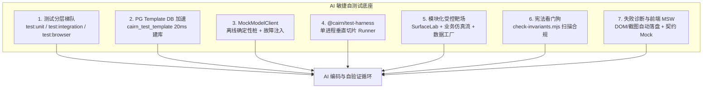
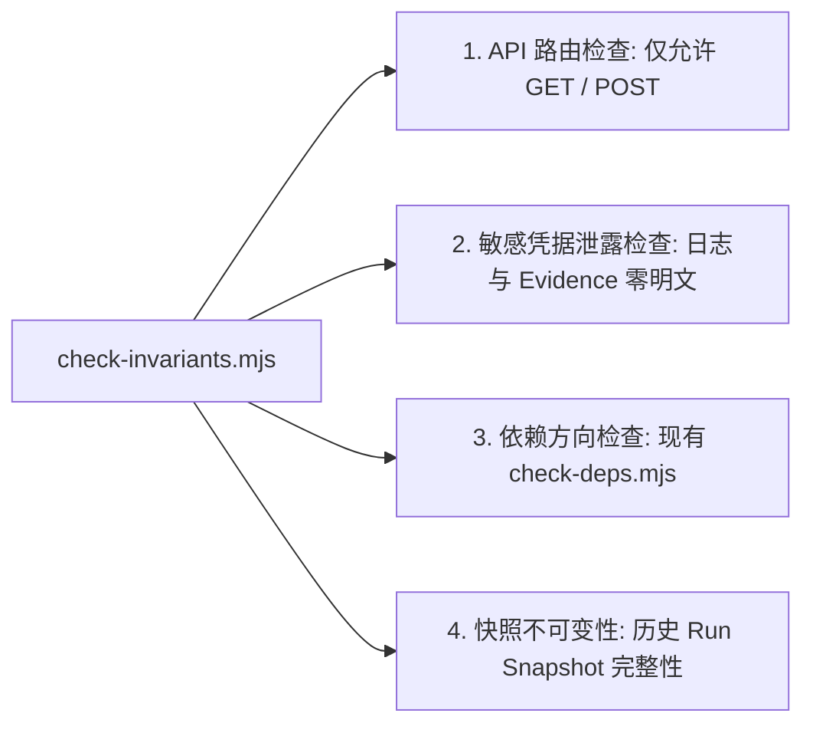
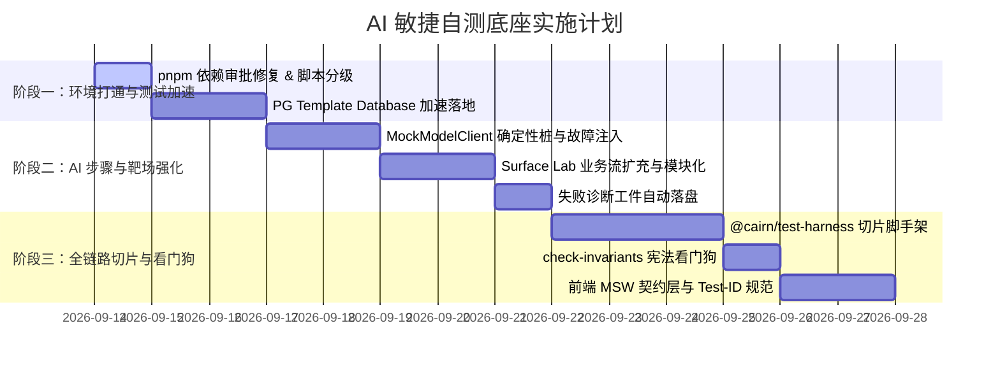

# 面向 AI 敏捷自测与验证的底座增强方案

日期：2026-09-13。状态：**方案待审（2026-09-13）**。
对应：[工程计划](../plan/识途开发路线与工程实施计划.md) 质量策略、D0~D4 持续交付支撑；关联 [识途宪法](../../AGENTS.md) 与 [架构设计](../arch/03_识途Execution与Browser_Runtime详细设计_v1.0.md)。

---

## 1. 背景与核心痛点

随着识途平台逐步进入 **P8/P9（AI 步骤闭环）**、**P10/P11/P13（确定性场景编写 Studio）** 以及 **P12（录制回填与混编）** 的高密度功能演进期，AI 编程助手（Agentic Coding Assistant）已成为核心的开发参与者。

然而，在 AI 进行代码编写、重构与功能交付时，现有的测试底座和开发基础设施存在若干阻断自测、延长反馈周期的结构性瓶颈：

1. **测试反馈周期过长，阻断秒级自验循环**：
   - 目前 `packages/worker` 包含 24 个用例文件，因 Postgres 隔离库竞争与浏览器句柄限制，配置了 `fileParallelism: false` 纯串行执行。整包单次运行需 **3~4 分钟**。
   - 缺少“纯内存/单元测试”、“轻量集成测试”与“重型端到端/真浏览器测试”的命令级分层。AI 哪怕只改动一个纯函数或状态校验，也往往触发重型套件运行，导致等待超时或上下文碎片化。
2. **根环境存在阻塞性报错**：
   - 根目录执行 `pnpm test` 时，因 pnpm 11 原生构建依赖审批机制（`[ERR_PNPM_IGNORED_BUILDS]: sharp`），直接报退出码 1 阻断，导致 AI 无法在根目录以单一命令完成全量质量验收。
3. **隔离数据库初始化开销过大**：
   - [packages/db/src/testing.ts](../../packages/db/src/testing.ts) 当前的 `openIsolatedDb` 对每个测试文件都执行 `CREATE DATABASE` 并在其上从头执行全量 14 个 Drizzle Migration（单次 1~2 秒）。数十个用例文件累加导致数据库开销占据总耗时的 60% 以上。
4. **缺乏确定性的大模型 Mock 与故障注入底座**：
   - 后续 P8/P9 的 `AI Action`、`AI Extract`、`AI Assert` 强依赖大模型交互。在本地自测与 CI 环境中，AI 无法也不应直接消耗真实的商用大模型 API（存在配额限制、网络延迟与偶发随机性）。
   - 缺乏确定性的 Mock 桩、快照回放（VCR）及针对超时、Rate Limit、格式错乱、幻觉等异常场景的故障注入工具。
5. **API 与 Worker 跨边界切片测试成本高昂**：
   - 识途的核心执行链路是 `API (创建) -> DB (持久化) -> Worker (原子领取/Lease) -> Engine (执行) -> Browser (操作/截图) -> Storage (证据) -> SSE (通知) -> Web (复盘)`。
   - 目前 API 与 Worker 的测试相互割裂。若要编写一条验证完整垂直切片的集成测试，需手写数百行样板代码手动拼装容器、数据库句柄与调度循环，阻碍了 AI 针对端到端特性的覆盖。
6. **受控靶场未模块化，业务仿真覆盖不足**：
   - [`tests/target-surface-lab`](../../tests/target-surface-lab/README.md) 虽已具备基础 DOM/iframe 样本，但每个测试文件都在手动调用 `http.createServer` 读取静态文件，且缺少标准的业务流页面（如包含凭据校验与验证码的登录流、多表单参数传递、分页异步加载等）。
7. **缺乏宪法不变量与合规自动化看门狗**：
   - 《识途宪法》（[AGENTS.md](../../AGENTS.md)）锁定了严格的 19 条铁律（如只能对外暴露 GET/POST、Worker 不调用 API、凭据脱敏、Evidence 独立状态轴等）。目前缺乏专门的静态扫描与合规测试，AI 编码易无意识触犯红线。
8. **UI 组件测试重型依赖真实后端**：
   - 针对即将构建的 Sequence Editor 复杂交互面板，缺乏前端标准的 MSW 契约 Mock 层与统一的 `data-testid` 规范；且无头浏览器测试失败时缺乏即时 DOM/截图落盘机制，AI 无法进行可视化根因自诊断。

---

## 2. 目标与非目标

### 目标

1. **环境与分级门禁打通**：
   - 修复根目录 pnpm 构建审批问题，实现根级 `pnpm test` 零错误畅通运行。
   - 建立明确的测试梯队：`test:unit`（纯内存，<2s）、`test:integration`（核心集成）、`test:browser`（L2 靶场）、`test:ai`（智能步骤桩）。
2. **PostgreSQL Template Database 加速**：
   - 在 `packages/db` 中引入模板数据库机制，仅在 `globalSetup` 中执行一次 Migration，测试用例建库耗时从 1.5s 压降至 20ms，整体集成测试提速 5~8 倍。
3. **标准 `MockModelClient` 与故障注入桩**：
   - 交付离线确定性模型桩，支持按 Prompt/URL 规则匹配坐标、JSON 提取物与断言理由；支持超时、429、格式损坏等故障注入，为 P8/P9 自测提供 100% 离线确定性环境。
4. **轻量级单进程垂直切片脚手架 (`@cairn/test-harness`)**：
   - 提供 15~20 行代码即可启动“轻量 API + 真实 DB + Worker Engine + 靶场 Browser + 证据落盘”的全链路测试辅助库。
5. **受控靶场模块化与业务流扩充**：
   - 将 `target-surface-lab` 封装为即调即用的单例/按需服务器，并新增登录流、表单联动流与分页数据表格流。
6. **宪法红线自动化看门狗 (`check-invariants.mjs`)**：
   - 自动扫描 NestJS Controller 路由（禁止 PUT/PATCH/DELETE）、扫描测试库与日志确保零明文凭据泄漏、验证历史 Run 快照不可变性。
7. **前端 MSW 契约层与失败自动诊断工件**：
   - 基于 `@cairn/shared` Zod 契约实现前端 MSW Mock；在 Playwright/Vitest 失败时自动保存当时的 DOM 快照与视口截图至 `.artifacts/test-failures/`。

### 非目标

- 不推翻现有 PostgreSQL / Drizzle / Vitest / Playwright / MinIO 的技术选型。
- 不引入重型服务网格或庞大的第三方大型测试云，所有能力保持本地自包含、无外网依赖。
- 不放宽任何《识途宪法》（[AGENTS.md](../../AGENTS.md)）中的 19 条硬性架构不变量。
- 不破坏现有各包的独立构建与目录边界。

---

## 3. 详细设计与关键模块



---

### 3.1 根环境修复与测试分层梯队

#### 3.1.1 根环境修复
在工作区配置文件 `pnpm-workspace.yaml` 中将 `sharp` 加入构建放行名单，消除 pnpm 11 的安全中断：
```yaml
allowBuilds:
  '@swc/core': true
  esbuild: true
  sharp: true

onlyBuiltDependencies:
  - esbuild
  - '@swc/core'
  - playwright
  - sharp
```

#### 3.1.2 脚本分级体系
在根目录及各个 package 中规范化测试命令：

| 命令 | 目标覆盖 | 运行依赖 | 预期耗时 | 适用场景 |
| :--- | :--- | :--- | :--- | :--- |
| `pnpm test:unit` | 纯领域 Schema、Zod 契约、状态机计算、数据清洗、参数解析 | 纯内存，无 DB，无网络，无浏览器 | < 3s | AI 每次改写基础逻辑时秒级自查 |
| `pnpm test:integration` | API Controller、DB Repository、Session/Run 租约流转 | 本地 PostgreSQL 模板库、MinIO | < 30s | AI 提交服务层改动时的中度自查 |
| `pnpm test:browser` | Browser Surface、Playwright 操作、靶场交互 | Chromium Headless + Surface Lab | < 60s | 浏览器动作与定位器验证 |
| `pnpm test:ai` | AI 步骤规划、提取、断言逻辑 | MockModelClient 离线环境 | < 15s | P8/P9 智能执行器逻辑验证 |
| `pnpm test` (全量) | 依赖检查 + 宪法看门狗 + 迁移检查 + 全包测试 | 全栈基础基础设施 | < 2min | PR 提交前最终总体验收 |

---

### 3.2 数据库模板加速 (PostgreSQL Template Database)

#### 3.2.1 机制原理与并发约束
当前痛点在于每个测试都要反复执行 14 次迁移脚本。PostgreSQL 支持原生 `CREATE DATABASE "db_target" TEMPLATE "db_template"` 特性：
1. **全局准备（一次性）**：
   - 在 Vitest 的 `globalSetup` 阶段，连接 PostgreSQL 创建基准模板库 `cairn_test_template`（若存留则先 `DROP ... WITH (FORCE)`）。
   - 在该库中一次性执行全部 Drizzle Migrations。
   - **关键约束**：执行完成后**必须完全关闭连接池**并执行 `REVOKE CONNECT ON DATABASE cairn_test_template FROM public`，确保无任何活跃连接。否则 Postgres 会抛出 `55006: source database is being accessed by other users`。
2. **测试用例建库（亚秒级）**：
   - 测试文件调用 `openIsolatedDb(name)` 时，优先探测模板库：
     ```sql
     CREATE DATABASE "cairn_test_xxx" TEMPLATE cairn_test_template;
     ```
   - 若模板库存在，建库耗时从 **1500ms 降至 20ms**。
   - **平滑降级（Graceful Fallback）**：若开发者/AI 独立运行单个测试文件而跳过了 `globalSetup`，捕获异常后自动降级为传统“新建库 + 执行 migration”，确保单个文件随时可独立 debug。
3. **测试收尾**：
   - 保持现有的 `DROP DATABASE ... WITH (FORCE)` 机制不变。
   - `globalTeardown` 中清理 `cairn_test_template`。

---

### 3.3 确定性大模型 Mock 与故障注入桩 (`MockModelClient`)

#### 3.3.1 接口契约
在 `packages/worker/src/ai/` 规范化通用模型访问适配接口：

```ts
export interface ModelRequest {
  type: 'action' | 'extract' | 'assert';
  systemPrompt?: string;
  userPrompt: string;
  screenshotBase64?: string;
  schema?: Record<string, unknown>;
  options?: { timeoutMs?: number; temperature?: number };
}

export interface ModelResponse<T = unknown> {
  content: string;
  structured?: T;
  usage?: { promptTokens: number; completionTokens: number; totalCostUsd?: number };
  model: string;
}

export interface IModelClient {
  invoke<T = unknown>(req: ModelRequest): Promise<ModelResponse<T>>;
}
```

#### 3.3.2 `MockModelClient` 功能
1. **模式切换**：
   - `mock`：依据注册的规则或预置响应直接返回。
   - `replay`：从 `.fixtures/cassettes/` 加载已持久化的单测快照。
   - `passthrough`：仅在显式设置 `CAIRN_AI_ONLINE=1` 时直连商用大模型。
2. **确定性注册与规则匹配**：
   ```ts
   const mock = new MockModelClient();
   // 按意图或页面特征模拟 Action 坐标
   mock.onAction(/点击登录按钮/i).reply({
     action: 'click',
     point: { x: 240, y: 180 },
     confidence: 0.95
   });
   // 按 Schema 模拟数据抽取
   mock.onExtract(/提取订单总额/i).reply({
     orderId: 'ORD-9981',
     amount: 128.5
   });
   ```
3. **故障注入能力**：
   ```ts
   // 模拟超时
   mock.onAction(/卡顿步骤/).timeout(5000);
   // 模拟速率限制 429
   mock.onAction(/频繁调用/).throwError('RATE_LIMIT_429', 'Too many requests');
   // 模拟返回损坏的 JSON
   mock.onExtract(/解析错误/).replyMalformedJson('{"order": 123');
   ```

---

### 3.4 进程内垂直切片测试脚手架 (`tests/harness`)

#### 3.4.1 目录归属与架构边界
依据 `tools/check-deps.mjs` 的宪法依赖规则，`packages/api` 与 `packages/worker` 互不依赖，生产代码中 Worker 严禁依赖 API。
因此，垂直切片测试脚手架必须放置在 **`tests/harness/`**（与 `tests/target-surface-lab` 同级作为测试基础设施），仅在端到端测试生命周期中作为跨模块装配方，不污染 `packages/*` 的生产依赖方向。同时在 `.gitignore` 中显式放行 `!tests/harness/**`。

#### 3.4.2 调用范式与全链路驱动
```ts
import { CairnTestHarness } from '../harness/index.js';

describe('全链路垂直切片集成自测', () => {
  let harness: CairnTestHarness;

  beforeAll(async () => {
    harness = await CairnTestHarness.create({
      mode: 'in-process',
      useTemplateDb: true,
      enableBrowser: true,
      mockAi: true,
    });
  });

  afterAll(async () => {
    await harness.destroy();
  });

  it('完成：创建场景 -> 调度执行 -> 生成截图与证据 -> 控制台状态确认', async () => {
    // 1. 快速准备测试环境数据
    const target = await harness.seedTarget({
      name: '测试系统',
      entryUrl: harness.lab.url('/auth-flow'),
    });

    // 2. 编写并发布场景
    const scenario = await harness.createScenario({
      targetId: target.id,
      steps: [
        { type: 'navigate', input: { url: harness.lab.url('/auth-flow') } },
        { type: 'fill', input: { selector: '#username', value: 'admin' } },
        { type: 'fill', input: { selector: '#password', value: 'secret' } },
        { type: 'click', input: { selector: '#login-btn' } },
        { type: 'assert', input: { selector: '#welcome-banner', text: '欢迎回来' } }
      ]
    });

    // 3. 触发运行并由内置 Worker 执行完成
    const runResult = await harness.executeRun(scenario.id);

    // 4. 验证核心事实源与不变量
    expect(runResult.status).toBe('SUCCEEDED');
    expect(runResult.attempts).toHaveLength(5);
    
    // 5. 验证证据落盘（元数据在 PG，截图在 Storage）
    const evidenceList = await harness.listEvidence(runResult.id);
    expect(evidenceList.length).toBeGreaterThanOrEqual(1);
    expect(evidenceList[0].storageKey).toBeDefined();
  });
});
```

---

### 3.5 业务仿真受控靶场与数据工厂

#### 3.5.1 `tests/target-surface-lab` 扩展
将原有的单文件 `server.mjs` 改造为支持程序化调用的服务模块，并新增核心业务路由：

1. **统一 API**：
   ```ts
   import { startLabServer, type LabServerInstance } from '@cairn/test-lab';
   const lab = await startLabServer({ port: 0 }); // 随机端口避免冲突
   console.log(lab.url('/auth-flow'));
   await lab.stop();
   ```
2. **新增业务路由集**：
   - `/auth-flow`：标准登录交互（含延时加载、账号密码校验、Session Cookie 写入、重定向仪表盘）。
   - `/order-flow`：主子表单录入（支持字段校验、提交后生成订单流水号并展示在 DOM 中）。
   - `/table-pagination`：分页异步列表（支持每页 10 条、搜索过滤、动态渲染，供 AI 批量提取测试）。
   - `/flaky-dom`：模拟偶发网络延迟、元素动态移除或重挂载、403 会话过期弹窗。

#### 3.5.2 测试数据工厂 (`@cairn/db/testing`)
提供统一构造器，杜绝手动拼接 SQL 字段：
- `createMockTarget(db, overrides?)`
- `createMockTargetAccount(db, targetId, overrides?)`
- `createMockScenario(db, targetId, steps, overrides?)`
- `createMockRun(db, scenarioVersion, overrides?)`

---

### 3.6 宪法不变量与合规自动化看门狗 (`tools/check-invariants.mjs`)

编写自动化扫描器，直接纳入 `pnpm check` 门禁，违规即红：



1. **API 接口合规检查**：
   扫描 `packages/api/src/**/*.controller.ts` 的 AST 树，断言只存在 `@Get()` 与 `@Post()` 装饰器，任何 `@Put()`、`@Patch()`、`@Delete()` 立即报错。
2. **凭据泄漏扫描器**：
   在测试钩子中注册检查器：扫描当前写入 DB 的 `evidence`、`run_snapshots` 记录及 Pino 日志流，若出现测试中生成的真实密码明文，立即中断测试并标红。
3. **快照不可变性验证**：
   固化自动化用例：先创建一个 Scenario 并生成 Run；修改该 Scenario 的后续版本；断言该 Run 关联的 `run_snapshots.snapshot_definition` 无任何改动，digest 计算严格一致。

---

### 3.7 前端 MSW 契约层与失败自动诊断工件

#### 3.7.1 前端 MSW Mock 契约层
在 `packages/web` 中配置基于 MSW (Mock Service Worker) 的测试环境：
- 基于 `@cairn/shared` 中的 Zod Schema 派生标准返回。
- 前端测试 Sequence Editor、Run Detail 时，直接使用内存 Mock，无需启动后台真实 NestJS 和 Postgres，测试在 500ms 内完成。

#### 3.7.2 测试失败自动诊断工件落盘 (Failure Artifacts Dump)
在 Playwright 与 Vitest 中注册全局 `afterEach`：
```ts
afterEach(async ({ task }) => {
  if (task.result?.state === 'fail' && currentTestPage) {
    const artifactDir = resolve(root, '.artifacts/test-failures', task.id);
    await mkdir(artifactDir, { recursive: true });
    
    // 1. 自动截取失败时刻的屏幕
    await currentTestPage.screenshot({ path: `${artifactDir}/screenshot.png` });
    // 2. 自动保存失败时刻的完整 DOM 结构
    const html = await currentTestPage.content();
    await writeFile(`${artifactDir}/dom.html`, html, 'utf8');
    // 3. 打印对 AI 友好的直接查看路径
    console.error(`\n🚨 [测试失败现场已保存]:\n  DOM: ${artifactDir}/dom.html\n  截图: ${artifactDir}/screenshot.png\n`);
  }
});
```
AI 在收到报错信息后，可直接调用 `view_file` 读取上述文件，秒级确认是因为页面渲染超时还是选择器失效。

---

## 4. 实施路线与交付 Gate



### 阶段验收 Gate

| 阶段 | 交付物 | 验收 Gate（通过条件） |
| :--- | :--- | :--- |
| **Phase 1<br/>基础闭环与加速** | - 根 `package.json` pnpm 配置<br>- `packages/db/src/testing.ts` 模板库实现<br>- `pnpm test:unit` 脚本 | 1. 根目录下执行 `pnpm test:unit` 在 3 秒内全绿通过。<br>2. 数据库集成测试建库耗时从 >1s 降至 <50ms，Worker 测试整包时间缩短 60% 以上。<br>3. 根目录执行 `pnpm check` 零报错。 |
| **Phase 2<br/>AI 离线桩与靶场** | - `MockModelClient`<br>- 模块化 `target-surface-lab`<br>- 失败工件自动落盘钩子 | 1. 在完全断网或无 API Key 情况下，可稳定运行 AI 步骤的规划、抽取与断言用例。<br>2. 成功捕获并验证超时、429、JSON 损坏 3 类故障注入。<br>3. 模拟故意失败测试，自动在 `.artifacts/test-failures/` 准确落盘 HTML 与截图。 |
| **Phase 3<br/>全链路脚手架与看门狗** | - `@cairn/test-harness`<br>- `tools/check-invariants.mjs`<br>- 前端 MSW Mock | 1. 使用 `CairnTestHarness` 仅用一个文件即可跑通完整执行与证据链路。<br>2. 故意注入一个 `@Patch()` 端点或泄漏明文密码时，`check-invariants` 必须可靠变红报错。<br>3. 前端可在无后端进程时运行完整的编排交互单测。 |

---

## 5. 风险与规避策略

1. **PostgreSQL 模板库连接占用风险**：
   - *风险*：若某个测试在创建库后未断开连接，会导致后续 `DROP DATABASE` 失败或模板库被加锁。
   - *规避*：严格在 `openIsolatedDb` 的清理逻辑中配置 `WITH (FORCE)` 选项，并由连接池监听器统一捕获 `57P01` 断连通知，不将正常关闭信号抛为未处理异常。
2. **Mock 与真实大模型行为脱节风险**：
   - *风险*：Mock 返回格式过于理想化，掩盖了真实大模型可能存在的细微格式瑕疵。
   - *规避*：在 CI 中保留可选的夜间/每周冒烟任务（`CAIRN_AI_ONLINE=1`），以极低频次对真实模型跑少样本验证，并更新本地快照文件（Cassettes）。
3. **靶场端口冲突风险**：
   - *风险*：并发测试或前序测试异常退出导致端口占用。
   - *规避*：模块化后的 `startLabServer` 默认使用系统随机空闲端口（`port: 0`），并将实际获得的端口动态注入测试上下文。
