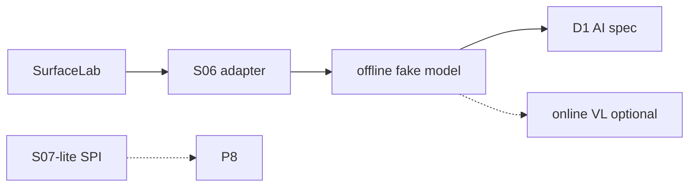

# D0 混编关键未知：受管 Page 适配层探针

日期：2026-09-13。状态：**离线 Gate 已记录**。本文冻结适配层范围、夹具、离线 Gate、失败出口与时限。在线 VL 未跑，不否定离线结论。

对应[工程计划](../plan/识途开发路线与工程实施计划.md) D0 的 S06，以及限时 1 日的 S07-lite。方向依据见[混合自动化与录制编排复核](2026-09-13-hybrid-authoring-direction-review.md)。P8 / P9 正式接入须另写方案，且只能收本探针已验证的控制面结论。

前置（代码侧已具备）：Browser Surface 与五个确定性 Web Step、Session / 双 Lease、[`tests/target-surface-lab`](../../tests/target-surface-lab/README.md)。受管 Page 路径必须走 `BrowserSessionManager.acquire` + 真实 PG，写法对齐 [`engine.lab.spec.ts`](../../packages/worker/src/browser/engine.lab.spec.ts)。

明确不是前置：录制上传实现仍可能只在工作区、未入库；本探针不依赖它，也不再把它写成「已落地 Gate」。S08 最小表仍以[录制上传方案](2026-09-13-extension-login-and-recording-upload.md)为准，不在此重开。Vendor 快照见 [vendor/README.md](../../vendor/README.md)（Midscene `v1.12.6`）。适配层依赖同版本 npm `@midscene/web` / `@midscene/core`，结论对该发布版成立；若改为直接改 vendor 源码，必须重跑并改记版本来源。

范围：在 Worker 里做一层 **P9 骨架适配**，证明平台能让 Midscene 服从受管 Page。S07-lite 只产出页内 Agent 的 SPI 约束，不做采用 / 拒绝。  
不是 Model Gateway 产品化、不是 AI Step 注册、不是 Sequence Editor、不是 SSE / Live View、不是旧 JS、不是录制回填 Studio、不是 Stagehand 对照。

## 1. 为什么改问法

上一稿问「Midscene 默认是否服从受管 Page」。这个问题从 vendor 就能读出答案：**默认不服从**。

- `aiAct` 只在每轮规划前和一批动作执行完之后看 `abortSignal`（`vendor/midscene/packages/core/src/agent/tasks.ts`）。`session.appendAndRun(executables.tasks)` 执行已规划点击时不检查。abort 落在「规划已返回、动作未跑完」窗口，点击仍会发生。单次第 9 步通过可能是假阳性。
- `aiQuery` 调 `executionOptions()` 时不传参，`abortSignal` 不走 `aiAssert` 那条透传。失败出口「只开放 aiQuery / aiAssert」本身不一定成立。
- 默认 `forceSameTabNavigation: true` 会注册永不移除的 `page.on('popup')`，关掉新窗并 `page.goto(popupUrl)`，绕过 Surface 的 `navigateInScope`。`destroy()` 之后监听还在。
- 默认 `forceChromeSelectRendering` 会给之后每个文档注入 `appearance: base-select`。`REUSE_PAGE` 用 `basePage`，污染会带进下一 Run。
- `launchPersistentContext` 的 `browser()` 为 `null`，「不得出现额外 Browser」没有对象可比。

因此本方案问的是：**识途适配层能不能让它服从**。产出物就是 P9 骨架：动作边检查、显式 `modelConfig` + 包装 client、页面残留检查。SDK 自带 abort 只负责少发模型请求。



## 2. 目标与非目标

### 目标

1. 扩展 Surface Lab：事件日志、`/canvas` 作为视觉目标、缺字段变体。无外网、可重置。
2. 交出适配层（`packages/worker/src/ai/midscene/`）。Engine 与 `WorkerModule` 不 import。`check-deps.mjs` 递归卡住 Engine 与非 `src/ai/` 路径引用 Midscene / page-agent。
3. **离线（D0 Gate）**：假模型 + 屏障，确定性验证取消、残留、受管 Page、模型调用计数、编造检测。不依赖真实 VL、不因模型采购卡住 D0。
4. **在线（非 Gate）**：有 `CAIRN_S06_ONLINE=1` 且显式 `modelConfig` 时加跑能力样本；失败记限制。L3 / DPM 默认不跑 AI（真实页面截图会外发）。
5. S07-lite（≤1 日）：自建无头注入，假 LLM，`customFetch` / `exposeBinding` 经 Worker；输出 SPI 约束清单。不做采用结论。
6. 每条离线结论可重跑。采用 / 限制 / 拒绝、命令和失败分类写回本文，不另开与方案平级的实验记录。工作区未提交时写 `HEAD` dirty，不假装有发布提交号。

### 非目标

- 不把 `ai_action` / `ai_extract` / `ai_assert` 写入 `EXECUTABLE_STEP_TYPES`。
- 不改 Engine 分发，不在本期修复 `fill.from` 对象 `JSON.stringify`（D8 记为已知缺口）。
- 不建 P8 Gateway 产品。适配层的包装 client 只是 Router 要吃的接口形状。
- 不做 Sequence Editor、SSE、Live View、旧 JS、S08 复验。
- 不修 popup → 当前 Surface / `pageRef`。popup 在 S06 **只记录，不进 Gate**。
- 不做 P9 的 5×5×3 评估集。
- 不注入 Page Agent 官方 demo IIFE（会连公网、自动初始化、显示面板）。
- 不把夹具通过写成已兼容企业系统。

## 3. 时限与 D0 退出归属

Spike 时限按计划第 4 节：S06 ≤ 3 个工程日，S07-lite ≤ 1 个工程日。超时未得出控制面结论则记限制采用或未完成，不得用「缺模型」抵充离线未跑。

| D0 退出项 | 归属 | 本方案是否 Gate |
| --- | --- | --- |
| 可重置夹具 + 可重跑样本 | 本文 §4 | 是 |
| S06 适配层让 Midscene 服从受管 Page | 本文 S06 离线 | 是 |
| S07 完整（真模型、凭据代理、分类评估） | P8 之后，归 D3 | 否 |
| S07-lite SPI 约束 | 本文，单独退出 | 否（不挡 D1 AI 方案） |
| S08 结构化导出 | 录制上传方案第 4 节，已记录 | 否 |
| S08 真实页面与转换缺口补测 | **待认领**（已落地方案不再承接新工作，建议归 P12 / D2 方案） | 否 |
| 本地录制与 Worker 的网络、登录条件 | **无人认领**，须另案，不在本文冒领 | 否 |
| S-LIVE 画面与受控认证 | 另案，可并行 | 否 |
| 旧 JS 受管调用 | D3 / P15 | 否 |

工程计划 D0 行与「S08 不重开」并存：本方案不删除计划原文，只声明哪些退出项由本文负责。D1 的 AI 部分只看 S06 离线结论。

## 4. 决策

本节 D1–D16 是方案内部编号，不是工程计划 D0–D4。

### D1. 问的是适配层，不是 SDK 默认值

禁止把「`new PlaywrightAgent(page)` 默认跑通」写成通过。必须显式：

- `forceSameTabNavigation: false`
- `forceChromeSelectRendering: false`
- `generateReport: false`
- `modelConfig` 为 plain object，并传包装过的 `createOpenAIClient`
- 动作边包装 `actionSpace()` 的 `call`

Midscene 在构造 Agent 时缓存 `fullActionSpace`，必须在 `new Agent` **之前**包装 `PlaywrightWebPage.actionSpace`。

### D2. 探针骨架放在 `src/ai/`，不进 Engine

路径：[`packages/worker/src/ai/midscene/`](../../packages/worker/src/ai/midscene/)。`WorkerModule` 不注册。进入正式 Run 必须另审 P8 / P9。

SDK 取 npm `@midscene/web@1.12.6`（与 vendor 快照同版本）。不把 vendor 推进 workspace，以免未安装 / 未构建的 vendor 成为隐前置。

### D3. 夹具是离线 Gate；真实目标不是

通过条件只用 Surface Lab。SNC DPM / L3 **默认不跑 AI**。设置 `CAIRN_S06_ONLINE=1` 且操作者知情截图外发时才能加跑，失败不否定离线。

### D4. 受管路径与「无自开浏览器」的可检查项

必须：`openIsolatedDb` → 登记 Target / Account → `registerWorker` → `BrowserSessionManager.acquire` → `pageForGrant`。禁止 `surface.lab.spec.ts` 那种直接 `launchSession`、无 SessionLease 的路径冒充受管。

`browser()` 在 persistent context 上为 null，改验三项：

1. `context.pages()` 在适配层调用前后的集合差（只允许样本步骤自己打开、且须记名）。
2. 本机 Chromium 相关进程数不因适配层净增（允许 Session 已有的那一份）。
3. 探针期间把 `chromium.launch` / `launchPersistentContext` / `browser.newContext` 打桩为抛错。

失败则拒绝 Chrome Bridge 或私自 launch 作为正式 Run 路径。

### D5. AI 步骤之后当前页仍属平台

**AI / 适配层调用返回后**，URL 与 `Page` 对象必须仍是 `pageForGrant` 那一页，除非该步本身是导航。SDK 抢走当前页则限制可改导航的类别。

### D6. popup 只记录，不进 S06 Gate

对照默认开 / 关 `forceSameTabNavigation` 的残留与跳转，写入本文落地结论。产品适配层固定关闭强制同 Tab。页面交接产品化归后续 P5 方案，不在 D0 假装已修。

### D7. 平台在动作边保证「abort 后零新动作」

```text
AbortSignal 或 SessionLease 失效
        ↓
包装后的 DeviceAction.call 抛错
        ↓
页面上不得再出现新的 click / input（读 window.__labEvents）
```

- abort 时机用屏障固定：包装 client 先扣住第 N 次模型请求，测试方 abort（或标租赁失效），再放行。与计划第 6 节「用屏障控制竞争顺序」一致。
- 丢租与取消走**同一个**检查函数，不推到 P9。本期用「检查函数读到 leaseLost」模拟，不要求完整 fencing 竞态。
- SDK 的 abort 只作为少发模型请求的辅助。第 9 步不得再写成「对 aiAct 随机 abort 一次看运气」。
- `aiQuery` / `aiAssert` 不得当作「SDK 自己停得住」的退路。只读类别若要进 D1，必须同样经过包装 client + 动作边（无动作也应零模型续呼）。

`destroy()` 不关页（Midscene `destroy` 对 Playwright page 基本是空操作）。「页面仍可用」几乎一定通过。真正要验的是 **destroy 之后还留下什么**（D15）。

### D8. 输出接续：验编造与 Engine 缺口，不验脚本自己

手写 `const orderNo = query.orderNo; fill(orderNo)` 按构造就会过，不是未知。

本探针要验：

1. **编造**：`/hybrid-missing` 页面没有单号。假模型返回像样的 `orderNo`。独立 DOM 断言页面不含该值，适配层 / 样本必须标 `fabricated` 并拒绝交给后续 fill。
2. **Engine 已知缺口**（本期不修，P9 / Compiler 必须面对）：
   - `contextKeySchema` 只接受标识符。
   - `contextValue` 只解包 `extract` 的 `value`（[`engine.ts`](../../packages/worker/src/engine/engine.ts)）。
   - `fill.from` 遇到非字符串会 `JSON.stringify`，`{ orderNo: "…" }` 会变成 `{"orderNo":"…"}` 灌进输入框且不报错。

离线样本若要把 AI 输出交给规则 `fill`，必须先取出**字符串字段**再写入 context。对象整包进 context 不算接续通过。

### D9. 显式 modelConfig，禁止回落进程环境

- 只用 Agent 构造参数里的 `modelConfig` + `createOpenAIClient`。这是 P8 Router 要接的口。
- 离线必须在 `MIDSCENE_*` / `OPENAI_*` 全为空（或测试里显式 stub 掉）的环境下跑，证明不会回落到 `globalModelConfigManager`。
- 包装 client 记录每次调用；解析失败的语义重试计入调用数。
- 运行目录用 `@midscene/shared/common` 的 `setMidsceneRunDir()` 指到临时目录（`@midscene/shared` 须显式列为同版本依赖）。不设 `MIDSCENE_RUN_DIR`，否则与上一条「`MIDSCENE_*` 全为空」冲突。`generateReport: false`；若仍落盘，检查报告不含凭据。
- 不得把演示 Key 或 `.env` 里的空 `MIDSCENE_OPENAI_*` 当成已路由。`.env.example` 删除 `MIDSCENE_*`，改列平台自有键（如 `CAIRN_S06_MODEL_BASE_URL` / `_NAME` / `_FAMILY` / `_API_KEY`），由适配层读取后经 `modelConfig` 显式传入。在线运行若往进程环境写 `MIDSCENE_MODEL_*`，全局配置里就有值，「未回落」检查会被掩盖。

### D10. S07-lite：自建无头入口，不注入 demo IIFE

官方 IIFE（`page-agent` demo）加载即初始化、默认连公网、从 script URL 读 apiKey、默认面板和遮罩。注入它会破坏夹具、违反「不访问外网」。

lite 要求：

- 自建脚本：无面板、无遮罩、不自动 init。落地用的是只转调 binding 的替身，不是 `PageAgentCore` 本体：本探针只验证 binding 机制（nonce、stop、CSP 下可用、导航后失效），Page Agent 本体的注入、`stop()` 与导航重建随完整 S07。
- 模型请求经 `exposeBinding` 交给 Worker；Worker 用假 LLM。
- `context.route` 拦截非 Lab origin，外网请求失败。
- 按 Attempt 发 nonce，校验请求形状。页面任意脚本裸调 binding 必须被拒（反向滥用：目标站可花平台额度）。
- 覆盖：注入、导航后状态、CSP 页、Worker 侧 stop、binding 可达性。

### D11. S07-lite 不做采用结论

产出 [`packages/worker/src/ai/page-agent/spi-constraints.md`](../../packages/worker/src/ai/page-agent/spi-constraints.md)。完整真模型、凭据代理、分类评估放到 P8 之后。官方已写明的限制（当前页、同源单层 iframe、多页靠扩展）直接记入清单，不必再用探针「发现」一遍。

### D12. 可选 Stagehand 对照仍不在本期

保持工程计划 S-ALT：仅当 S06 出现明确缺口或降本假设时另开。本期不建第三套适配。

### D13. 依赖边界必须自动检查

`tools/check-deps.mjs` 递归扫描：

- `packages/worker/src/engine/**` 不得出现 midscene / page-agent / `@midscene` / `@page-agent`。
- `packages/worker/src/**` 除 `src/ai/**` 外同样不得出现。
- Engine 边界单测改为递归，不能只扫一层目录。
- `packages/*` 下除 `@cairn/worker` 外，任何 manifest 不得声明 `@midscene/*`、`page-agent`、`@page-agent/*`；`@cairn/shared`、`@cairn/api`、`@cairn/web` 源码同样不得引用。

### D14. 离线先于在线

取消、popup 残留、页面残留、输出接续、模型计数都是控制面，必须用按请求序号回放的假模型做确定性验证。缺模型环境时**不得 skip 整个 S06**。在线步骤单独用 `CAIRN_S06_ONLINE=1`。

假模型不需要完整复刻 Qwen-VL 视觉规划格式才能过 Gate：控制面测试可以直接调用包装后的 `DeviceAction.call`，并用假 client 的屏障模拟「规划已返回 / 请求进行中」。若后续要把假响应喂进完整 `aiAct` 循环，工作量单列，超时则记限制，不挡离线 Gate。

但直接调用 `call` 只证明检查函数本身成立，证明不了 Midscene 的所有页面动作都经过 `actionSpace`。只做了直调时，S06 离线结论只能写「动作边检查成立」，不能写「aiAct 在 abort / 丢租后零新动作」。后者至少需要一次完整 `aiAct` 循环（假响应回放或在线运行），配合同一屏障与 `__labEvents`。在此之前可以写 D1 AI 方案，但 AI Action 类别不得开放，完整循环验证列为 D1 内部前置。

### D15. destroy 之后验残留，不验「页还能用」

适配层构造前后对比 Page 监听器与注入物，不得有未登记差异。destroy 之后：

1. 在 `/popup` 上用规则 `click` 打开子窗，行为与未创建 Agent 时一致（子窗在、当前页不 `goto` 子窗 URL）。
2. `REUSE_PAGE` 的下一 Run 没有 popup 监听和 select 样式残留。

### D16. 结论写回本文，不另开文档

Spike 的采用 / 限制 / 拒绝、可重跑命令和失败分类写进本文 §9 与落地结论。可重跑证据在测试里。不在 `docs/spec/` 再开一份同级「实验记录」。普通功能方案落地后只改状态与 CHANGELOG，不套用本条。

## 5. 夹具与样本

### 5.1 页面

| 路径 | 作用 |
| --- | --- |
| `/canvas` | 视觉目标。点击画布后结果区出现单号。无稳定 role 可点中画布内容 |
| `/hybrid-missing` | 检索成功但 DOM 无单号，供编造检测 |
| `/popup` | 已有。残留与规则 click 对照 |
| `/` | 已有。规则 fill / extract |
| `/csp` | S07-lite：同时限制 `script-src` 与 `connect-src`；验证注入是否生效，页内 `fetch` 模型请求被拦时 binding 路径是否仍可用 |

所有相关页引入 `/lab-events.js`，把 click / input / navigate 记到 `window.__labEvents`。探针用 `evaluate` 读取，作为「abort 后无新点击」的夹具侧证据。

### 5.2 S06 离线样本（脚本，不是 Scenario）

1. 受管 acquire → 规则 `navigate` `/canvas`
2. 包装动作边执行一次「点击画布」（模拟已规划动作）
3. 假模型返回 `{ orderNo }`；独立 DOM 断言页面含该号后，写入**字符串** context
4. 规则 `fill` / `assert` 只引用该字符串
5. `/hybrid-missing` + 假模型编造 → 样本 helper 识别为 `fabricated`（正式路径不做编造拦截，由场景里的确定性断言核对）
6. 屏障扣住第 N 次模型调用 → abort / leaseLost → 放行 → 动作边零新 click（读 `__labEvents`）
7. destroy 后 `/popup` 规则 click；`REUSE_PAGE` 下一 Run 无残留
8. `MIDSCENE_*` 为空；包装 client 无回落；launch 打桩未被调用
9. release：pages 差与进程数符合 D4

在线（可选）：真实 `aiAct` 点画布、`aiQuery` 抽单号。不进 D0 Gate。

### 5.3 S07-lite 样本

注入替身脚本（只转调 binding）→ 一次假 LLM binding → 导航后须重建或显式失效 → CSP 页上注入是否生效、页内 fetch 被 `connect-src` 拦下而 binding 仍可用 → stop 后 binding 拒绝 → 无 nonce 调用失败。

## 6. 验收

**本文 Gate** = 夹具可重跑 ∧ S06 离线控制面通过。S07-lite 单独退出。popup 记录不是 Gate。在线不是 Gate。

### 6.1 不算通过

- 只跑官方示例站或直接 `launchSession`。
- 对 `aiAct` 随机 abort、看一次运气。
- `destroy` 后页面还能点就当残留通过。
- 脚本自己传 JS 变量当「输出接续」。
- 用进程环境 `MIDSCENE_*` 当统一路由。
- 注入 demo IIFE。
- 为过探针向 Engine 注册 AI Step 或放松边界检查。
- 缺模型就 skip 整个 S06。

## 7. 现在不做 / 债务

1. popup → `pageRef`：P5 后续方案。
2. `fill.from` 对象 stringify：P9 / Compiler。本期用测试钉住现状。
3. 完整 `aiAct` 假响应回放：2026-09-14 已补（见 §11），不再挡 AI Action。
4. 平台 AI 证据、预算、Token：P8。
5. S07 完整版、S-LIVE、S08 网络 / 登录条件、旧 JS。
6. ADR A08 accepted：S06 离线通过后起草。

## 8. 探针之后

| 结论 | 下一步 |
| --- | --- |
| S06 离线采用或限制采用 | 可写 D1 AI 方案（P8 最小 Gateway + P9 收已验证控制面） |
| S06 离线拒绝 | D1 只交付确定性编辑；不得开放 AI 混编 |
| S07-lite 完成 | SPI 清单供 P8；不挡 D1 AI 方案 |
| 在线未跑或失败 | 记限制，不否定离线 |

## 9. 能力矩阵

| 编号 | 问题 | 决策 | 开放 | 关闭 | 证据 |
| --- | --- | --- | --- | --- | --- |
| S06 离线 | 适配层能否让 Midscene 服从受管 Page | 限制采用 | 动作边 abort/丢租（含完整 aiAct 回放下取消、超时、真实丢租零新动作）、只读拒绝整条动作通道、显式 modelConfig、安全标志构造、AI 执行过动作后 destroy 与 REUSE_PAGE 无未登记残留、迟到调用经会话作废不串 Run、AI 新开窗口收尾关闭 | 在线 VL、对象 context 直接 fill.from、编造拦截（平台不做；离线只验证样本比对 helper，正式路径由确定性断言核对） | §11；`packages/worker/src/ai/midscene/*.spec.ts` |
| S06 在线 | 真 VL 在夹具上的能力 | 未跑 | | 全部在线类别 | 需 `CAIRN_S06_ONLINE=1` |
| S07-lite | 页内 Agent 的 SPI 约束（替身脚本验证 binding 机制） | 已记录，无采用结论 | 无 | Page Agent 本体注入 / `stop()` / 导航重建、真模型 / 凭据代理 / 分类评估 | `packages/worker/src/ai/page-agent/` |

## 10. 修订

- 2026-09-13：初稿（问 SDK 默认是否服从）。
- 2026-09-13：复用优先，S07 / Stagehand 改为条件触发。
- 2026-09-13：吸收评审。问法改为适配层；D7 改动作边 + 屏障；残留与 REUSE_PAGE；D8 编造与 Engine 缺口；D9 显式 modelConfig；D4 三项检查与真实 PG；S07-lite；D0 归属表与时限；popup 退出 Gate；离线先于在线。
- 2026-09-13：落地离线 Gate 与 S07-lite。Worker `src/ai/` 骨架、`@midscene/web@1.12.6`（从 `playwright/agent` 入口，避开 `@playwright/test`）、夹具事件日志。S06 记限制采用。
- 2026-09-13：复查补齐 `.env.example` 改为 `CAIRN_S06_*`、`setMidsceneRunDir`、D13 跨包检查、离线样本 3–4/6/8–9 与 CSP binding。
- 2026-09-13：落地结论并回本文，删除与方案平级的实验记录。
- 2026-09-14：复查补完整 `aiAct` 回放下的停止用例；gate 接入 SessionGuard，修复真实丢租后仍可动作。
- 2026-09-14：复查第 3–7 项：矩阵收窄编造与残留表述并补 AI 执行后残留用例；S07-lite 注明替身；AI 新开窗口收尾关闭、hung 不被页面检查盖掉；迟到调用跨 Run 隔离用例；SDK 调试日志按 Agent 存活期轮换。

## 11. 落地结论

提交 `d111800`。适配层依赖 Midscene npm `1.12.6`（`@midscene/web` / `core` / `shared`）。

可复跑（在 `packages/worker`，避免仓根 `pnpm --filter` 触发 ignored `sharp` 构建）：

```text
npx vitest run src/ai/page-agent/inpage-binding.spec.ts src/ai/midscene src/engine/engine.boundary.spec.ts src/engine/engine.browser.spec.ts
node ../../tools/check-deps.mjs
```

2026-09-13 本机：7 个文件、44 条通过；`check-deps` 通过。未跑 `CAIRN_S06_ONLINE=1`。未做完整 `aiAct` 假响应回放——§9 只能写「动作边检查成立」，不能写「aiAct 在 abort 后零新动作」。（2026-09-14 已补，见下。）

2026-09-14 复查补齐完整循环：

- 修复：续租失败只 revoke 进程内 SessionGuard、不 abort 步骤信号，原 gate 只看信号，真实丢租后 Agent 仍能点击。`port.ts` 改由 `createStepGate` 构造 gate，动作边与模型边同时校验 `SessionGuard.assertHeld`。
- 新增 `managed-page.lab.spec.ts`「正式适配层：完整 aiAct 循环里的停止」：真 Midscene 规划循环，模型响应按序号回放 qwen3-vl 格式，在第 1 次规划已返回、动作尚未开始时注入。对照组真实点中画布；取消、超时、真实丢租三种注入均零新动作、出站模型调用保持 1 次；只读 Agent 在同一循环里零动作。`formal-agent.spec.ts` 补只读拒绝未知动作名。
- 反向验证：临时去掉 guard 校验，「真实丢租」用例点击 1 次而失败；恢复后通过。
- 本机：action-gate / formal-agent / port 单测 3 个文件 12 条通过，`managed-page.lab.spec.ts` 10 条通过，`check-deps` 与 Worker `tsc --noEmit` 通过。
- 已知现象：gate 拦下模型请求后 Midscene 自带一次约 2s 的重试，同样被拦、不出站。

2026-09-14 复查第 3–7 项：

- 残留：新增用例在 AI 真正执行过动作之后再查残留（Node 侧 popup / load 监听、页内新标签拦截器、元素检查器全局、select 样式），并验证规则 popup 不被劫持、REUSE_PAGE 下一 Run 无残留。对照：SDK 默认参数构造的 `PlaywrightAgent` 会被检出 popup、load 监听与 select 样式，说明检查看得见。
- 编造：原「不得交给 fill」用例没有调用 fill，断言形同虚设；改为只验证样本比对 helper，§9 把编造拦截列入关闭——正式路径不做，由场景里的确定性断言核对。
- S07-lite：注明注入的是只转调 binding 的替身，结论只对 binding 机制成立；Page Agent 本体归完整 S07。
- 新窗口：`settleAiCommand` 在步骤收尾先关闭 AI 新开的页，再报 `AI_POPUP_UNSUPPORTED`；未落定结果原样返回，页面检查不再盖掉 hung（`withManagedPage` 范围检查失败的分支同样保留）。
- 迟到调用：扣住规划响应模拟卡在底层调用里的 SDK，gate 故意不接信号。先 invalidate 再 release 时，下一 Run 换了新页、旧页已关、零迟到点击；对照组不作废会话时，迟到点击落到下一 Run 复用的页面。
- 日志：`run-dir.ts` 以 Agent 存活期计数，全部销毁后轮换到新一代目录并删除旧代；仍有 Agent 在途但单代超过 64 MiB 也轮换。
- 本机：`src/ai` 下 10 个测试文件全部通过，`check-deps` 通过。

2026-09-14 丢租分类：

- 问题：gate 拦下动作后 SDK 抛出被它包过一层的报错，`AiResult` 没有错误码字段，执行器一律记 `AI_EXECUTION_FAILED / EXECUTOR`。Engine 判中止只看取消与超时信号，丢租不触发，于是副作用 AI 步骤被记成普通失败，绕过了 `finishAttempt` 对「成功但会话租约已失效」的处置（`runs.ts`：SIDE_EFFECT 进 NEEDS_REVIEW、其余 FAILED）。
- 改法：`ActionGate` 记 `actionsStarted`；`leaseLostError` 只看这条计数，不解析报错文本——已放行过动作记 UNKNOWN（副作用步骤由引擎转人工核查），没放行过记 INFRASTRUCTURE。`AiResult` 增加可选结构化 `error`，端口在丢租两处填它，执行器原样使用。
- 附带：`shouldRetry` 对 `SESSION_LEASE_LOST` 不再重试——同一次执行复用同一份会话授权，guard 撤销后不会刷新，重试注定失败。
- 用例：端口单测验证分类与"SDK 包过的报错不影响分类"；lab 用例用真实 SDK 验证规划阶段丢租零动作、点过一次后丢租记 UNKNOWN；Engine 用例验证副作用进 NEEDS_REVIEW、只读记 `SESSION_LEASE_LOST` 且不重试（作者设了 `retryLimit: 2`，仍只尝试 1 次）。
- 反向验证：去掉"不重试"规则，未放行动作的用例重试 3 次而失败；去掉执行器的结构化错误透传，副作用步骤从 NEEDS_REVIEW 掉成 FAILED。
