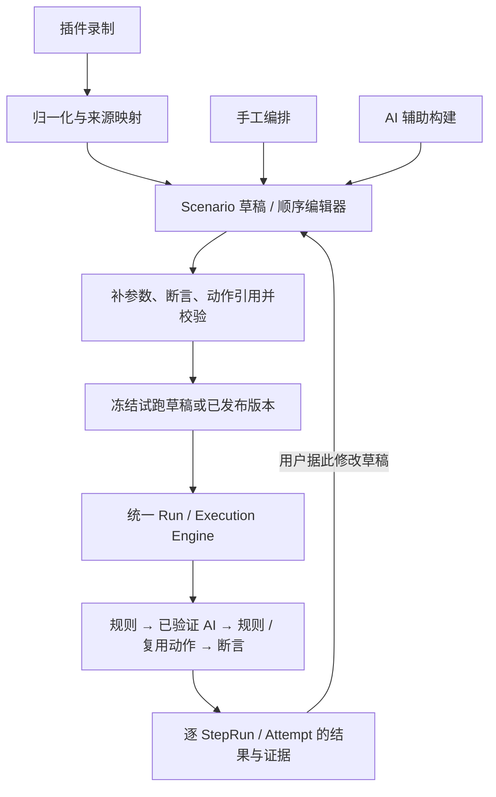

# 混合自动化与录制编排：方向复核与浏览器交互边界

日期：2026-09-13。状态：方向复核与行业依据；本轮交付调整已并入[唯一工程计划](../plan/识途开发路线与工程实施计划.md#5-当前交付顺序与验收样例)。本文不再维护独立路线图；新增能力仍须详细方案评审，不能视为已经实现。

本轮进一步确认复用优先与必要自研，依据见第 8 节；近期以规则与一个已验证 AI 的闭环为准，不把 Midscene＋Page Agent 的项目组合当作硬目标。候选角色与交付时点只维护在工程计划。

核对范围：Cairn 当前工作区（HEAD `6065ec1`，含未提交改动）、PulseAI 当前实现、相关产品官方资料；本轮收尾复核已纳入同日新增的插件登录与录制上传。代码结论来自静态审查；本次没有重新执行浏览器、AI 或故障注入测试。验收项不能当成已经通过的结果，阶段 Gate 统一以工程计划为准。

## 1. 判断

用户描述的产品目标成立：一个 Scenario 内，由用户按步骤组合规则自动化、所需 AI 能力和可复用动作；从浏览器录制生成可编辑草稿，再补参数、断言与业务模块，最终进入统一运行与证据体系。视觉和 DOM 是按需求采用的能力，不要求分别绑定两个框架。

这与成熟产品正在采用的混合自动化方向一致。仅凭“脚本与 AI 混编”不能判断比商业产品先进；差异应由真实系统的构建成本、首次试跑成功率、误操作、维护成本和失败解释能力证明。识途可以聚焦企业 Web 仿真、测试和巡检，无需把完整桌面 RPA、BPMN 和跨天人工流程都纳入第一版。

原架构的领域方向与这个目标一致。当前落地更接近执行基础设施，用户创建和修正场景的闭环尚未交付。需要调整后续顺序、补齐交接契约，并保留已经完成的持久化、Session、Lease 与 Evidence 能力。

不建议先把整个插件做完再开发平台。应该先验证受管浏览器中的混编，以及录制数据能否转换成平台步骤；随后以一条可编辑、可试跑的业务链路串起插件和平台。

## 2. 商业产品与技术路线对照

| 参考 | 官方资料确认的能力 | 对识途的启示 |
| --- | --- | --- |
| UiPath Maestro | 画布上的任务绑定自动化、AI Agent 与人工步骤，配置变量后测试、发布。[官方说明](https://docs.uipath.com/maestro/automation-cloud/latest/user-guide/understanding-process-implementation) | 混合执行单元与统一流程管理是已有产品方向。 |
| Automation Anywhere | Automation 360 v.38 将 AI Agent 纳入 Process Composer，与 bots、API 和文档流程一起编排。[发布说明](https://docs.automationanywhere.com/r/automation-360/automation-360-v38) | AI 节点需要成为可配置、可治理的流程组成部分。 |
| Power Automate Desktop | 录制结果转换为可编辑的 flow actions；Copilot 生成步骤属于另一个构建入口，相关生成能力仍标注 preview。[录制文档](https://learn.microsoft.com/en-us/power-automate/desktop-flows/recording-flow)、[Copilot 文档](https://learn.microsoft.com/en-us/power-automate/desktop-flows/copilot-in-power-automate-for-desktop) | “录制 → 动作 → 编辑”成立；生成流程的 AI 与运行时操作页面的 AI 要区分。 |
| Stagehand | Agent 提供 DOM、视觉 CUA 与二者组合的模式，文档中的 Hybrid 需要 experimental 开关。[Agent 文档](https://docs.stagehand.dev/v3/basics/agent) | DOM 与视觉互补也是浏览器自动化的现实路线，但不能忽略不同模式的能力限制。 |

这些资料支持产品模式的比较，不证明各家都在底层共享同一个 Playwright Page，也不构成稳定性或商业效果的独立实测。

### Midscene 与 Page Agent 的定位

- 本文将用户所说的 MidSense 理解为 Midscene。Midscene 提供 Playwright 集成，可绑定已有 Page；Chrome Bridge 是另一种接入方式。[官方 API](https://midscenejs.com/reference/)
- Alibaba Page Agent 主要通过 DOM 文本理解和操作页面，没有视觉识别能力。官方限制页列出了嵌套／跨域 iframe 等不支持项；可选扩展增加多页与浏览器层控制。不能从 Playwright 能操作某类 iframe，推导出 Page Agent 也支持。[官方 README](https://github.com/alibaba/page-agent)、[能力限制](https://alibaba.github.io/page-agent/docs/introduction/limitations/)
- Cairn 固定的 vendor 快照与在线文档未必完全一致，适配验证应锁定实际提交、SDK 和模型版本。[当前来源记录](../../vendor/README.md)

## 3. 应交付给用户的产品模型



运行中的步骤链共享 Browser Session 与显式 Execution Context。上图的多个构建入口不表示 MVP 运行时支持分支或并行。

需要区分以下概念：

| 概念 | 应表达的含义 |
| --- | --- |
| Step Type | 点击、填入、提取、确定性断言，以及 AI Action / AI Extract / AI Assert 等用户意图。 |
| Executor / Provider | 完成该 Step 的实现，如 Playwright、Midscene、Page Agent。Provider 不应代替 Step 的输入输出契约。 |
| 步骤间混编 | 第 1 步规则、第 2 步视觉、第 3 步规则。首版核心能力。 |
| 单步内部 DOM＋视觉融合 | 同一步内融合两种感知或定位结果。独立的后续优化，不应成为步骤间混编的前置条件。 |
| 复用模块 | 有名称、版本、参数与输出的 Business Action；可由结构化子步骤实现，也可能需要受控代码实现。 |
| 画布 | 首版是可增删、重排、配置的顺序步骤画布。自由连线不能代替 Step 契约和运行语义。 |

AI Step 保存每次运行都要完成的意图。一次执行中的点击轨迹只进入 Evidence。多个独立 Step 也不能为了省一次 Agent 调用而合成一条大 prompt，再把一个整体结果复制成各步的独立结论。

### “传统脚本”需要拆成两项验收

第一项是通用规则步骤，例如录制产生的 Navigate、Fill、Click。第二项是 PulseAI 里已经写好的 JS 模块复用。实现前者，并不意味着已经支持后者。

建议通用步骤作为默认编辑方式，重复步骤收成版本化 Business Action。确需复用既有 JS 时，首版只注册平台维护的可信模块，明确输入输出、模块版本／摘要、允许能力、超时取消和 Evidence；只使用传入的受管执行能力。任意用户上传 JS 需要独立的执行隔离设计，单靠路径白名单或 TypeScript 接口不能形成安全隔离。

## 4. Cairn 的方向与实际进度

### 本次调整前的历史诊断

[原 MVP 路线文档，现为范围与验收基线](../arch/05_识途MVP范围与开发实施路线图_v1.0.md)在调整前把核心闭环定义为“多入口构建、混合步骤、会话复用、逐步证据”，要求早期验证 Midscene、Page Agent、RPA → AI → RPA 和 Recorder；当时 Vertical Slice 的第二条就是录制。

[工程计划](../plan/识途开发路线与工程实施计划.md)的 v1.0 曾选择 P0–P7 先完成 Runtime Foundation，P8–P9 接 AI，P10–P11 做正式编译与编辑器，P12 才交付 Recorder，P15 才做动作复用。它并非完全禁止提前验证：允许 AI 探路、P10 与 AI 工作交错推进，但 Recorder 的 S08 探针仍排在 P11 后。以上是本次修订前的情况，已不代表当前排期。

这个调整有合理部分：状态事实、所有权、凭据和证据必须可信。问题在于最能检验产品是否成立的三个交接——录制转步骤、不同执行器接续、用户修正后试跑——被放得较晚，基础设施的阶段验收无法替代它们。

### 当前代码核对

| 能力 | 当前证据 | 判断 |
| --- | --- | --- |
| 持久化运行基础 | Engine、RunSnapshot、RunLease、SessionLease、恢复、Evidence 与授权下载已有实现；方案索引记录了对应交付。 | 保留并复用，不建议推倒。未在本次重新验收其运行结果。 |
| 确定性浏览器步骤 | [step.ts](../../packages/shared/src/step.ts)注册 navigate、click、fill、extract、assert，另有三个测试步骤。 | 已有基础浏览器能力，尚未覆盖录制器全部操作类型。 |
| AI 混编 | 同一 Step Schema 尚无 AI 类型；[Engine](../../packages/worker/src/engine/engine.ts)当前分发测试步骤与 BrowserCommand。 | 统一生命周期已有基础，AI Adapter、模型路由及其调度接入未落地。vendor 源码不等于运行能力。 |
| 场景编辑 | [新建场景](../../packages/web/src/features/scenarios/create-dialog.tsx)仅使用 FIXTURE_STEP_TYPES；[详情页](../../packages/web/src/features/scenarios/detail.tsx)展示步骤及 JSON 输入。 | 当前不是供业务用户编排真实 Web 流程的 Studio。 |
| Draft / Publish | [场景 Repository](../../packages/db/src/runs/scenarios.ts)已有创建／追加不可变版本；[场景契约](../../packages/shared/src/scenario.ts)主要是 active／disabled 与可执行 steps。 | 版本基础可复用；带未完成项的草稿、并发修订、发布和试跑边界仍待建设。 |
| 输出接续 | 当前 from 主要支持 echo、fill 的命名键；extract 返回带 value 的对象。 | 需要验证结构化 AI 输出如何选择字段交给后续填入／断言，不能只证明共享了一个 Context 对象。 |
| 录制上传 | 收尾复核时，[插件面板](../../packages/extension/playwright-crx/src/cairn/panel.tsx)、[录制契约](../../packages/shared/src/recording.ts)和 recordings API 已新增；[模块方案](2026-09-13-extension-login-and-recording-upload.md)记录插件登录、Target 绑定、JSONL 整批上传为 IR 草稿。 | 上传与草稿展示基础已有；平台 Studio 发起、回填可编辑 Scenario、试跑发布闭环仍待完成。本次未重跑该模块验收。 |
| 新窗口交接 | [surface.ts](../../packages/worker/src/browser/surface.ts)明确写明 popup 不成为后续步骤的当前 Surface；TargetDescriptor 尚无 pageRef。 | “能打开新窗口”与“下一步能在该窗口继续”是不同能力，混编前必须补齐或明确限制。 |
| 实时观察 | [Run 页面](../../packages/web/src/features/runs/detail.tsx)当前依赖手动 GET 刷新，API 未见 SSE 路由。 | 最小观察面已有，SSE 尚待完成；不是已经存在错误的高频轮询。 |

### PulseAI 可以继承什么

PulseAI 的 [逐步执行实现](../../../PulseAI/src/server/runtime/extension-executor.ts)已经按计划切换 Provider，并复用现有 SessionManager 与 BrowserManager。它对真实登录、Bridge 就绪、tab 交接、失败样本的经验有直接价值。

也有明确的迁移限制：

- [buildScriptStepPlan](../../../PulseAI/src/server/services/task-run-service.ts)仍拒绝多个脚本步骤，并限定 extension runtime 与 midscene_bridge。
- [Page Agent Provider](../../../PulseAI/src/server/services/browser-worker/providers/page-agent-hub-provider.ts)的 structuredLocator 分支直接使用 Playwright，说明 Provider 名称与实际动作方式已有交叠，迁移时需拆清。
- ExtensionExecutor 会合并相邻且符合条件的 Midscene 步骤。Cairn 需要以每个 StepRun / Attempt 的真实完成条件重新审视这一优化。
- [阶段记录](../../../PulseAI/docs/summary/2026-06-01-step-level-mixed-provider-execution-summary.md)说明当时的步骤截图只生成 ref，未保存二进制。因此不能把该阶段记录当作完整证据链已经通过的证明；当前 Cairn 的对象存储能力应继续使用。

## 5. 需要先补齐的边界

### 5.1 浏览器在哪里运行，谁能操作它

首发模式建议使用 Worker 纳管浏览器。Midscene 优先验证 Playwright Adapter；Page Agent 若按业务需求启动，再独立验证页内注入、导航后重建、模型代理、取消和权限限制。API 不持有正式浏览器。

录制发生在用户 Chrome，并不意味着 Worker 拥有相同的登录态、证书、内网访问和本地文件。先用真实目标验证这一差异。如果目标必须使用用户机器上的认证或网络，应把受管本地 Worker／Local Browser Bridge 提前；这个通道仍需进入统一 Run、Snapshot、Lease 与 Evidence。

同一 Session 的独占还不足以保证步骤接续。必须约定当前页面、popup 的归属和选择、关闭页面的处理、Frame 重新定位，以及 Provider 完成时交回哪个页面。外部动作一旦发出无法被数据库 fencing 撤回；取消／丢租后不能可靠停止的适配器，应受限或被隔离，不能宣称安全可重试。

### 5.2 插件登录与目标登录是两种身份

插件连接到具体平台实例，复用控制台登录与授权，服务器从认证上下文确定上传人，并验证其 Target 权限。TargetAccount 表示运行时登录业务系统的账号；不能拿业务账号来推断上传者。

录制上传协议至少解决：来源版本、录制 ID、操作顺序、Target、幂等重传、内容大小、诊断与返回的草稿 ID。登录过期、用户切换、上传中断和 MV3 生命周期不能造成数据串归属或假成功。第一版可结束后整批上传，不需要先造持续流式上传系统。业务 API 继续只用 GET／POST。

现有上游壳有下载 storage state 的能力，但这不应自动进入录制上传包。密码、Cookie、Token 和实际登录态与操作录制分开处理；敏感输入应在采集侧排除或转成待填参数。

### 5.3 录制的是操作，平台要的是可维护定义

[playwright-crx 官方说明](https://github.com/ruifigueira/playwright-crx)确认其 Player 使用内部 JSONL，而非真正执行各语言导出的代码。初次审查时，公开 Recorder 类型没有可直接当平台协议使用的结构化 actions 事件；同日新增的[提取适配](../../packages/extension/playwright-crx/src/cairn/extract.ts)已从壳收到的 `sources` 选择 JSONL 的 actions／text，无需再新增引擎导出钩子。

后续复用现有提取、归一化和上传契约，补齐真实页面上的来源映射、Frame／popup 支持与用户编辑闭环；无需通用 JS 解析器，也不让上游内部字段直接成为 Scenario 事实源。已有夹具／模块测试记录与实际浏览器端到端验收仍应分别说明。

必须区分已记录动作、推测意图和缺失预期。连续输入可按明确规则合并；录制“点提交”不能自动证明“业务提交成功”。上游已经支持若干断言录制模式，应优先映射可支持的断言，缺失的预期交给用户补齐。

对键盘、选择框、文件、新窗口、iframe、Canvas 等逐项维护“可捕获／可导入／可执行”三列能力表。不支持的操作保留为待处理项，阻止将不完整定义发布；不能静默丢掉后宣称上传成功。

### 5.4 每步可接续、可验证、可停止

AI Action、AI Extract、AI Assert 各有契约。提取和判断用只读工具集合或可验证的能力限制，不能只在 prompt 写“不要修改”。每步明确输入、输出 Schema、目标范围、最大耗时／动作预算和失败行为。

在模型自报成功之外，使用业务后置条件检查结果。格式正确的 JSON 只证明契约成立，不证明内容正确。AI 提取订单号后，下一规则步骤必须能绑定该字段，并在错误类型、空值或缺字段时停止。

用户显式选用规则或已开放 AI 能力；第一版不需要智能 AUTO Router，也不以同时提供视觉／DOM 两个品牌为前提。失败后换 Provider 重做属于另一项重试策略，尤其不能在提交结果未知时盲目执行。每个逻辑步骤都保留自己的 Attempt、输出、可公开的判断说明和实际证据。

### 5.5 草稿编辑、试跑与发布

录制产生的半成品必须能保存。草稿可含未解决项，可执行快照则必须完成必需校验。试跑前冻结草稿，修改不能改变在途 Run，发布形成新版本。断言和参数绑定与编辑器一起交付。

从中间某一步调试需要该步所需的变量和页面前置状态。第一版可以从头试跑；不能把数组截掉前半段就宣称支持从任意步骤恢复。

### 5.6 录制入口、运行画面与控制协议

“嵌入平台”需要区分：用户从哪里点开始录制、被操作浏览器在哪里运行、平台展示什么内容。平台有录制入口，不意味着把目标网站放进控制台 iframe。

| 官方产品 | 录制或编辑入口 | 运行／浏览器交互可确认的事实 |
| --- | --- | --- |
| UiPath Studio Web | Web UI 自动化设计需要 Studio Web 与目标网站在同一浏览器，安装对应扩展。[设计说明](https://docs.uipath.com/studio-web/automation-cloud/latest/user-guide/using-ui-automation) | 默认运行使用云端 serverless robot；输出面板提供 Live streaming、新标签、全屏与画中画，并有 Take Control。[运行输出](https://docs.uipath.com/studio-web/automation-cloud/latest/user-guide/viewing-the-run-output) |
| Automation Anywhere | Web 编辑器发起录制，需本地已注册设备／Bot Agent，浏览器自动化依赖扩展；录制生成可编辑 Capture actions。[录制说明](https://docs.automationanywhere.com/bundle/enterprise-v2019/page/enterprise-cloud/topics/aae-client/bot-creator/using-the-workbench/cloud-capturing-recording.html) | 官方排障资料确认扩展与本地组件使用 Native Messaging Host；这只说明本地通信，不能推导远程画面协议。[扩展排障](https://docs.automationanywhere.com/r/automation-360/google-chrome-extension-troubleshooting?contentId=q~F4yS0I1Vslz_LD77D~Kg) |
| Power Automate Desktop | 桌面设计器的 Recorder 捕获实际桌面／Web 操作，生成 flow actions。[录制说明](https://learn.microsoft.com/en-us/power-automate/desktop-flows/recording-flow) | 浏览器扩展属于 Web 自动化集成；它不是“所有录制都在 Web 控制台 iframe 内”的例子。[扩展说明](https://learn.microsoft.com/en-us/power-automate/desktop-flows/install-browser-extensions) |
| Browserbase（浏览器基础设施） | 可提供供其他平台集成的远程浏览器，不等同完整 RPA 产品。 | Session Live View 明确支持将查看器 URL 嵌入 iframe，并可观看及交互；自动化通过另一个 connectUrl 接入 CDP。[Live View](https://docs.browserbase.com/platform/browser/observability/session-live-view)、[Node SDK](https://docs.browserbase.com/reference/sdk/nodejs) |
| Browserless（浏览器基础设施） | 可给平台提供现有远程 Session 的查看／交互入口。 | 官方 `Browserless.liveURL` 是供应商扩展的 CDP 命令，返回临时交互查看器 URL；这同时使用浏览器协议和供应商封装。[CDP extensions](https://docs.browserless.io/api-reference/cdp-extensions) |

因此可以确认行业存在“平台发起、本地浏览器录制”和“平台内看远程浏览器并交互”两类做法。UiPath 的用户文档未公开直播传输及 HTML 容器实现，不能据此认定其内部一定用 iframe、CDP 或某个私有协议。上表不是全行业占比统计。

技术上，这些名词位于不同层：

| 层 | 作用与识途建议 |
| --- | --- |
| iframe／Web 组件 | 前端展示容器。可嵌入受管浏览器查看器；直接嵌入业务站点会受目标站点 `frame-ancestors` 等策略限制，且并不等于 Worker 当前持有的 Session。[MDN](https://developer.mozilla.org/en-US/docs/Web/HTTP/Reference/Headers/Content-Security-Policy/frame-ancestors) |
| Playwright／CDP | 控制实际浏览器、页面、截图与输入。保留现有 Playwright Runtime；可用 CDP 会话验证画面采集，无需把整个执行器迁成 connectOverCDP。Playwright 明确说明 connectOverCDP 仅支持 Chromium，且保真度低于原生连接。[官方 API](https://playwright.dev/docs/api/class-browsertype#browser-type-connect-over-cdp) |
| 画面传输 | CDP `Page.startScreencast` 提供图像帧且标为 Experimental，输入有独立的 Input 命令；它们不是完整远程桌面产品。帧传输、中继、输入映射、时延与浏览器版本兼容需要 S-LIVE 实测。[Page](https://chromedevtools.github.io/devtools-protocol/tot/Page/#method-startScreencast)、[Input](https://chromedevtools.github.io/devtools-protocol/tot/Input/#method-dispatchMouseEvent) |
| 平台控制契约 | 平台自行定义谁能看、谁能操作、操作哪个 Run/Session/Page、何时收回控制权。可封装标准浏览器能力，不必发明新的底层浏览器协议；也不能把原始 CDP 直接暴露给 Web。 |
| SSE 与 Evidence | SSE 提示持久化运行状态变化；Live View 展示当前画面；Evidence 保存关联到具体 Attempt 的事实。三者分别承担职责，视频或截图流不能反推完整逻辑步骤。 |

建议的用户链路与控制边界：

```text
录制：Studio 发起 → 本地 Chrome + CRX → 结构化动作上传 → 同一草稿
试跑：Studio 发起 → 统一 Run → Worker / Browser Runtime → 受管 Chrome
观察：Studio / Run 查看器 ← 鉴权中继 ← 同一受管 Chrome 的画面
登录：获授权的输入 → 受控中继 → Browser Runtime 检查占用权后执行
状态：Worker → PostgreSQL → API / SSE → Studio / Run
```

Web 只连接平台受控入口，不直连正式 Worker。控制面可验证权限，中继转交浏览器控制命令；Worker 仍执行动作并直接持久化事实，不通过 API 回调写运行状态。平台业务接口仍遵守 GET／POST；画面通道先按 PoC 选择，不能把运行状态 SSE 当高帧率视频管道。

首版先做只读实时画面，以及首次登录／WAITING_FOR_AUTH 期间的受控输入。沿用当前[认证等待与恢复](2026-09-11-run-lease.md)：等待期释放 RunLease，Session owner Worker 依独立认证占用保住浏览器，确认自动化停止后才授予短时人工控制。认证输入不用已失效的执行 grant；断连、到期、取消或占用失效撤权。先关闭输入，再经 resume-auth 重新领取增代并检查认证与页面。通用的“任意 AI 动作执行中暂停、接管、续跑”需要单独验证 Agent 的停止能力，暂不承诺。

查看器切换展示的 tab 不应偷偷改变执行器当前 Page。导航、popup、画面尺寸、中文输入、断线后旧坐标输入、会话换代和敏感画面都要验证。仅前端禁用点击不能形成只读权限；也不默认保存密码按键流或所有直播帧。

将来若需要完全在平台内录制，仍须在远程浏览器中加入语义动作捕获，再进入同一录制协议。只有远程画面和点击坐标，还不足以生成可维护的 Locator、FramePath、参数和业务断言。当前优先复用 CRX，不先建设第二套完整录制器。

## 6. 交付顺序的唯一入口

本轮新增的 Live View、受控认证、录制交接与混编要求，已并入[工程计划第 5 节](../plan/识途开发路线与工程实施计划.md#5-当前交付顺序与验收样例)；本文原独立顺序表已删除。对应的实现边界与验收项维护在主计划 P7、P11、P12、P15 和 S-LIVE 中。

[arch/05](../arch/05_识途MVP范围与开发实施路线图_v1.0.md)保留范围与指标，本文保留现状证据和取舍；以后修改交付顺序只更新主计划。当前修订不要求重建已完成基础，也不代表新增模块的详细设计已经通过审查。

## 7. 贯穿各次交付的共同业务样例

准备一条约 10 步、数据可重置的流程，覆盖规则定位、一个已验证 AI 的操作／提取、数据交给后续输入、确定性断言与 AI 判断。额外 Provider 仅在实际决定采用时加入同样例评估。各次交付只验收主计划列明的部分；录制和模块复用不成为 D1 的额外前置。模块能力交付时至少安排两次调用，分别位于 AI 前后。真实系统的实验使用已授权范围；未知副作用、误点和故障实验放在受控夹具。

完整闭环需要覆盖：

1. 用户能在 Web 创建／修改步骤，并逐步选择已支持的执行方式。
2. 运行不因切换 Provider 而重新登录、换成另一个无关浏览器或丢失当前页。
3. 至少一个 popup／导航场景证明后续步骤获得正确页面；iframe 按各 Provider 的支持范围分别验收。
4. AI 输出交给确定性步骤，输出错误时能定位并停止；不能只验证固定字符串输入。
5. 中途取消与模拟丢租后停止新动作；未知副作用不自动切 Provider 再做一遍。
6. 能从持久化 Run／StepRun／Attempt 和实际证据复盘；修改模型配置、动作版本或草稿不改变历史解释。
7. 同一流程可从录制导入，也可手工构建，编辑后进入相同 Runtime；录制缺预期时明确提示补断言。
8. 普通用户无需改数据库、写 JSON 或让开发者代改代码，便能完成一次草稿到试跑的闭环。
9. 试跑可看到同一受管 Page，认证等待时有受控登录入口；断线显示明确，人工输入与自动化互斥，认证占用失效后旧控制授权被拒绝。具体 Gate 以主计划 LV01–LV06 为准。

后续每次新增能力，都应说明它让上述哪一步变得可用或更可靠。阶段完成的依据应包含这条用户流程，不能只由某个模块测试通过或管理页面完成来代替。

## 8. 复用优先决策的源码依据

本轮已下载正式发布快照供阅读，版本来源见[本机参考目录](../../vendor/ref/README.md)。以下属于静态核对，未安装、联调或比较真实运行成本；不把上游 main 分支和 Cloud 宣传直接算作该快照已经可用的能力。

- Midscene 的 [PlaywrightPageAgent](../../vendor/midscene/packages/web-integration/src/playwright/page-agent.ts)接受已有 Playwright Page，为现有受管浏览器接入提供入口；不因此认定取消、popup 和只读语义已通过。
- Stagehand 3.7.3 的 [V3 初始化](../../vendor/ref/stagehand/packages/core/lib/v3/v3.ts)支持通过指定 CDP URL 连接现有浏览器，适合作为执行 SDK 候选；它没有自动替代 Cairn 的场景、账号、运行和证据产品层。
- Skyvern v1.0.53 包含工作流、录制与运行持久化，确有整套复用价值；但[默认执行器](../../vendor/ref/skyvern/skyvern/forge/sdk/executor/background_task_executor.py)会拒绝 sequential credential 路径，[录制 code-first](../../vendor/ref/skyvern/skyvern/services/browser_recording/code_first.py)从代码派生展示步骤。迁移需要核对产品模型、自托管可靠性与[许可](../../vendor/ref/skyvern/LICENSE)，不能直接假设其 Cloud 能力完整包含在默认自托管中。
- n8n 可参考编排、数据映射与节点设计；[当前许可](../../vendor/ref/n8n/LICENSE.md)不能被理解为任意闭源白标售卖授权。参考设计、直接采用依赖和复制源码是不同的复用方式，实际采用时记录来源与适用许可。

因此当前保留 Cairn 产品与必要运行管理，复用成熟执行能力。自研边界、候选触发条件与取舍记录只引用[主计划复用边界](../plan/识途开发路线与工程实施计划.md#复用与自研的边界)，不在本文再建选型排期。未来整体迁移应以实际剩余交付成本和能力验证重新决策，既不因已有投入固守，也不因下载了源码就立即切换。
