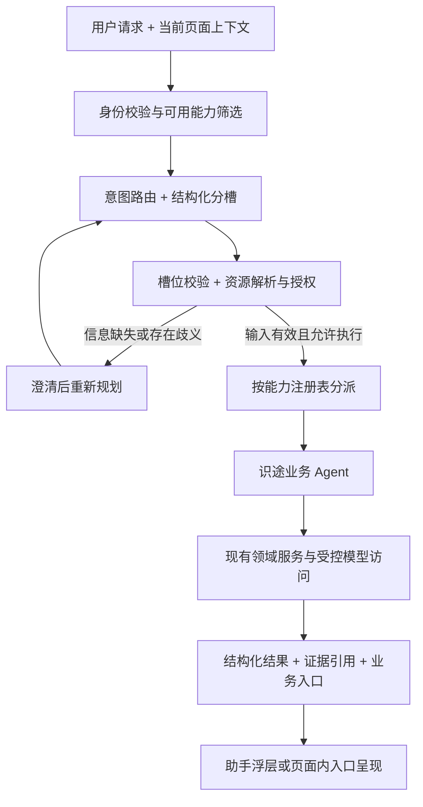

# 平台助手：架构复用边界与分层约定

日期：2026-09-14。状态：**架构复用方向已由用户确认；以下为分层与最小契约建议，具体 Agent 与实现方案待审，未实施**。

一期具体范围与验收标准见[平台助手一期方案](2026-09-14-platform-assistant-phase-one.md)，该方案已按权限先行原则落地一期契约。本文件保留架构复用范围，功能选择与实现细节以对应方案为准。

关联：[两类 AI 独立模型配置边界](2026-09-13-ai-model-configuration-boundaries.md)、[Scenario Authoring 与 IR](../arch/04_识途Scenario_Authoring与IR详细设计_v1.0.md)。交付顺序只维护在[工程实施计划第 5 节](../plan/识途开发路线与工程实施计划.md#5-当前交付顺序与验收样例)，本文不新增排期。

## 1. 已确认的复用范围

识途借鉴 `snc-log` 的架构逻辑：**用户请求与上下文 → 意图路由与分槽 → 校验与分派 → 具体 Agent 完成任务 → 结构化结果与业务联动**。

具体 Agent 的职责、业务输入输出、提示词、取数与操作能力，由识途按自身领域模型单独定义和实现。日志平台的调查、规则、数据源、字段等 Agent 不作为识途的能力清单。

复用重点是职责划分、调用契约与治理方式。前后端按识途现有 React / NestJS 工程落地；是否抽取共享实现，待存在稳定的共同契约后单独判断。本次不引入跨项目运行依赖。

已查看的参考实现如下。链接为本机源码位置，供设计溯源：

| 参考 | 可借鉴的机制 |
| --- | --- |
| [能力注册表](/Users/tinker/src/work/ChinaMobile/snc-log/log-api/internal/handler/ai_assist_registry.go) | 集中登记意图、说明、权限、槽位与处理入口，路由和分派消费同一份清单 |
| [助手分派与结果](/Users/tinker/src/work/ChinaMobile/snc-log/log-api/internal/handler/ai_assist.go) | 校验计划与操作者、按能力分派、结构化事实与受控业务链接 |
| [上下文分层装配](/Users/tinker/src/work/ChinaMobile/snc-log/log-api/internal/handler/ai_field_semantics.go) | 索引、相关语义和具体明细分层提供给模型 |
| [AI 功能契约治理](/Users/tinker/src/work/ChinaMobile/snc-log/DOC/spec/2026-08-20-ai-prompt-governance.md) | 提示词、输入装配、输出契约、修复、降级、预算与审计共同维护 |

## 2. 建议的最小调用链

| 层 | 职责与边界 |
| --- | --- |
| 交互入口 | 收集问句、当前页面和被选中的业务对象；页面上下文仅是候选输入，服务端重新解析与授权。浮层和页面快捷入口使用同一套能力 |
| 意图路由与分槽 | 识别本轮任务，选择已登记能力，提取结构化输入；不在路由阶段执行领域操作。明确的快捷入口可以跳过模型分类，仍经过相同校验与分派 |
| 校验与分派 | 用 Runtime Schema 校验槽位，解析资源与版本，检查权限及操作条件，绑定操作者和本轮任务，再交给对应 Agent。权限在实际取数或操作时仍由领域服务执行 |
| 业务 Agent | 实现该能力的输入装配、领域服务调用、必要的模型调用及结果校验；以明确结果完成本轮任务。简单能力可用单次处理器实现，有真实需求时再增加有界工具循环 |
| 结果呈现 | 展示解释、草稿、状态、证据引用或业务操作入口；链接和操作参数由受控代码产生，模型文本不直接成为可执行命令 |

槽位指任务需要的结构化输入，例如 `runId`、`scenarioId`、`stepId` 和修改意图。名称和类型随具体 Agent 确定，以上仅为示例。

多轮追问只在对应任务与资源范围内合并槽位；明确的新值、清空和沿用应可区分。缺少必填输入、有多个资源候选或对象关联冲突时进行澄清。切换任务或 Target 时不静默沿用旧资源槽位；不得用任意默认资源或扩大查询范围补齐缺失输入。

## 3. 通用层应稳定的契约

能力清单集中维护下列信息，供路由、分派与验收共同使用；具体字段名及持久化结构在实施方案中确定。

| 信息 | 用途 |
| --- | --- |
| 能力标识、版本与适用说明 | 告诉路由有哪些能力、何时使用；记录本轮由哪个版本处理 |
| 输入与输出 Runtime Schema | 限定槽位、必填项和产物，阻止未知字段或非法结果进入业务操作 |
| 所需权限、资源范围与操作性质 | 区分查询、建议、草稿变更和执行请求；据此落实授权及必要的用户确认 |
| 处理入口及上下文装配 | 分派到识途自己的 Agent，按需取得业务语义与授权事实 |
| 超时、取消、调用上限与降级 | 控制本轮资源消耗，明确失败或模型不可用时可以提供的结果 |
| 提示词与契约版本、审计关联 | 关联请求、操作者、能力、实际模型、用量及业务对象，支持复盘 |

上下文采用渐进装配：L1 提供当前调用允许使用的完整能力索引，L2 加载命中能力及相关领域语义，L3 按需加载授权后的对象事实、参数或证据。具体加载由代码控制；业务事实、用户材料和证据按不可信数据处理，不能改写能力权限与执行边界。

能力身份、槽位和处理入口保持一致，但不要求每一层都调用模型。领域事实读取复用既有服务；模型不可用时能返回事实的能力可降级返回事实及业务入口，需要模型产出的能力明确返回不可用，不伪造结果。

## 4. 与识途运行时的关系

| 概念 | 在识途中的含义 |
| --- | --- |
| 意图路由 | 根据问句与上下文选择业务能力，提取本轮输入 |
| 模型路由 | 为一次模型调用解析模型服务及配置；沿用两类 AI 配置边界，与意图路由分开 |
| 助手业务 Agent | 接受分派并完成平台任务；其具体功能由识途单独实现 |
| Step Executor | 在 Execution Engine 调度下执行 Scenario Step，受 Run / StepRun / Attempt 和受管浏览器约束 |

纯解释和辅助生成使用平台通用 AI，不为调用模型创建浏览器 Session 或伪造 Run。助手会话与槽位用于对话连续性，Run 的持久化状态和 Snapshot 继续解释正式执行；二者通过业务对象引用关联。

涉及场景编写时，产物进入版本化 Structured Step 草稿，并经过已有校验与编译。是否采纳草稿、发布或试跑由相应业务操作表达，不因一次模型回答成功而自动连续完成。

涉及目标系统执行时，业务 Agent 通过既有 Run 创建服务提交请求，由 Worker 的 Execution Engine、Executor Registry 和 Browser Runtime 执行。API 仍为控制面；助手不直接持有正式浏览器或绕过租约操作目标系统。正式运行的授权、绑定 Target、快照、状态与证据要求全部继承。

历史运行分析读取该 Run 的冻结定义及关联 Evidence，不用当前 Scenario 解释旧 Run，也不把助手的分析结论写成原 Run 的执行结果。若某项判断作为 Scenario 的 AI Assert 决定运行结果，仍进入统一的 StepRun / Attempt 与冻结执行配置。

通用模型访问可复用 SecretProvider、日志、超时取消与用量记录；平台 AI 与浏览器 AI 保持独立配置。公共实现的放置按现有依赖边界确定，不让 API 为复用模型客户端而依赖 Worker。

## 5. 后续功能定义与验收方向

后续每个 Agent 的方案应明确：用户任务、输入与缺槽处理、权限及资源范围、事实来源、产物、可用操作、模型需求、失败与取消行为、实际验收样例。首批功能的范围建议已展开到[一期方案](2026-09-14-platform-assistant-phase-one.md)，交付顺序仍由工程计划维护。

通用层的验收至少覆盖：

1. 新能力通过同一份登记信息参与路由与分派，缺失权限说明、Schema 或处理入口能被自动检查发现。
2. 路由结果为未知能力、非法槽位或缺少必填输入时，不执行其他能力兜底；明确快捷入口仍受全部领域校验约束。
3. 多轮槽位不跨用户、任务或资源范围泄漏；伪造页面上下文、过期版本及确认后变更的参数不能获得操作授权。
4. 模型输出中的链接、操作和业务对象引用经过代码校验；建议与事实可区分，证据能定位到相应历史对象。
5. 助手触发执行仍产生统一 Run 与冻结 Snapshot；状态通知丢失后能从持久化状态恢复，助手不建立独立的浏览器执行体系。
6. 具体 Agent 按同一批业务样例评估路由准确性、任务完成质量、人工投入与模型成本；采用哪些指标和门槛由该功能方案确定。

实现时与首个获批 Agent 一起落地必要的通用层、模型配置及调用方，避免先建设没有业务消费者的完整 Agent 平台。
