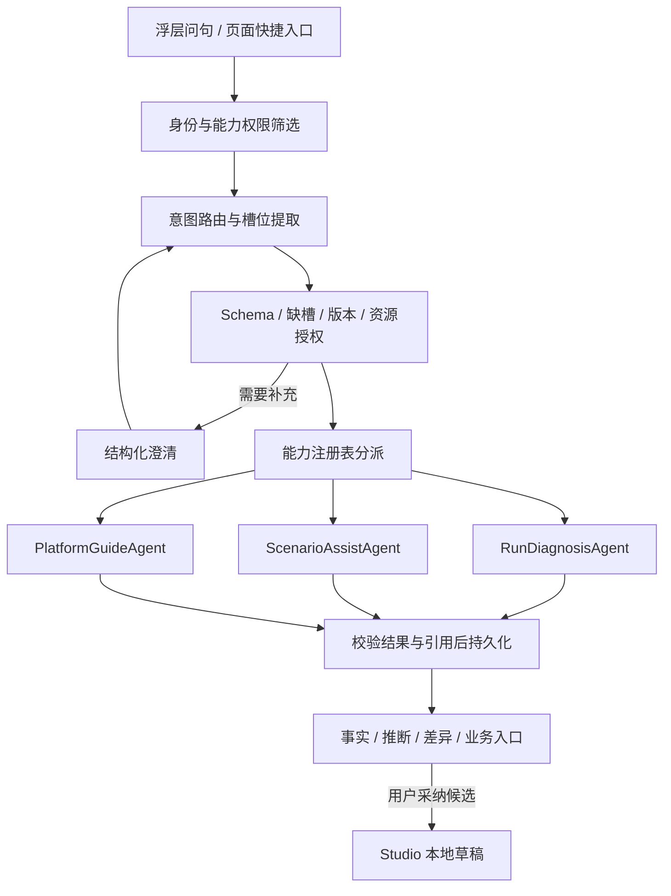

# 平台助手一期：运行诊断、步骤辅助与功能导览

日期：2026-09-14。状态：**已按权限先行原则落地一期契约**。审查记录：[一期方案审查](../reviews/2026-09-14-platform-assistant-phase-one-review.md)。实施验证：[一期落地验证](../reviews/2026-09-14-platform-assistant-phase-one-implementation.md)。

已确认的前提是复用 snc-log 的架构逻辑，具体业务 Agent 由识途实现，见[架构复用边界与分层约定](2026-09-14-platform-assistant-architecture.md)。本文提出一期的功能范围、调用契约、实现边界和验收标准，不代表这些具体范围已经审查通过。

关联：[两类 AI 配置边界](2026-09-13-ai-model-configuration-boundaries.md)、[顺序编排方案](2026-09-13-sequence-studio-foundation.md)、[运行观察方案](2026-09-13-run-realtime-observation.md)。交付顺序只维护在[工程实施计划第 5 节](../plan/识途开发路线与工程实施计划.md#5-当前交付顺序与验收样例)，本文不新增 D 阶段或有效排期。

## 1. 一期要交付的用户结果

一期围绕两个核心任务建设：**理解一次运行发生了什么，改善现有场景中的一个步骤**。功能导览作为轻量补充，共用一个助手入口和同一条路由分派链。

| 能力 | 用户问题示例 | 一期交付结果 |
| --- | --- | --- |
| 运行诊断 | “这次为什么失败？”“为什么一直等登录？”“慢在哪一步？” | 基于指定 Run 的状态、冻结定义与证据，给出事实、可能原因、缺失信息及可点开的处理入口 |
| 场景与步骤解释 | “这个场景在做什么？”“这一步为什么引用不到前一步输出？” | 解释指定版本或已保存草稿，定位到步骤、输入输出与 Compiler 诊断 |
| 单步修改建议 | “把这条 AI 指令写清楚”“把预期文字改成已完成”“改用前一步的金额字段” | 生成受限的结构化修改候选，展示差异；用户采纳到 Studio 后按现有流程保存、试跑 |
| 功能导览 | “在哪里配置目标账号？”“怎样查看失败证据？” | 返回平台已实现、符合权限的入口和简短操作说明 |

实现为三个业务 Agent：`RunDiagnosisAgent`、`ScenarioAssistAgent`、`PlatformGuideAgent`。场景解释和单步建议是同一场景 Agent 下的两项能力；前端不要求用户先选 Agent。

一期验收看用户是否更快定位问题、减少步骤配置与修正成本。助手能回答多少种闲聊、注册多少 Agent，不作为交付目标。

## 2. 建设依据与范围取舍

### 2.1 现有基础可以承接什么

| 已有实现 | 本期复用方式 | 仍需补齐的部分 |
| --- | --- | --- |
| [Run 一致观察](../../packages/db/src/observe/observation.ts)与[运行 DTO](../../packages/shared/src/run-api.ts) | 读取同一观察版本下的状态、Snapshot、StepRun / Attempt、Evidence | 面向模型的最小事实投影、证据引用校验与诊断结果 |
| [Scenario 草稿与诊断契约](../../packages/shared/src/scenario.ts)、[Compiler](../../packages/shared/src/compiler.ts) | 读取明确 revision，校验候选步骤及整份文档 | 受限候选 Schema、生成与差异呈现 |
| [Studio 三层草稿](../../packages/web/src/features/scenarios/use-studio-draft.ts) | 复用本地候选、字段草稿、撤销及版本冲突处理 | 采纳候选的受控入口与过期检查 |
| [产品权限与能力地图](../../packages/shared/src/rbac.ts) | 筛选可用能力，复用领域权限和功能身份 | 助手使用权限、可供模型读取的简短语义与路由映射 |
| [平台配置中心](../../packages/shared/src/platform-config.ts)及 SecretProvider | 延续配置修订、凭据保护和管理权限 | 平台通用 AI 配置及独立的文本模型调用方 |

现有浏览器 AI、模型探针和 Worker 内的模型接口，不等于平台通用 AI 已交付。配置和真实调用随本期功能一起实现。

目前的[三线复查记录](../reviews/2026-09-14-abc-integration-review.md)仍有联合验收与故障处理缺口。上表确认的是可复用实现，不将本次文档核对视为这些缺口已修复。助手功能按所依赖的事实、草稿和运行链路验收后开放。

### 2.2 一期边界

一期每轮处理一个明确任务，事实读取与工具分派由代码控制。Agent 可以调用受控模型完成理解、解释和受限生成；不建设自由规划的多 Agent 协作循环。

本期不包含整场景从零生成、增删重排步骤、推测新定位器、全站页面采集、知识库与经验学习、主动巡检、自动发布或自动执行 Run。运行截图和 Trace 提供授权查看入口，图片理解及 Trace 自动解析后续另行定义。

这些取舍让一期消费已有事实和已保存定义，避免把目标系统知识、浏览器感知或自主执行加入助手接入的前置。

## 3. 三个 Agent 的职责与产物

### 3.1 RunDiagnosisAgent：解释单次运行

**登记能力：** `run.diagnose`。所需权限为 `ai:assist` + `run:read` + `target:read`。助手不扩大权限：先具备平台角色与领域权限，再由 `ai:assist` 赋能。Run 及其绑定 Target 必须按现有 GET 可见（未删除）；缺少 `target:read` 或 Target 已不可见时不得诊断，也不得透露该目标的名称与详情。其他入口另按该入口权限判断。

**槽位：** 必填 `runId`；可选 `stepId`、`focus`，其中 `focus` 为 `overview / failure / waiting / timing`。`stepId` 必须属于该 Run 的 Snapshot。没有明确 Run 时，要求用户选择；一期不替用户选“最近一次”或自动扩大为跨 Run 分析。

**事实包：** 复用一致观察查询，记录 `eventSeq`、读取时间及 Snapshot 摘要；由代码提取以下内容：

- Run 状态、Evidence 完整性、等待认证／资源／人工核查原因。
- 目标步骤、失败或异常 Attempt、相邻依赖步骤的必要输入输出说明。
- 冻结的 Step 类型、执行策略、错误码、已脱敏的结构化证据、已有 AI 判断及用量。
- 持久化时间戳计算出的步骤与 Attempt 耗时；没有数据的成本、Token 或时间段标记未知。

**结果：** `facts[]`、`hypotheses[]`、`missingInformation[]`、`nextActions[]`。引用键为闭合格式 `run|stepRun|attempt|evidence|step:<id>`。`nextActions` 只允许 `run.detail` / `run.evidence` / `run.auth` / `run.review` / `studio.step` / `target.accounts` / `platform.config`；入口由服务端按引用键生成，不得出现重跑、取消、代填认证或代为核查。模型只能引用本轮事实包中的键。`focus=waiting` 覆盖 `WAITING_FOR_AUTH` 以及已有 `placement.state`（`owner_at_capacity` / `session_not_ready` / `owner_required` / `session_lost`），不新造 Run 状态。

业务语义由代码和验收样例守住：

1. Attempt 失败而后续尝试成功，不得将整个 Run 判为失败。
2. Run 成功但 Evidence 不完整，应分别解释；不将补证据等同于重跑业务操作。
3. `WAITING_FOR_AUTH`、资源等待和 `NEEDS_REVIEW` 分别给出对应事实及已有页面入口；未知副作用不得建议无条件重放。
4. 模型提出的原因标为推断并关联依据；证据不足时写明缺少什么，不输出未经证实的根因结论。
5. 运行仍在变化时展示“基于某时刻的状态”；旧回答保持原观察版本，用户重新提问才生成新诊断。

一期可以解释并跳转到已有处理页面，助手本身不执行取消、认证输入、恢复、核查结论或重跑。

### 3.2 ScenarioAssistAgent：解释定义，生成单步候选

**能力一：** `scenario.explain`，权限为 `ai:assist` + `workflow:read` + `target:read`。场景及其绑定 Target 必须按现有 GET 可见。

槽位为 `scenarioId`、`definitionRef` 和可选 `stepId`。`definitionRef` 明确为已发布 `versionId` 或已保存的 `draftRevision`；页面带来的版本须重新核对。没有明确版本时，通过上下文说明或澄清确定，不混用当前草稿与历史版本。

返回场景摘要、选中步骤作用、前序数据引用、输出契约和 Compiler 问题定位。前序引用和输出类型从共享契约取得，未知输出类型保持“运行时确定”。有未保存内容时，入口明确提示本轮解释的是已保存版本。

**能力二：** `scenario.propose-step`，权限为 `ai:assist` + `workflow:read` + `workflow:write` + `target:read`。没有编写权限的角色不得看到「修改建议」入口。

槽位必须包含 `scenarioId`、`draftRevision`、`stepId`、`changeRequest`。首版只接受已保存草稿中的现有步骤；生成入口要求当前 Studio 无未保存修改、无字段草稿和远端版本冲突。

候选用受限的联合 Schema 表达，一次只能返回下列一种变更：

| 候选种类 | 可修改对象 | 允许的变化 |
| --- | --- | --- |
| `ai_instruction` | 已有 `ai_action / ai_extract / ai_assert` | 替换 `instruction`；保留 Step 类型和现有提取输出契约，不生成 selector 或操作轨迹 |
| `assert_expectation` | 已有确定性 `assert` | 修改 `expect`，复用现有 `assertExpectSchema`；定位目标保持原样，目标不满足新预期的前置条件时返回诊断 |
| `fill_binding` | 已有 `fill` | 选择已有前序输出或已声明输入的 `from / fromField`；构造器去掉互斥的 `value`，保留定位目标与 `sensitive` |

修改断言的预期必须来自用户明确要求或已明确的业务条件，不得为了让失败变成功自行降低断言要求。字段值未知时澄清；无法从现有定义得到定位目标时不编造目标。

fill 的 `value` 无论是否标记敏感，都不得进入模型、会话正文或普通日志。构造器可以对敏感 fill 做绑定，并保持 `sensitive: true`。定位器或字段名命中现有敏感启发式时按敏感处理。Execution Context 与 Attempt 原始输出只传结构说明或已声明非敏感字段。事实包有字符上限，超出写入 `missingInformation`。文档摘要用共享 `canonicalJson` + SHA-256。

模型只返回上述候选数据。服务端用确定性构造器生成候选文档，保持 Step ID、顺序、类型、输出名称、副作用分类、执行策略、Target 绑定及凭据相关字段不变。禁止模型输出任意 JSON Patch 或整份 Scenario 替换。

生成结果必须经过候选 Schema、`stepSchema`、`scenarioDocumentSchema` 和现有 Compiler。候选新增的编译错误阻断采纳；基线原有、与本次修改无关的未解决问题可保留，但必须展示诊断并标注“尚不可执行”。比较采用结构化诊断的 code / stepId / fieldPath，不比较中文 message。不将结构合法解释为已经通过试跑。

**采纳流程：**

1. 返回候选、改前改后差异、理由、诊断，以及来源 `draftRevision`、原文档摘要和 `stepId`；摘要基于规范化文档，由前后端共用的函数计算。
2. 用户点击“采纳到编辑器”。前端检查当前 revision、文档摘要与生成来源一致，且没有字段草稿或远端变更；不满足时保留本地编辑，要求基于当前草稿重新生成。
3. 候选进入 Studio 本地草稿，支持撤销；显示“未保存”。原有保存按钮继续使用版本冲突检查，发布和试跑仍是原有独立操作。
4. 采纳不自动写数据库。本期不新增服务端直接应用候选的业务接口；后续保存沿用现有领域权限与 Compiler，助手不能绕过它们。

AI Step 的候选只能面向当前已开放的类型。没有 `ai:execute` 不阻断有编写权限的用户编辑草稿；真正执行继续由已有运行权限和能力闸门判断。

### 3.3 PlatformGuideAgent：提供可达入口

**登记能力：** `platform.guide`。需要 `ai:assist`，所返回入口还需满足该入口现有权限。没有 `target:read` 不得返回目标或账号入口；没有对应菜单 / 动作权限不得返回该入口名称。

槽位为 `question` 和可选 `topic`。目录项必须引用 `CONSOLE_CAPABILITIES` 的 id 和已存在路由。一期覆盖 Target / TargetAccount、Scenario / Studio、Run / Evidence、运行详情中的受管画面（`session:view`，不是独立侧栏菜单）及平台配置。人工短说明不能单独成为入口事实源。

确定性匹配到菜单或快捷问题时可以直接返回，不调用模型。自由问句需要模型分类时只用于选择目录项，不读取账号凭据或平台模型连接详情。返回功能名称、简短操作步骤与经代码生成的入口。

明确区分可用、配置未启用、无权限和未支持。无法提供入口时说明原因；不得把规划中的功能说成已可用，也不得泄露无权资源的名称和详情。

## 4. 通用执行链：路由、分槽与分派

### 4.1 路由协议

路由输出为严格联合结构：`dispatch { capabilityId, slots }`、`clarify { missingFields, question }` 或 `unsupported { reasonCode }`。缺少权限的能力不进入本轮可用索引；调用者无法通过手工传能力 ID 绕过分派前和服务层的检查。

四项能力各自描述适用范围和槽位，不让模型在自由字符串中发明 Agent 名。显式的页面快捷入口只预填槽位和 `capabilityHint`，不能降低权限。问句明显属于另一项已授权能力时仍须分类；分类结果与 hint 不一致则澄清，不静默执行 hint。自由文本最多进行一次分类，之后由代码确定 Agent 和取数范围。用户可见结果使用中文。

优先级为本轮明确输入、有效的结构化补充、同一任务的已确认槽位、页面上下文候选。页面上下文不得覆盖用户本轮指定对象。资源名称有多个匹配项时返回有权限的候选供选择；无法解析时澄清。

一次只完成一个任务。“改一下再跑”“分析所有失败并修复”等复合或超出范围的请求先说明一期可完成的部分，待用户选择后执行；不自动串联多个 Agent。

### 4.2 多轮与上下文

追问通过 `replyToTurnId` 绑定上一轮任务；槽位的沿用、替换和清空分别表达。改变 capability、Target 或主要业务对象后重新校验相关槽位，不将助手槽位写入 Run 的 Execution Context。

L1 是当前有权限的能力与必要枚举索引；L2 是命中能力的业务语义；L3 是授权后的具体事实。首版完整读取来源文档用于校验，送给模型的上下文只保留相关部分，并标注删减、缺失和截断范围。

与 snc-log 相同，通用层负责把任务送到正确能力；Run、Scenario、Step、Evidence 的具体语义由识途自己的 Agent 和领域服务负责。平台 AI 的模型选择与本节的意图路由分别配置和实现。

## 5. 模型配置、调用治理与数据边界

### 5.1 平台通用 AI 配置

在现有配置中心增加独立的 `platformAi` 分组，拟采用 `platform-default` 路由。Router 和需要模型的业务 Agent 首期使用这一条显式配置，浏览器步骤继续使用现有 `browserAi`。

必要字段为启用状态、服务地址、模型名、Secret 引用、单请求与整轮超时、每轮调用上限、输出 Token 上限，以及用户／平台在途上限。拟定初始值如下，属于可调整的本期参数，不进入宪法：

| 参数 | 初始值与含义 |
| --- | --- |
| 单请求超时 / 整轮超时 | 20 秒 / 60 秒；每次请求取本轮剩余时间与单请求上限的较小值 |
| 每轮模型调用上限 | 3 次：分类、业务生成、至多一次结构修复；快捷入口省掉分类后也不增加自主循环 |
| 单次输出上限 | 2048 Token；所有实际调用预占额度，重试和修复计入同一上限 |
| 用户 / 平台同时在途上限 | 1 / 4；数据库原子预占并带到期时间，不能通过多 API 实例放大上限 |

SDK 自动重试关闭。超时、429、网络失败不自动再发完整业务请求；只有可修复的输出结构或引用错误允许一次修复，仍受总调用与时间限制。失败后有事实的能力降级返回事实，生成能力返回明确诊断。

在现行 v1 文档上增加可选 `platformAi` 分组，缺省关闭；读取旧修订时补默认值，不改写旧行。`platform-default` 只是配置槽名称，不是通用 Model Router。更新或恢复生成新的修订，不改写历史 Run。平台模型 Secret 延续地址绑定与受控读取，前端不取得明文；管理员使用现有 `platform-config:read/write` 权限管理。整轮超时必须小于部署反向代理空闲超时。

本期接入文本与结构化 JSON 输出，不要求供应商工具调用或图片能力。按已有配置边界，分别用明确登记的 DeepSeek、千问文本模型验证；具体模型名在验收环境冻结，不依据接口兼容推定能力兼容。

### 5.2 权限与脱敏

新增 `ai:assist`，与浏览器执行的 `ai:execute` 分开。`ai` 资源产品名为「AI」；`PERMISSION_ACTIONS` 增加 `assist`。四类系统角色都获得 `ai:assist`，因为助手只赋能该角色已有的平台能力。只读角色除 `ai:assist` 外仍全部为 `:read`；`ai:assist` 不授予写、执行、删除。自定义角色不自动补授权。控制台能力地图增加 `action.assistant.use`。

**权限先行：** 没有对应领域权限，助手不得取数、解释、生成候选或给出入口。对绑定 Target 的对象，还须能看见该 Target；对这个 Target 没有访问权限时，不能让 AI 对其做任何事。资源可见性与对应 GET 相同，已删除对象视为不存在。本期不引入 Workspace 或按 Target 的资源级 ACL；若日后增加，助手走同一可见性函数。

现有部分领域读取依靠 Controller 的权限守卫，服务方法本身不接收 actor。助手直接调用服务时必须显式传入当前 actor，复用统一的权限判定并核对对象关联（步骤属于 Snapshot、版本属于场景、Run 绑定 Target），不能仅靠注册表中的权限描述放行。

通用路由不带全量 Run Snapshot、Execution Context、TargetAccount 或配置对象。Agent 先做白名单投影和脱敏，只传本轮必要的事实。原始口令、Secret 内容和引用详情、认证 Header、控制 token、敏感 fill 值及 URL 中的凭据参数不进入模型或会话记录；未知敏感性的原始输出保留结构说明，不整包发送。

用户文字和模型回答也通过统一的敏感内容处理后持久化；任意自由文本的秘密识别不承诺穷尽。确定性保护以不读取凭据正文、不装配秘密字段及明确的敏感声明为基础；错误日志同样执行脱敏。

对话归当前控制台用户所有。历史结果再次读取时重新检查引用对象的权限；权限撤销或对象已不可访问时不返回其中派生的业务内容，仅保留不可访问提示。其他用户的 conversation / turn ID 不能用来获取内容。

### 5.3 结果可信性

每项结果记录能力版本、输入来源、配置修订、实际模型、提示词／策略版本、读取时间、耗时、Token 与成本（可获得时）及错误码。数值缺失使用空值，不写成零成本。

不持久化或呈现模型私有推理过程。用户看到的是真实处理阶段、必要的判断理由、事实引用和差异。结果中的事实引用、入口及候选字段均经代码校验；引用有效性测试不能替代对结论是否符合证据的业务评测。

## 6. API 与持久化契约

下列为本期拟新增的业务路径，均沿用 API 公共前缀、GET / POST、鉴权和错误信封。逻辑上的路由和分派在同一轮服务端处理，不强制拆成两个网络请求。

| 方法与路径 | 用途 |
| --- | --- |
| `GET /assistant/capabilities` | 返回当前用户可用能力、必需上下文和不可用原因；不返回服务端提示词与模型秘密配置 |
| `POST /assistant/conversations` | 创建属于当前用户的对话；重试通过调用方请求 ID 幂等处理 |
| `GET /assistant/conversations` | 服务端分页查询本人的对话 |
| `GET /assistant/conversations/:id/turns` | 分页恢复对话，包括结构化结果与候选；逐轮重新检查访问范围 |
| `POST /assistant/conversations/:id/turns` | 提交一轮任务，接受 `clientTurnId`、问句、页面上下文和可选 `replyToTurnId / capabilityHint`；返回处理结果或本轮 SSE |
| `GET /assistant/conversations/:id/turns/:turnId` | 响应丢失或页面刷新后查询持久化状态和结果 |

`capabilityHint` 仅是明确入口的提示，不能替代权限及输入校验。用户问题限 2000 字，业务 JSON 请求体上限沿用 64 KiB；资源明细由服务端读取，不由前端上传完整文档。客户端通过 `Accept: text/event-stream` 选择阶段流，否则返回最终 JSON；两种形式使用同一份持久化结果 Schema。所有新跨边界 DTO 使用 Zod。

持久化最少包含三个逻辑对象，物理结构由 `@cairn/db` 适配实现：

| 对象 | 必要信息与约束 |
| --- | --- |
| AssistantConversation | ID、owner、标题和时间；标题来自脱敏后的首条问句；不保存跨用户记忆 |
| AssistantTurn | conversation、clientTurnId、父轮次、脱敏问句、已解析任务、状态、deadline、处理 token、来源版本、结果／候选；同一会话的 clientTurnId 唯一，同一用户只能有一个有效在途轮次 |
| PlatformAiCall | turn、调用序号、用途、配置与实际模型、提示词版本、额度预占、用量、错误和耗时；不重复保存完整业务正文 |

轮次状态为 `RUNNING / CLARIFY / COMPLETED / FAILED / CANCELLED / INTERRUPTED`；`CLARIFY` 是本轮已结束、等待用户提交新一轮输入，不占在途额度。状态转换、幂等和终态提交用条件更新／事务保护；同一 token 过期或轮次已终止后不接受迟到结果。

**一期采用与 HTTP 请求绑定的短任务。** 在途 POST 挂在登录后布局级 owner，路由切换不卸载请求。用户点击停止、关闭标签或刷新会中断连接，轮次记 `CANCELLED` 并拒绝迟到结果。进程退出或 deadline 记 `INTERRUPTED`，恢复不自动再调模型。供应商是否已经消耗 Token 按可获得的实际记录说明。助手正文由 API 侧持久化作业清理，不进 Worker 对象 purge。助手轮次不写入控制台操作记录表。

进程异常退出后的未完成轮次由到期时间回收：查询或下一次领取先原子收口过期状态，过期轮次不得继续占并发额度。它们标为 `INTERRUPTED`，不自动续跑模型。相同 clientTurnId 与请求摘要返回已存结果或在途状态，不再次扣额执行；同 ID 的请求内容不同则返回冲突，不能当成追问。用户主动重试生成新的轮次。停止只作用于当前发起请求的连接；其他设备恢复到仍在途轮次时只读其状态，不承诺跨设备后台取消。

错误按现有 HTTP 语义返回：无权为 403，资源不可见或不存在为 404，幂等键内容冲突／草稿来源过期／同用户在途冲突为 409，平台容量耗尽为 429，模型未启用为带明确原因的不可用结果。缺槽和未支持请求是可呈现的路由结果，不伪装成系统异常。模型关闭时，指定能力若可提供确定性事实或导览仍可降级完成。

SSE 仅传 `accepted / stage / result / error` 等可核对事件；终态及结果先提交数据库，再通知前端。丢失结果时用 GET 恢复；尚在途时可在 deadline 后做一次恢复查询，不用高频轮询。助手流不改动 Run 的 SSE，也不把助手轮次加入 Run 队列。

新增数据结构与约束须在 PostgreSQL、MySQL、SQLite 三套适配及转储契约中一致实现；业务服务不引用物理表和 SQL 方言。轮次正文按终态时间默认保留 30 天，调用元数据按发生时间保留 90 天；无剩余轮次且 30 天未活动的空会话可清理。清理由持久化作业处理，相关引用用可空关联保留审计边界；重试幂等只对保留期内记录承诺。

## 7. 交互与组件复用

2026-09-14 用户确认采用[亲和观测员](../design/front/assistant-friendly-observer-v1.md)，正式透明素材为 [assistant-observer-v1.png](../../packages/web/src/assets/brand/assistant-observer-v1.png)。页面悬浮入口和助手面板头像已统一引用，保留原图比例。按用户要求，其他助手候选及独立说明已删除。产品 Logo 继续沿用已选 B 版。

图标使用约定与生成记录维护在上述说明，[尺寸与使用位置样本](../design/front/assistant-icon-preview.html)用于视觉对照；本次替换与验证结果见[图标替换记录](../reviews/2026-09-14-assistant-icon-replacement.md)。

遵循[前端工作流](../design/front/ai-workflow.md)与[设计语言](../design/front/design-language.md)。本节定义任务行为，具体布局在实现前提供局部交互样本；本次不修改设计 Token。

- 登录后提供一个次级全局助手入口，运行详情增加“分析本次运行”，Studio 当前步骤增加“解释步骤／修改建议”。页面入口与全局助手共用状态和后端。
- 悬浮入口只呈现已选头像，去掉外层白色圆底、边框和阴影；保留 56px 点击区域及键盘焦点提示。鼠标和触控可以在视口内自由拖动，移动超过 6px 判为拖动；拖动结束不打开面板，中断时恢复原位置。
- 入口位置作为本浏览器 UI 偏好按相对坐标保存；刷新恢复，窗口缩小时保持可见，存储异常不阻塞助手。右键／键盘菜单提供方向移动与重置，方向键也可移动。局部验收覆盖点击／拖动分离、取消、恢复、边界、窄屏和键盘操作。
- 面板顶部显示本轮 Target / Run 或 Scenario 版本及步骤；切换页面不静默改变正在处理的对象。用户可以明确开启当前页面的新任务。
- 2026-09-14 用户进一步明确：助手为默认右下角的非模态竖向长方形浮窗，约 400 × 600px，无遮罩、不挤压页面，点击主页面保持打开；这取代此前误解的居中模态方案。可拖动标题栏移动，方向键提供等价操作，双击标题栏或 Home 回到右下角；关闭重开保留本页会话内的位置，视口变化时限制在可见范围。空问句和处理中不可重复发送，输入区常驻、结果区滚动。复用平台 Token、Button、Textarea 与图标；浮窗不锁定焦点，不屏蔽页面点击与滚动。验证默认位置、拖动/取消/复位、窄屏、主页面操作、焦点返回和既有提问路径。
- 一轮消息依次呈现用户问题、真实处理状态和结构化结果。使用“已确认事实／可能原因／建议操作”区分信息；证据和步骤直接可达。
- 单步候选展示字段级差异和编译诊断，主要动作是“采纳到编辑器”。有未保存修改、远端版本变化或候选过期时不能覆盖当前编辑。
- 空态只展示与当前页面及权限相关的少量快捷问题。无模型时给出配置状态或可用的确定性导览；失败保留问句，重试必须由用户触发。
- 关闭后焦点返回入口，键盘可以进入和退出面板；持续浮层不能遮住当前键盘焦点。流式状态仅做必要的辅助技术播报，不反复播报整段消息。
- 蓝色承载操作，紫色只标识 AI 能力；成功、失败和待处理沿用平台语义。助手入口不与业务页主操作争夺最高强调。

组件落点复用 [AuthenticatedLayout](../../packages/web/src/components/layout/authenticated-layout.tsx)、[助手浮窗](../../packages/web/src/features/assistant/floating-window.tsx)、运行证据 Viewer、Studio 草稿与诊断定位。新增助手目录承载本功能，不复制一套运行详情或编辑器。

本次弹窗整改已实施，实际验证范围见[弹窗整改报告](../reviews/2026-09-14-assistant-dialog-redesign.md)。

## 8. 工程落点与依赖

| 工作范围 | 建议落点 | 完成条件 |
| --- | --- | --- |
| 共用契约 | `packages/shared/src/assistant.ts` 及相关 Schema | 四项能力输入、路由结果、引用、候选、配置、轮次状态可运行时校验 |
| 模型访问与路由分派 | `packages/api/src/assistant/` | 平台文本客户端、注册表、事实装配、三个 Agent、取消与额度门禁；不依赖 Worker |
| 数据与审计 | `packages/db` 及三库迁移 | 所有权、幂等、在途预占、到期回收、调用记录、正文清理与转储兼容 |
| 平台 AI 配置 | 现有 platform-config 服务与页面 | 独立分组、Secret 地址绑定、旧修订兼容、连接及输出契约验证 |
| 助手与采纳入口 | `packages/web/src/features/assistant/`、现有 Run / Studio | 结构化结果、上下文、历史恢复、版本冲突和候选采纳交互 |

先在 API 内实现实际需要的文本模型访问边界，复用 Secret、日志与既有基础工具；Worker 内的 Midscene 适配保持领域归属。只有出现两个正式调用方需要共享同一中立实现时才抽共用包，不提前建设独立网关或动态插件系统。

运行诊断依赖可核对的一致观察和证据权限；步骤辅助依赖已保存草稿、Compiler 与 Studio 冲突处理；后续用户试跑继续按 D1/D2 联合验收开放。导览不依赖浏览器。契约和离线评测可先准备，开发与发布进入时间仍以唯一工程计划为准。

## 9. 验收矩阵与发布门槛

以下是拟定的验收要求，结果在实施后记录到 `docs/reviews/` 并登记，不把计划中的样例写成已通过。

| 编号 | 验收样例 | 必须满足 |
| --- | --- | --- |
| AS01 | 四能力正常问句、快捷入口、缺槽、重名、多任务、越权和未支持请求 | 路由到合法能力或明确澄清；拒绝情况无领域取数与操作；快捷入口不绕过权限 |
| AS02 | 切换页面、变更 Run、跨 Target 追问、伪造父轮次 | 本轮对象与来源版本明确；槽位不串任务、用户或资源 |
| AS03 | 失败 Attempt 后成功、认证等待、资源等待、NEEDS_REVIEW | 区分三层执行状态及等待原因；不建议未知副作用的无条件重放 |
| AS04 | 成功 Run 缺证据、证据不可用、当前 Scenario 已修改 | 结果与证据两轴分开；引用历史 Snapshot；不编造截图内容或缺失根因 |
| AS05 | 运行仍变化、步骤耗时与用量缺失 | 回答带观察版本与时间；有依据才给数值，缺失不当零 |
| AS06 | 三类单步候选及非法／超范围候选 | 合法产物经共享 Schema 和 Compiler；其他变更被拒，不改变受保护字段或自动放宽断言 |
| AS07 | 生成期间用户修改、另一用户保存、刷新后恢复旧候选 | 采纳前检查 revision 和文档摘要，保留本地修改；现有保存仍拒绝版本冲突 |
| AS08 | 采纳、撤销、保存，以及用户另行试跑 | 采纳只改本地候选，保存产生真实草稿修订；试跑使用统一 Run，新结果不改旧 Snapshot |
| AS09 | 关闭两类 AI 中任一类、分别设置不同模型与 Secret | 仅影响对应功能；平台 AI 不调用 Midscene，不启动浏览器，不静默回退另一配置 |
| AS10 | 429、超时、结构损坏、引用越界、取消、SDK 迟到 | 调用与修复有硬上限；终态不被迟到结果覆盖，失败与降级明确可见 |
| AS11 | 双 API 实例重复提交、同用户并发、进程退出 | 幂等受理与额度预占原子化，过期轮次释放额度，恢复不自动再调用模型 |
| AS12 | 对话 ID 越权、权限撤销、提示注入、敏感字段样例 | 读写和历史恢复均重新授权；受保护字段不进入模型、结果或普通日志 |
| AS13 | 三库迁移、旧配置修订、导出导入、正文到期清理 | 相同的所有权、状态和幂等约束；历史对象可解释，清理不破坏审计关联 |
| AS14 | 桌面与窄屏、键盘、空态／错误／无权限／加载 | 当前任务清楚、焦点可见、结果可达；既有编辑和运行观察路径不被遮挡或打断 |

**离线确定性门槛：** 上述契约、状态、权限与数据边界用受控样例全部通过；对路由、候选字段、越权、版本冲突和迟到结果建立能抓到反例的测试。三库适用的约束均验证，不用单库通过替代。

**真实模型门槛：** 固定 60 条任务样例：24 条路由／缺槽／拒识，16 条运行诊断，16 条场景解释与单步候选，4 条导览。两家实际采用的文本模型分别执行，发布记录保留模型名、配置和样本分母；确定性快捷路径单独统计，不拿来提高模型准确率。

建议门槛：需要模型分类的样例路由正确率至少 95%；含应拒绝／澄清的安全关键样例不得错误分派执行；诊断样例至少 90% 同时满足事实正确、区分推断和下一步可用，执行状态与历史定义解释不得发生严重错误。明确且属于支持范围的单步需求至少 90% 在一次修复以内得到可采纳候选，其余必须明确诊断；不得靠全部拒绝凑结构合法率。

**用户效果门槛：** 从上述样例选 10 项运行诊断和 10 项步骤任务，分别记录人工基线和使用助手的完成时间、人工修正次数及最终正确性。先保留配对数据，再判断是否减少人工投入；建议中位完成时间至少下降 20%，任务正确性不下降。若样本或人员不足，标为效果待验证，不能宣称达到该收益。

结构化输出合法、接口成功和模型回答流畅都不能单独代表验收通过。后续扩大到整场景生成或自动修复循环，应先证明本期在真实样例中的效果与维护成本。

## 10. 本次待审结论

建议批准的一期范围是：**运行诊断、已保存定义解释、三类受限单步候选、功能导览，以及支撑这四项能力所必需的路由分槽、平台模型配置、会话恢复和治理。**

本方案不将 Agent 数量或框架完整度作为建设目标；每项通用机制都随实际业务能力交付。审查通过后按工程计划进入实现，并在对应报告中记录测试、真实模型与用户效果验收结果。
